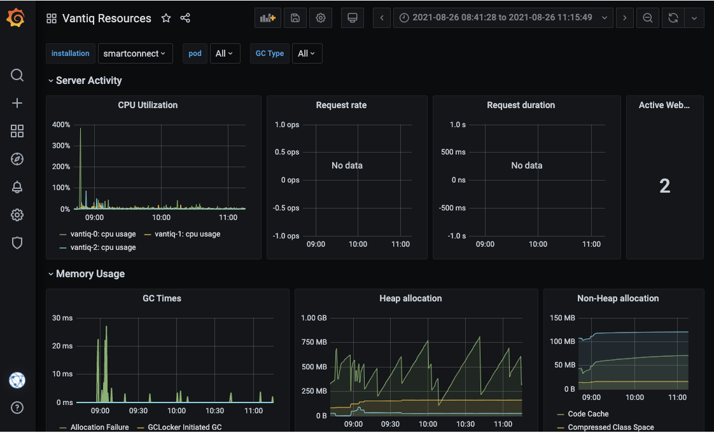

# はじめに

本記事ではVANTIQ保守作業において、[k8sdeploy_tools](https://github.com/Vantiq/k8sdeploy_tools)でカバーされていない補足の説明や、構築時のトラブルシューティング方法や事例について記載する。

## 前提

- Kubectlツールを使ってk8sクラスタを操作する環境へのアクセスがあること

# 目次

(TOC to be added)

# 初回構築作業 (Quick Reference)

### 事前準備 (アクセス権限等)
- SSL証明書ファイル (from Customer)
- 有効なVantiq Licenseファイル (`license.key`, `public.pem`) (from Vantiq Support)
- DNS Zoneの管理権限、もしくは即時対応可能な更新依頼先 (from Customer)
  DNS管理者が外部の方の場合、事前に相談しておくこと
　既存のzoneであれば、15分程度で有効になる(実際には数分で有効になるはず)
　新規のzoneであれば、最大48時間程度かかることになる
- `k8sdeploy_tools`, `k8sdeploy`リポジトリへのアクセス権限 (from Vantiq Support)
- `k8sdeploy_clusters_jp`リポジトリへのアクセス権限 (from JapanVirtualSRE)
- *quay.io* へのvantiqリポジトリへのアクセス権限（from Vantiq Support)


### 事前準備 (作業環境)
- java8 - Oracle or OpenJDK最新バージョン
- git
- kubectl - 有効なバージョン (Cloud側のK8sバージョン ± 1以内)
- helm 3 - 最新バージョン
- docker CE - 最新バージョン
- [git-secret](https://github.com/Vantiq/PStools/tree/main/git-secret) - secret, senstiveファイルをgitにアップロードする際に必要。
- stern - ログをpod横断的に確認するのに便利


## 構築作業

1. 最新バージョンのk8sdeploy_toolsを取得する。`git clone https://github.com/Vantiq/k8sdeploy_tools.git`
1. `k8sdeploy_tools` に移動
1. `.gradle/gradle.properties`にgithubのk8sdeployにアクセス,`username`と`password`を設定する。2段階認証を有効にしている場合、passwordはpersonal access tokenとなる。
1. `./gradlew configureClient`を実行し、vantiqのhelm chart repoを取得する。
1. `targetCluster`, `vantiqSystem` がないことを確認
1. 以下のコマンドを実行
   `./gradlew configureVantiqSystem`
   `targetCluster`、`vantiqSystem` が作成されたことを確認
   `targetCluster`には、`cluster.properties`, `deploy.yaml`のみが生成される
1. targetCluster に移動
1. クラスタ名を決定し、以下のコマンドを実行
	git checkout -b <クラスタ名>
1. `cluster.properties` 構成を設定するの
1. 続けてcluster.properties に任意の設定を行う、下記は例
   - #`requiredRemote`=`false` のコメントアウトを外す
   - `provider`=`aws` (azure|alicloud|openstack|kubeadm)
   - `vantiq_system_release`=`3.9.0` (SRE or Supportに要確認)
   - `deployment`=`development` (developmentは、シングル構成、productionはトリプルクラスタ構成)
   - `vantiq.installation`=`tkeksfuji7` (クラスタのホスト名になる)
1. `~/.kube/config`を `kubeconfig` としてコピーし、必要な修正を実施
1. 次のコマンドを実行し、クラスタとの接続を確認
	`./gradlew -Pcluster=<クラスタ名> clusterInfo`
	エラーなく正常にclient version, server versionが返ることを確認
	エラーの場合、`kubeconfig`の記述、kubectlのバージョン不整合など、確認すること
1. 次のコマンドを実行し、設定ファイルを生成
	`./gradlew -Pcluster=<クラスタ名> setupCluster`
	`secrets.yaml`ファイルと`deploy`というディレクトリが生成される
1. `deploy.yaml` と`secrets.yaml`を修正
1. 次のコマンドを実行し、パスワード関連ファイルを生成
	`./gradlew -Pcluster=<クラスタ名> generateSecrets`
1. 次のコマンドを実行し、デプロイを実施
	`./gradlew -Pcluster=<クラスタ名> deploy`
	正常に終わらない場合は、deploy.yaml, secrets.yamlの設定を確認。必要に応じて`deploy`の代わりに、`deployNginx`, `deployShared`, `deployVantiq`それぞれ個別に行う。
1. 以下のコマンドにて各種podが動作していることを確認
	`kubectl get pod -A`
1. Vantiq podが動作している場合、以下のコマンドにて出力されるlog内からkeyを確認し保存
	`kubectl logs pod/vantiq-0 -c vantiq -n <vantiqのnamespace>`
    ```
  	2020-05-06T16:21:57.493 [vert.x-eventloop-thread-7] INFO  i.v.c.i.l.c.VertxIsolatedDeployer - Succeeded in deploying verticle
  	2020-05-06T16:21:58.595 [vert.x-eventloop-thread-0] INFO  io.vantiq.startup - ******************************************************************
  	2020-05-06T16:21:58.595 [vert.x-eventloop-thread-0] INFO  io.vantiq.startup - *          1234567890123456789012345678901234567890=          *
  	2020-05-06T16:21:58.595 [vert.x-eventloop-thread-0] INFO  io.vantiq.startup - ******************************************************************
    ```
1. 以下のコマンドを実行し、各種podが適切なnodeに乗っていることを確認
	`kubectl describe nodes|egrep "^Name:|instance|mongo|vantiq|metrics|vision|influx|grafana|coredns|keycloak|nginx|telegraf|domain"`
	適切なノードに乗っていない場合は、別途手順()を確認
    ```
  	kubectl taint nodes --all key=value:NoSchedule
  	kubectl taint nodes <node名> key:NoSchedule-
  	kubectl scale <deploy or sts> -n <ns> --replicas=1
  	kubectl scale <deploy or sts> -n <ns> --replicas=3
  	kubectl taint nodes --all key:NoSchedule-
    ```
1. 以下のコメントよりLoad BalancerのDNS名を確認
	`kubectl get svc -A`
   1. 上記DNS名が名前解決できることを確認
  　　LBにて設定されたホスト名をCNAME (AWS CLB)もしくはAレコード (Azure LB)で解決できるように設定する
  　 Internet-facing: インターネットにて名前解決ができること
  　 Internal: Internalネットワーク内にあるホストから名前解決できること
   1. 上記で確認したDNS名のCNAME/Aレコードとして、計画しているDNS名を設定。DNS Zone管理者に確認すること。
   1. DNS登録ができたことを確認
1. Keycloakでsystem adminユーザーを作成する
   1. 以下にアクセス
	`https://<ドメイン名>/auth/`
	Keycloakページが表示されるので、`Administrator Console`をクリック
	Keycloakの管理者名とパスワード(`secrets.yaml`の`shared.keycloak.data.password`にて指定した内容)を使いログイン
	作成するユーザは、利用ユーザとは違い、”System Admin”のため、取り扱いには注意が必要(Orgを自由に作成可能となる)
   1. メニューにあるManage配下のUsersに移動
   1. Add Userボタンをクリック
   1. Usernameを入力し、Saveをクリック
   1. 作成したユーザのCredential タブをクリック
   1. パスワードを設定し、TemporaryをoffにしてReset Passwordをクリック
   1. Details タブに移動し、Email verifiedをONに変更しSaveをクリック
   1. Role mapping タブに移動し、Client rolesのrealm managementを選択
   1. 全てのAvailable rolesを選択し、Add selectedボタンをクリック
   1. 右上のユーザー名アイコンからlogout
1. Vantiq IDEでsystem namespaceの初期設定
   1. 以下のページにアクセスし、作成したユーザ名、パスワードでログイン
  	`https://<ドメイン名>/` #上記ステップでログアウトした画面からはログインできないため、左記のページに移動すること
  	作成したユーザー名とパスワードでログイン
   1. System adminのGrafana設定を実施
	    Add Grafana dashboard for System users に従い、設定を行う
	    `k8sdeploy_tools/vantiqSystem/deploy/vantiq/dashboards` にあるファイルを設定
	     インポートすべきファイルは、適切なBranchを選択する必要がある(vantiq_system_releaseを指定)
      - InfluxDB Internal.json -> internals
      - MongoDB Monitoring Dashboard.json -> kubernetes
      - Organization Activitiy.json -> systemDB, kubernetes, vantiqServer
      - Vantiq Resources.json -> kubernetes, vantiqServer
   1. Source: `GenericEmailSender` を修正
	    Search boxに”generic”と入力し、enterを押下
	    検索結果Windowが表示されるが、systemにチェックをつけ、GenericEmailSenderをクリック
	    適切なemail serverの設定を行い、saveをクリック
   1. ノードのプロパティを更新
	    デプロイ -> ノードで、"self"を選択
	    デフォルトのhttp://localhost:8080を、デプロイされているドメイン名に変更する（例：https://hr-vantiq.co.jp)
   1. ユーザー向けOrganizationを作成
	    Administer -> Organization
	    Newアイコンをクリック
	    Org name, Org description, namespace (root namespace), invite Destination(Org Adminのメールアドレス)、「管理者になる」をチェック（自分がOrg管理者になる場合）し、Save.
   1. Org管理者を追加
	    Namespaceから、作成したorganizationのroot namespaceに移動する
	    Administer　→ user
	    新規をクリック
	    認証プロパティのアイコンをクリックし、権限をOrganization AdminにしてOKとする。追加するユーザーのメールアドレスを入力し、保存する。


# 保守作業

### SSL証明書を更新する
SSL証明書が期限切れになると、ブラウザでアクセス時にエラーとなるが、このようになる前に計画的にSSL証明書を更新が必要である。


1. SSL証明書を取得する。
  - 顧客調達の場合、必要なリードタイムを考慮し、前もって証明書の更新を依頼する。
  - Vantiq内部で非本番用の場合、[SSLなう](https://sslnow.ml/)などを使って、Let's Encryptの証明書を取得してもよい。
2.  SSL証明書はすべての中間証明書を含む、フルチェーンであること。（すべての必要な中間照明書がオリジナルの証明書のファイルにアペンドされていること）
3. 取得した証明書と秘密鍵(それぞれ、`fullchain.crt`、`private.key`とする)を`targetCluster/deploy/sensitive`の下の該当するファイルと置き換える。
4. k8sdeploy_toolsのルートで`./gradlew -Pcluster=<cluster name> generateSecrets`を実行する。
5. `./gradlew -Pcluster=<cluster name> deployVantiq`を実行する。
6. ブラウザでアクセスし、証明書が変わっていることを確認する。


# トラブルシューティング

### Grafana Data Source追加する時、エラーとなる
InfluxDBを追加する時、URLを`http://influxdb-influxdb:8086`としたが、エラーとなる。


Solution: URLを`http://influxdb:8086`とする。


### AzureでBackupの設定ができない

mongodb backupを設定する追加の手順。(Azure)
`secrets.yaml`の`vantiq`キーの下に、以下の設定を追加（or コメントアウト）

```yaml
vantig:
  dbbackup-creds:
    files:
      credentials: deploy/sensitive/azure_storage_credentials.txt
```
`deploy/sensitive`の下に、`azure_store_credentials.txt`を作成し、以下の設定を追加。
```
export AZURE_STORAGE_ACCOUNT=<ストレージアカウント名>
export AZURE_STORAGE_KEY=<ストレージキー>
```
例)
```
export AZURE_STORAGE_ACCOUNT=vantiqbackupstorage
export AZURE_STORAGE_KEY=XXXXXXX7CGqYriw9X3jwojPiHlc/3Jjhn3/MIEKYAJq0KwJZ9fd6zf9nMNt0DmIJcYfqaGmaM1isY3tayXXXXXXX==
```
`deploy.yaml`の`vantiq`のキーの下に、以下を追加。<bucket名>は任意.

```yaml
vantiq:
  mongodb:
    backup:
    enabled: true
    provider: azure
    schedule: "@daily"
    bucket: <bucket名>
```


### Grafanaでメトリクスが表示されない
`Vantiq Resources`の`Request rate`、`Request duration`が表示されない。`MongoDB Monitoring Dashboard`が表示されない。



#### InfluxDBにメトリクスが存在するか診断する
データが表示されていないパネルのクエリを調べると、`kubernetes`データベースの`nginx_ingress_controller_requests`が使われているが、これがInfluxDBにあるか確認する。

```sh
# influx-0のpodのシェルに入る
$ kubectl exec -it influxdb-0 -n shared -- /bin/sh

# influxのシェルに入る
$ influx
Connected to http://localhost:8086 version 1.8.1
InfluxDB shell version: 1.8.1

# データベースの切り替え
> use kubernetes
Using database kubernetes

# 保存されているメトリクスを確認
> show measurements
name: measurements
name
----
cpu
disk
diskio
docker
docker_container_blkio
docker_container_cpu
docker_container_mem
docker_container_status
go_gc_duration_seconds
...
```

#### telegrafでエラーが出ているか診断する
メトリクスがない場合、telegraf側でエラーが出ているか確認する。

```sh
$ stern -n shared telegraf-* -s 1s

telegraf-prom-86c55969cb-fxmnx telegraf 2021-08-25T23:33:35Z E! [inputs.prometheus] Unable to watch resources: kubernetes api: Failure 403 pods is forbidden: User "system:serviceaccount:shared:telegraf-prom" cannot watch resource "pods" in API group "" at the cluster scope
telegraf-prom-86c55969cb-fxmnx telegraf 2021-08-25T23:33:36Z E! [inputs.prometheus] Unable to watch resources: kubernetes api: Failure 403 pods is forbidden: User "system:serviceaccount:shared:telegraf-prom" cannot watch resource "pods" in API group "" at the cluster scope
telegraf-prom-86c55969cb-fxmnx telegraf 2021-08-25T23:33:37Z E! [inputs.prometheus] Unable to watch resources: kubernetes api: Failure 403 pods is forbidden: User "system:serviceaccount:shared:telegraf-prom" cannot watch resource "pods" in API group "" at the cluster scope
telegraf-prom-86c55969cb-fxmnx telegraf 2021-08-25T23:33:38Z E! [inputs.prometheus] Unable to watch resources: kubernetes api: Failure 403 pods is forbidden: User "system:serviceaccount:shared:telegraf-prom" cannot watch resource "pods" in API group "" at the cluster scope
```

#### Solution
AWSやAzureで、kubernetesクラスタのRBACを有効にすると、デフォルトではClusterレベルの情報にアクセスする権限がない。`Service Account`を作成し、明示的に`telegraf`に対して権限をつける必要がある。

```sh
kubectl apply -f k8s-additional-roles.yaml
```
**k8s-additional-roles.yaml**
```yaml
kind: ClusterRole
apiVersion: rbac.authorization.k8s.io/v1
metadata:
  name: influx:cluster:viewer
  labels:
    rbac.authorization.k8s.io/aggregate-view-telegraf: "true"
rules:
  - apiGroups: [""]
    resources: ["persistentvolumes", "nodes"]
    verbs: ["get", "list"]

---
kind: ClusterRole
apiVersion: rbac.authorization.k8s.io/v1
metadata:
  name: influx:telegraf
aggregationRule:
  clusterRoleSelectors:
    - matchLabels:
        rbac.authorization.k8s.io/aggregate-view-telegraf: "true"
    - matchLabels:
        rbac.authorization.k8s.io/aggregate-to-view: "true"
rules: [] # Rules are automatically filled in by the controller manager.
---
apiVersion: rbac.authorization.k8s.io/v1
kind: ClusterRoleBinding
metadata:

  name: influx:telegraf:viewer
roleRef:
  apiGroup: rbac.authorization.k8s.io
  kind: ClusterRole
  name: influx:telegraf
subjects:
- kind: ServiceAccount
  name: telegraf-ds
  namespace: shared
- kind: ServiceAccount
  name: telegraf-prom
  namespace: shared
```
Reference: https://stackoverflow.com/questions/53908848/kubernetes-pods-nodes-is-forbidden/53909115


### keycloak podが起動しない

Keycloakが短い周期でエラーとなり、起動しない。
```
shared         keycloak-0                                       0/1     Error                        2          107s
shared         keycloak-1                                       0/1     Error                        2          113s
shared         keycloak-2                                       0/1     Error                        2          104s
shared         keycloak-0                                       0/1     CrashLoopBackOff             2          113s
shared         keycloak-1                                       0/1     CrashLoopBackOff             2          118s
shared         keycloak-2                                       0/1     CrashLoopBackOff             2          113s
```
初期インストール時によくある問題として、資格情報が正しく設定されてない可能性がある。`kubectl logs`で調べると、以下のようなエラーが出ていることがある。

```sh
$ kubectl logs -n shared keycloak-0 -f
Picked up JAVA_TOOL_OPTIONS: -XX:+UseContainerSupport -XX:MaxRAMPercentage=50.0
Added 'keycloak' to '/opt/jboss/keycloak/standalone/configuration/keycloak-add-user.json', restart server to load user
=========================================================================

  Using PostgreSQL database

=========================================================================

Picked up JAVA_TOOL_OPTIONS: -XX:+UseContainerSupport -XX:MaxRAMPercentage=50.0
12:12:33,661 INFO  [org.jboss.modules] (CLI command executor) JBoss Modules version 1.10.0.Final

...
12:13:01,951 WARN  [org.jboss.jca.core.connectionmanager.pool.strategy.OnePool] (ServerService Thread Pool -- 65) IJ000604: Throwable while attempting to get a new connection: null: javax.resource.ResourceException: IJ031084: Unable to create connection
	at org.jboss.ironjacamar.jdbcadapters@1.4.20.Final//org.jboss.jca.adapters.jdbc.local.LocalManagedConnectionFactory.createLocalManagedConnection(LocalManagedConnectionFactory.java:345)

...

Caused by: org.postgresql.util.PSQLException: FATAL: password authentication failed for user "keycloak"
	at org.postgresql.jdbc@42.2.5//org.postgresql.core.v3.ConnectionFactoryImpl.doAuthentication(ConnectionFactoryImpl.java:514)
	at org.postgresql.jdbc@42.2.5//org.postgresql.core.v3.ConnectionFactoryImpl.tryConnect(ConnectionFactoryImpl.java:141)
	at org.postgresql.jdbc@42.2.5//org.postgresql.core.v3.ConnectionFactoryImpl.openConnectionImpl(ConnectionFactoryImpl.java:192)
```

#### Azure Database for PostgreSQLが起動せずエラーになる場合
Azure Database for PostgreSQLの場合、`keycloak.keycloak.persistence`の下に、`dbHost`と`dbUser`をそれぞれ設定する必要がある。

```yaml
keycloak:
  keycloak:
    # This is the password for the initial Keycloak admin user ('keycloak').  This user has
    # complete access to all of the Keycloak realms, so you want to make sure to use a secure
    # value.
#    password: <enter password to use for the Keycloak admin user>

    # This is the connection information used by Keycloak to connect with the PostgreSQL database
    # used to store all user identities.  The host is the DNS name for the PostgreSQL server and
    # the password is the password that was chosen to secure the "keycloak" database (the DB admin
    # user is assumed to be "keycloak").
    persistence:
      dbHost: keycloakvantiqjpinternalprod.postgres.database.azure.com
      dbUser: keycloak@keycloakvantiqjpinternalprod
```

#### その他
[`alpine-f`ツール](./alpine-f.md)を使って、直接Postgresに繋げてみて、問題を切り分ける。


### Vantiq IDEにログインしようとすると、エラーが出る

エラーが出てログインできない。
```
{"code":"io.vantiq.server.error","message":"Failed to complete authentication code flow. Please contact your Vantiq administrator and have them confirm the health/configuration of the OAuth server. Request failed due to exception: javax.net.ssl.SSLHandshakeException: Failed to create SSL connection","params":[]}
```

Vantiq podとkeycloak間で認証の通信がうまく行っていないことが原因である。

#### SSL証明書が有効かどうか診断する

デフォルトでは自己署名の証明書（self-signed certificate)を信頼しない。開発環境などで一時的に自己署名の証明書を使用する場合は、明示的に指定する。

```yaml
nginx:
  controller:
    tls:
      cert: cert.perm
      key: key.perm
      # this is sued if you use self-signed SSL
      selfSigned: true
```

#### サーバー間の時刻同期ができてきるか診断する

サーバー間で時刻同期ができていないと、pod間のtokenが無効と見なされてエラーとなる。閉域網で構成する際、時刻同期サービスへ通信ができないと時刻はズレる。
[時刻同期確認ツール](./timestamp_ds.md)


### System Admin用のkeyを紛失した、期限切れになった

System Admin用のkeyはVantiq podを再起動したり、48時間で失効するので、DNSレコード登録等の作業で手間取ると初回のログインができなくなる。

Vantiqのデプロイからやり直す必要がある

- `undeplyVantiq` を実施
- `MongoDB`の`pv`と`pvc` を削除
- `deployVantiq` を実施


### Vantiq MongoDBの回復したい

1. vantiqサービスをscale=0にする
```
kubectl scale sts -n xxxx vantiq --replicas=0
```
2. mongorestoreを実行
```
kubectl create job mongorestore --from=cronjob/mongorestore -n xxx
```
3. userdbrestoreを実行（userdbを使用する場合)
```
kubectl create job userdbrestore --from=cronjob/userdbrestore -n xxx
```
4. vantiqサービスのスケールを戻す
```
kubectl scale sts -n xxx vantiq --replicas=3
```
https://github.com/Vantiq/k8sdeploy_tools/blob/master/scripts/README.md
