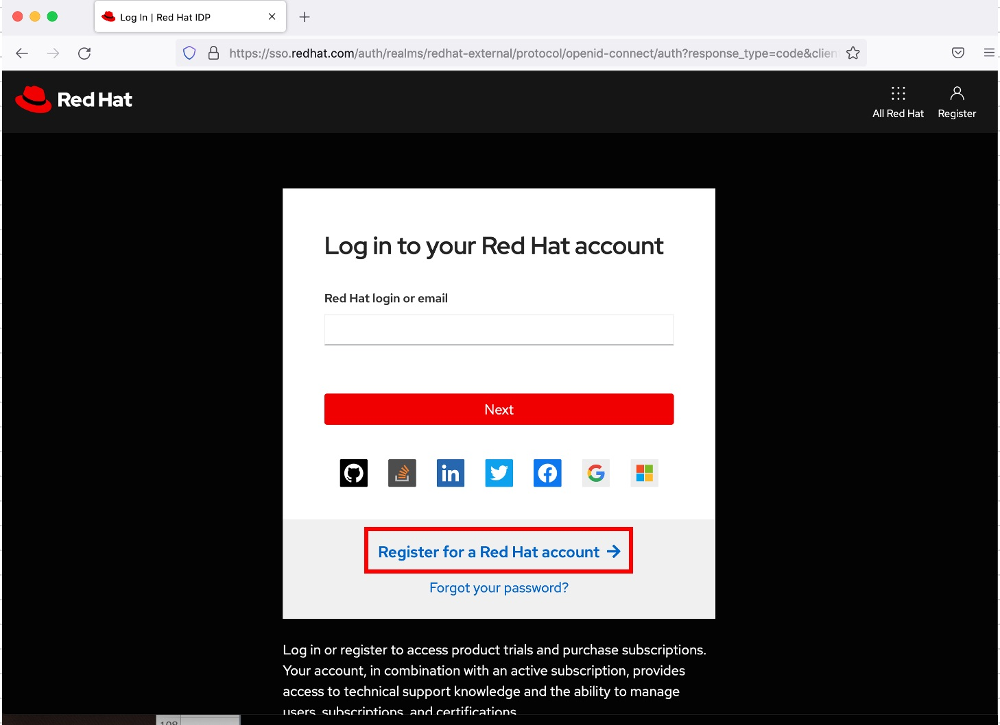
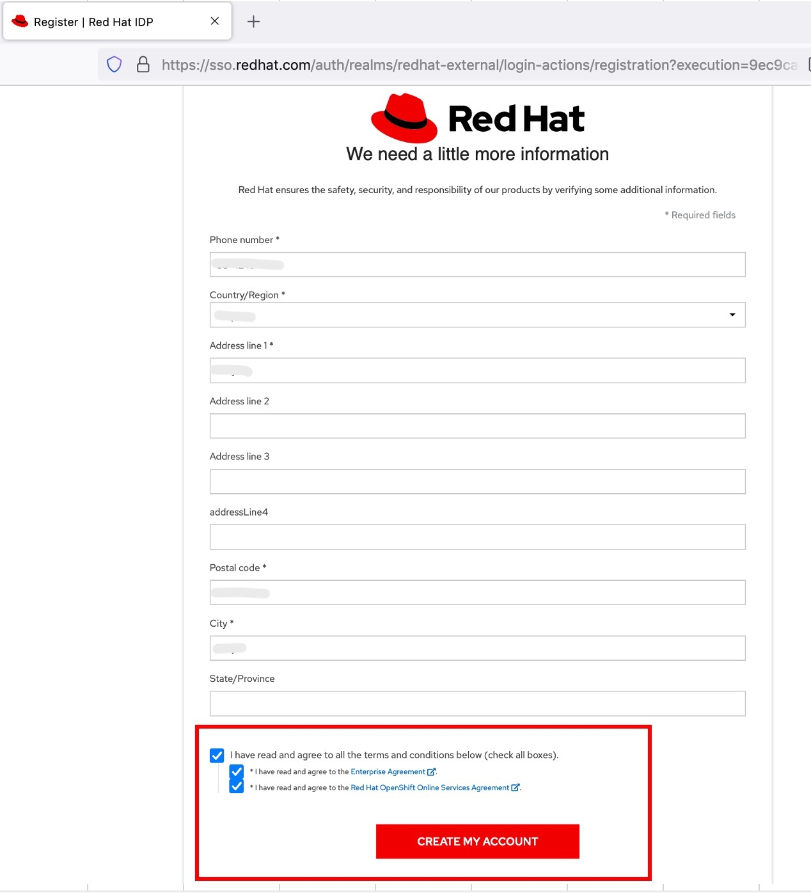
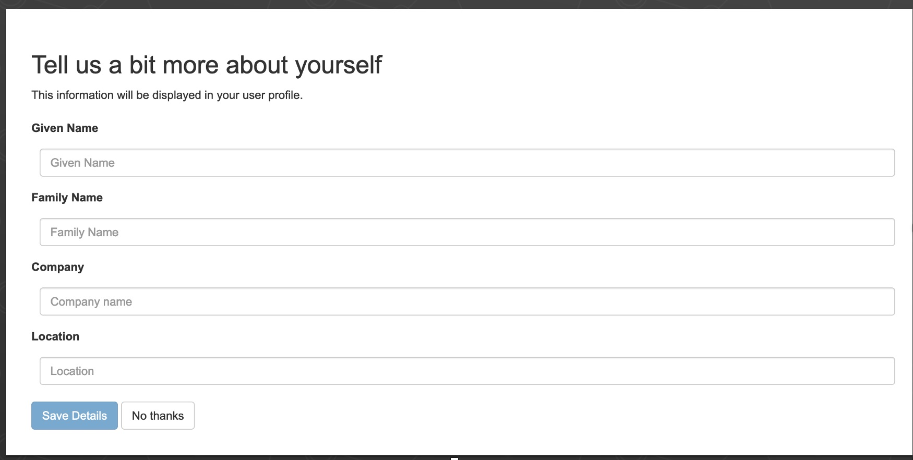
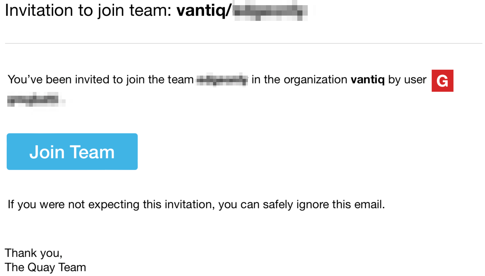

## About this document

This article describes the procedure for creating a new account on Quay.io.  

## How to create a new Quay.io account  

  It is possible to sing in to Quay.io with a RED HAT account.       
  Here are the procedures for creating a new one.    

## Go to https://quay.io/

### 1. Select [TRY FOR FREE ON CLOUD]   

### 2. Select [Start Free Trial] for any plan

### 3. Select [Sign in with Red Hat] in the RED HAT screen

### 4. Select [Register for a Red Hat account]

### 5. Fill in all fields and select [NEXT]  
- **Note:** The username specified here should be __"your company name_admin"__ so that the Vantiq Support team can identify you.  
  

### 6. Fill in the required fields, check the checkboxes, and select [CREATE MY ACCOUNT]  

  

### 7. Check [I'm not a robot] checkbox and select [Continue]

  

### 8. Confirm Username, then select [Confirm Username]   

  

### 9. The following dialog may be selected [No thanks]  

  

### 10. Now in the [Quay.io] repository  

  

### 11. Click Username to Sign out, etc

  

### 12. Accept the invitation to join the Vantiq team
- The Vantiq Support team will assign permissions to the created account. Once you have received an email invitation, please follow the instructions to **Join Team**.  

  
