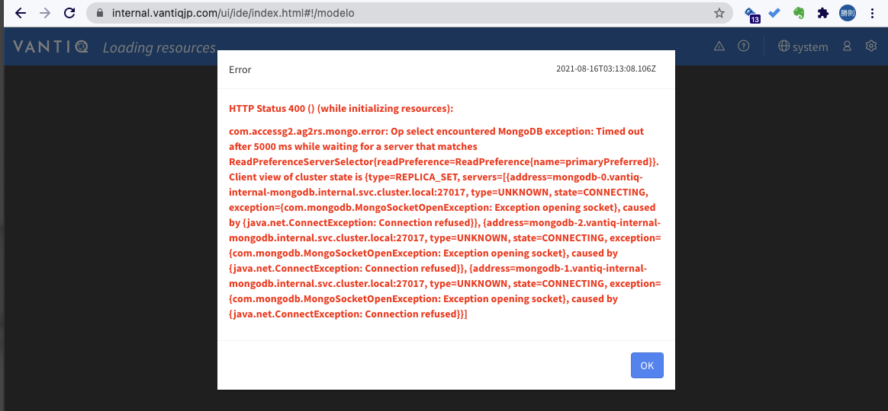
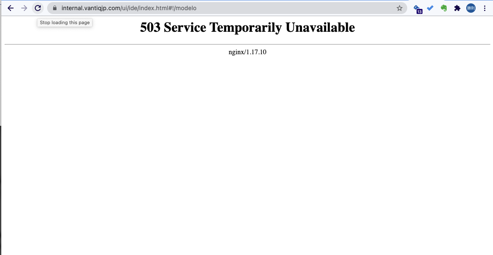

# Introduction to MongoDB configuration on the Vantiq

## About the availability of MongoDB configured on the Vantiq

### TL;DR
At least two of the three mirrored configuration servers need to be up and running.

### Details
MongoDBs in the Vantiq are the three-server mirror configuration, and its configuration details are the following.  

- Three servers are up and running: Primary + Secondary + Secondary
- Two servers are up and running: Primary + Secondary
- One server is up and running: Secondary

Primary is for write only, Secondary is for read only.  
If the servers become single due to AZ failure etc., it will be able to read only, so attempting to write will result in a timeout error.  



After a few minutes, as the Vantiq pod is no longer able to do the regular write access, the container of the pod itself turns into NOT Ready`.  
As a result, it gets `503 Service Temporary Unavailable`.  




## The timing for deleting mongodb backup job

In the CronJob of `mongodbbackup`, `successfulJobsHistoryLimit: 3` is configured.  

```sh
kubectl get cj -n internal mongobackup -o yaml
```
```yaml
apiVersion: batch/v1beta1
kind: CronJob
metadata:
  annotations:
...
schedule: '@daily'
successfulJobsHistoryLimit: 3
suspend: false
```

With that, completed jobs older than three generations will be automatically deleted.  

```sh
$ kubectl get pods -n internal
NAME                           READY   STATUS      RESTARTS   AGE
metrics-collector-0            1/1     Running     6          81d
mongobackup-1630195200-z8ztx   0/1     Completed   0          2d11h
mongobackup-1630281600-q76jh   0/1     Completed   0          35h
mongobackup-1630368000-f6wjk   0/1     Completed   0          11h
mongodb-0                      2/2     Running     0          15d
mongodb-1                      2/2     Running     0          15d
```
