# Relationship between Vantiq Organization, Namespace and User Role

### What is Namespace?
- Namespace ensures exclusive isolation of development resources.  
- Development Resource includes App, Procedure, Rule, Client, Project, User, etc.  
- Users can access the Namespace to which they have been invited.  

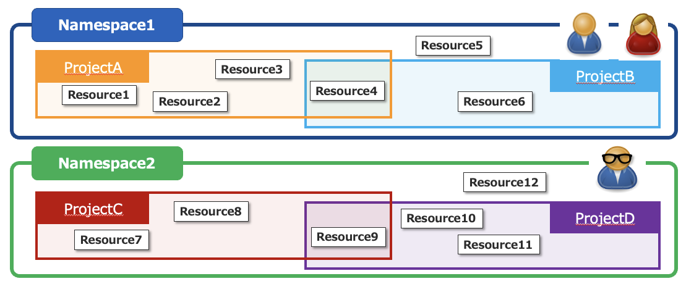

- There are four types of Namespace and they have different purposes.  
  - **System NS** – Manage resources related to the whole Vantiq cluster  
  - **Organization Root NS** – Manage Organization (tenants)   
  - **Developer NS** – Developers develop applications (create development resources)  
  - **Application NS** – Operators manage application Users, deploy and operate applications  
- Note: The Namespace type is not displayed to Users.  

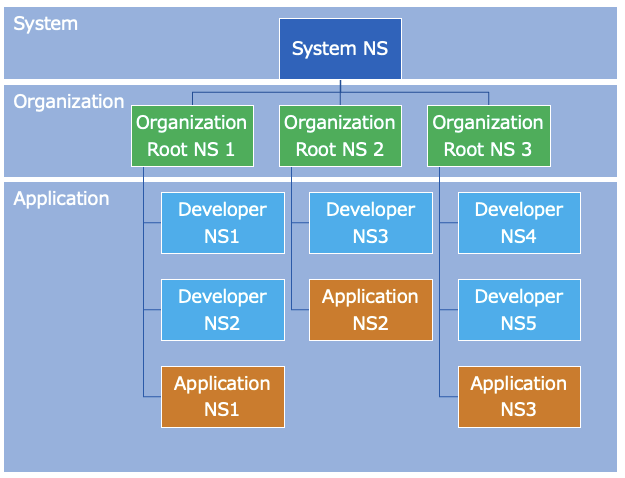

### Relationship between Role types and Namespace
- Each Namespace type has its own defined Role, and Users can perform operations by being assigned to a Role.  

Types of NS | Role | Main Responsibilities | Create new Users | Create new NS | Create Development Resources
--|---|---|---|---|--
System NS | System Admin |- Manage the whole System  - Create and manage Organization | **Yes (1)** | **Yes (2)**  | **Yes (3)** |  
Organization Root NS | Organization Admin  | - Manage the whole Organization | **Yes** | **Yes**  | **Yes (3)**
 Organization Root NS | User(Developer)  | - Manage Developer NS | No  | **Yes**  | No  
Developer NS  | Developer  | - Development and Maintenance | No  | **Yes**  | **Yes**
Application NS  | NS Admin  | - Operate Application   - Manage End Users | **Yes** | No | No
Application NS  | User  | - Use Application | No | No | No

- (1) Can invite System Admin newly. Also, can invite Organization Admin newly when creating an Organization.  
- (2) Only Organization Root NS can be created.  
- (3) Can be created but not recommended.  

### Invite to Namespace
- Authorized user can grant access to the NS by sending invitation E-mail.

#### Invite a new User
- Administer >> Users >> New  

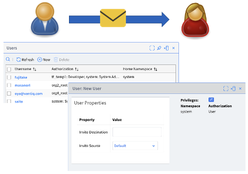

#### Grant permission to NS to existing User
- Administer >> Namespaces >> Manage Authorizations  

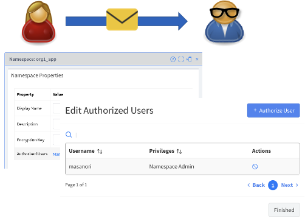

### Scenario in which Users start to use the system  

#### 1) System Admin creates Organization
- System Admin creates Organization and at the same time invites and assigns Organization Admin.  

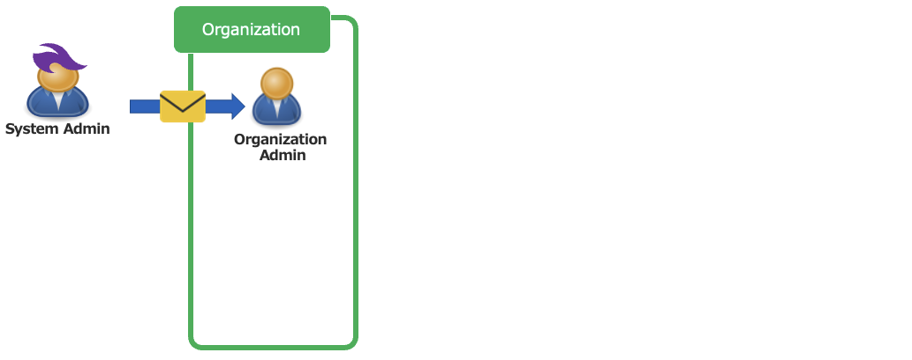

#### 2) Organization Admin invites Developer

- Organization Admin invites Developer as the role of User (Developer).  

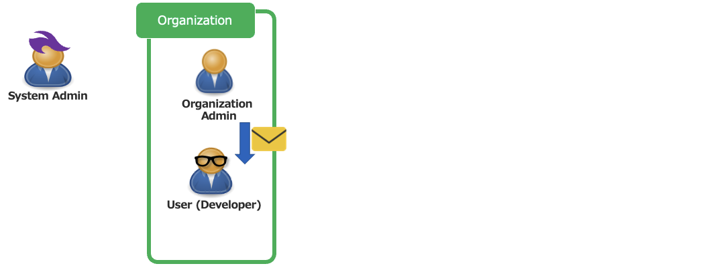

#### 3) Developer creates Developer Namespace

- Developer creates Namespace for development and becomes Developer.  

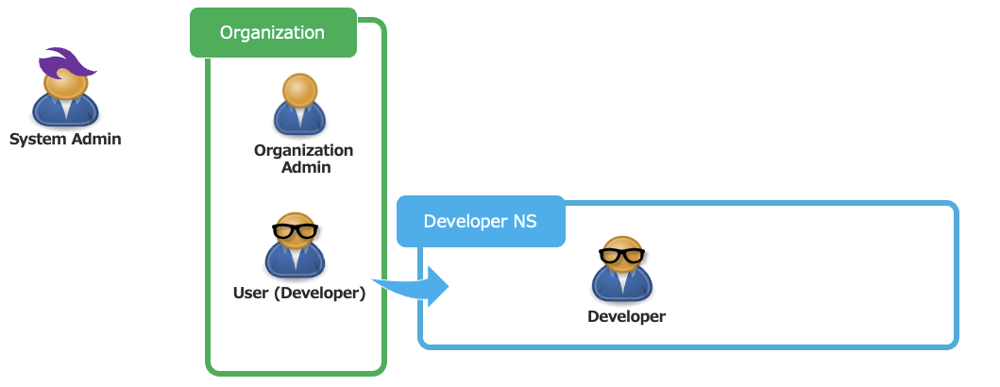

#### 4) Developer invites other Developer to Developer Namespace

- Developer invite existing User to Developer Namespace as Developer.  

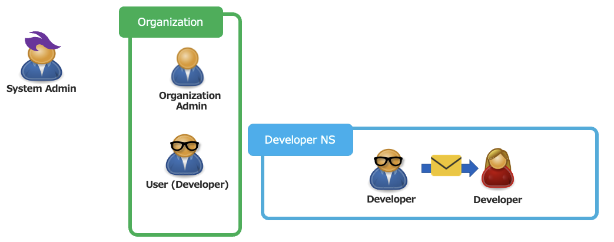

#### 5) Organization Admin invites NS Admin

- Organization Admin creates Application NS. And then invite User to this NS as NS Admin.  

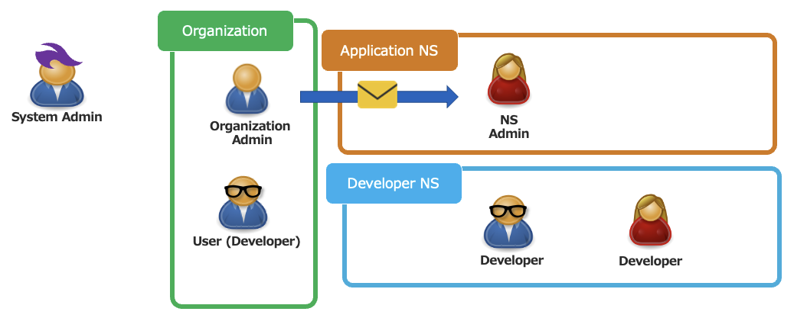

#### 6) NS Admin invites User

- NS Admin invites User to Application NS as User.  

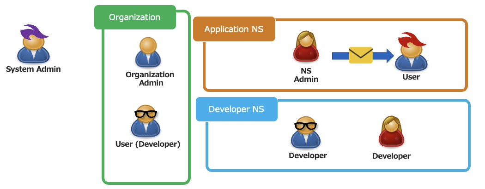

### Home Namespace and Current Namespace

- **Home Namespace** - This is the Namespace when the user's account is created (when the user is invited to NS for the first time) and user information is managed in the Home Namespace. It cannot be changed.  

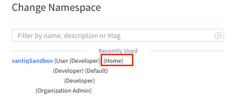

- **Current Namespace** – The Namespace which is currently working.  

## References
- [Administrators Reference Guide](https://internal.vantiqjp.com/docs/system/namespaces/index.html)
