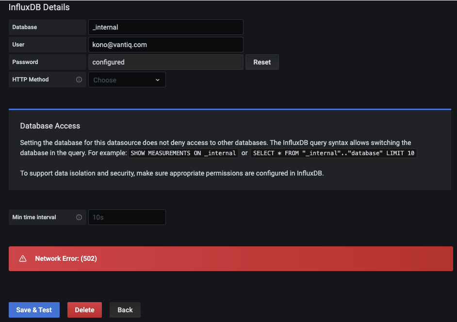
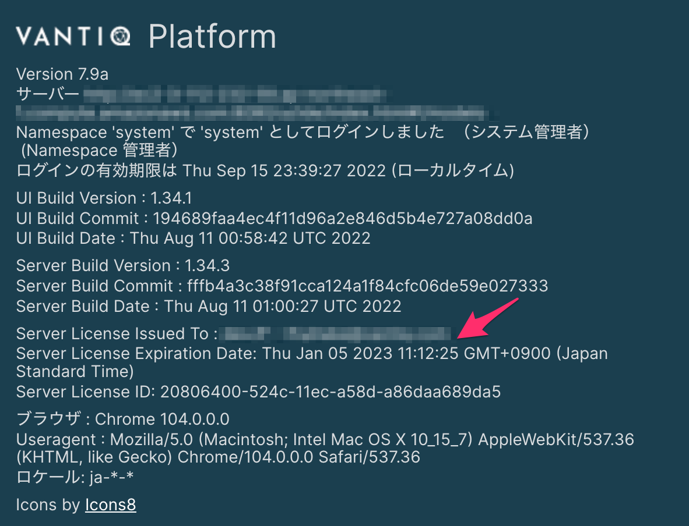

# Introduction

This document describes troubleshooting during build and examples related to [k8sdeploy_tools](https://github.com/Vantiq/k8sdeploy_tools) _(permissions required)_ in VANTIQ maintenance work.  

## Prerequisites

- Must have access to an environment that uses Kubectl tools to operate the k8s cluster.  

# Table Of Contents

  - [How to recover Vantiq MongoDB](#recovery_of_vantiq_mongoDB)
  - [When adding a Grafana Data Source, an error occurs](#error_when_adding_grafana_data_source)  
  - [Unable to configure Backup in Azure](#unable_to_configure_backup_in_azure)
  - [Repeating undeploy and deploy made PV Release. How to reuse Old PV](#reuse_old_pv)
  - [Metrics not displayed in Grafana](#metrics_not_showing_up_in_grafana)  
  - [When updating Vantiq version, all Dashboard in Grafana is disappeared](#metrics_gone_after_vantiq_update)
  - [Keycloak pod would not start](#keycloak_pod_will_not_start)  
  - [Pod repeatedly restarts and cannot start](#pod-cannot-start)  
  - [Error when trying to login to Vantiq IDE](#error_when_trying_to_login_to_vantiq_ide)  
  - [Lost or expired key for System Admin](#lost_or_expired_key_for_system_admin)   
  - [How to check license expiration date](#check-license-expiration)


# How to recover Vantiq MongoDB<a id="recovery_of_vantiq_mongoDB"></a>

1. Set vantiq service to scale=0  
```
kubectl scale sts -n xxxx vantiq --replicas=0
```
2. Execute mongorestore  
```
kubectl create job mongorestore --from=cronjob/mongorestore -n xxx
```
3. Execute userdbrestore（if using userdb)
```
kubectl create job userdbrestore --from=cronjob/userdbrestore -n xxx
```
4. Restore vantiq service scale value  
```
kubectl scale sts -n xxx vantiq --replicas=3
```


# When adding a Grafana Data Source, an error occurs<a id="error_when_adding_grafana_data_source"></a>
When adding InfluxDB, set the URL to `http://influxdb-influxdb:8086`, causing an error.      


#### Solution
Set the URL to `http://influxdb:8086`.  

#### Solution 2
After `Vantiq_system_version: 3.10.1`, it is required to set User/Password of Influxdb, and the input value is the contents described in `secrets.yaml`.  

# Unable to configure Backup in Azure<a id="unable_to_configure_backup_in_azure"></a>

Additional procedures to configure mongodb backup (Azure). Add (or comment out) the following settings under the `vantiq` key in `secrets.yaml`.  

```yaml
vantig:
  dbbackup-creds:
    files:
      credentials: deploy/sensitive/azure_storage_credentials.txt
```
Create `azure_store_credentials.txt` under `deploy/sensitive` and add the following settings.  
```
export AZURE_STORAGE_ACCOUNT=<Storage account name>
export AZURE_STORAGE_KEY=<Storage key>
```
e.g)  
```
export AZURE_STORAGE_ACCOUNT=vantiqbackupstorage
export AZURE_STORAGE_KEY=XXXXXXX7CGqYriw9X3jwojPiHlc/3Jjhn3/MIEKYAJq0KwJZ9fd6zf9nMNt0DmIJcYfqaGmaM1isY3tayXXXXXXX==
```
Add the following under the `vantiq` key in `deploy.yaml`. <bucket name> is optional.  

```yaml
vantiq:
  mongodb:
    backup:
    enabled: true
    provider: azure
    schedule: "@daily"
    bucket: <bucket name>
```

# Repeating undeploy and deploy made PV Release. How to reuse Old PV<a id="reuse_old_pv"></a>

Repeating `undeploy` and `deploy` will create a new PV and the information in the previous PV will no longer be visible. (status = `Released`)  
```
$ kubectl get pv
pvc-a6d5da12-7e3e-4a32-a5b3-bbbbbbbbbbbb   5Gi        RWO            Retain           Bound      shared/grafana                    vantiq-sc               5d21h
pvc-ec37c469-782a-473f-a6f9-aaaaaaaaaaaa   5Gi        RWO            Retain           Released   shared/grafana                    vantiq-sc               247d
```
#### Recovery procedures  
1. Delete the pod of the deploy or sts that mounts the PV, PVC.  
```
$ kubectl scale deploy -n shared grafana --replicas=0
deployment.apps/grafana scaled
```
2. Clear the claimRef of the PV. -> Status of the PV becomes `Available` and it becomes reusable.  
```
kubectl patch pv pvc-ec37c469-782a-473f-a6f9-aaaaaaaaaaaa -p '{"spec":{"claimRef": null}}'
```
3. Create a PVC claiming a PV. PVCs are immutable and so cannot be edited. Therefore, it is necessary to re-create the PVC separately when replacing the volume.  

```sh
vi old-grafana-pvc.yaml
```
```yaml
kind: PersistentVolumeClaim
apiVersion: v1
metadata:
  name: old-grafana-pv
  namespace: shared
spec:
  accessModes:
  - ReadWriteOnce
  resources:
    requests:
      storage: 5Gi          
  volumeName: pvc-ec37c469-782a-473f-a6f9-aaaaaaaaaaaa
  storageClassName: vantiq-sc
  volumeMode: Filesystem
```
4. Apply the PVC.  
```sh
kubectl apply -f old-grafana-pvc.yaml
```
5. Rewrite the reference part of the PVC in the deployment or statefulset (It is the `claimName` part).
```sh
kubectl edit deploy -n shared grafanna
```
```yaml
...
volumes:
- configMap:
    defaultMode: 420
    name: grafana
  name: config
- name: storage
  persistentVolumeClaim:
    claimName: old-grafana-pv
...
```
6. Launch the pod of deploy or sts that mounts PV, PVC.  
```sh
$ kubectl scale deploy -n shared grafana --replicas=1
deployment.apps/grafana scaled
```

#### Note on Recovery  
- In the above example, grafana and grafanadb have a dependency and will not start unless they are on the same node. In other words, the PVs of grafana and grafanadb should be in the same AZ. The existing PVCs may have to be deleted in order to re-create the PVs in the intended AZ.  
- When deleting PVs and PVCs, only the specific modules that are needed can be deployed again. For example, GrafanaDB
```sh
./gradlew -Pcluster=vantiq-vantiqjp-internal deployGrafanaDB
```

# Metrics not displayed in Grafana<a id="metrics_not_showing_up_in_grafana"></a>
The `Request rate` and `Request duration` in `Vantiq Resources` are not displayed. `MongoDB Monitoring Dashboard` is not displayed.  


#### Diagnose if metrics exist in InfluxDB  
Examine the query in the panel where data is not displayed, it uses `nginx_ingress_controller_requests` from the `kubernetes` database. Check to see if this exists in InfluxDB.  

```sh
# Enter the shell of the influx-0 pod  
$ kubectl exec -it influxdb-0 -n shared -- /bin/sh

# Enter the shell of the influx  
$ influx
Connected to http://localhost:8086 version 1.8.1
InfluxDB shell version: 1.8.1

# Switch the databases  
> use kubernetes
Using database kubernetes

# Confirm the stored metrics  
> show measurements
name: measurements
name
----
cpu
disk
diskio
docker
docker_container_blkio
docker_container_cpu
docker_container_mem
docker_container_status
go_gc_duration_seconds
...
```

#### Examine if there is an error in telegraf  
Confirm that there is an error on the telegraf side if there are no metrics.  

```sh
$ stern -n shared telegraf-* -s 1s

telegraf-prom-86c55969cb-fxmnx telegraf 2021-08-25T23:33:35Z E! [inputs.prometheus] Unable to watch resources: kubernetes api: Failure 403 pods is forbidden: User "system:serviceaccount:shared:telegraf-prom" cannot watch resource "pods" in API group "" at the cluster scope
telegraf-prom-86c55969cb-fxmnx telegraf 2021-08-25T23:33:36Z E! [inputs.prometheus] Unable to watch resources: kubernetes api: Failure 403 pods is forbidden: User "system:serviceaccount:shared:telegraf-prom" cannot watch resource "pods" in API group "" at the cluster scope
telegraf-prom-86c55969cb-fxmnx telegraf 2021-08-25T23:33:37Z E! [inputs.prometheus] Unable to watch resources: kubernetes api: Failure 403 pods is forbidden: User "system:serviceaccount:shared:telegraf-prom" cannot watch resource "pods" in API group "" at the cluster scope
telegraf-prom-86c55969cb-fxmnx telegraf 2021-08-25T23:33:38Z E! [inputs.prometheus] Unable to watch resources: kubernetes api: Failure 403 pods is forbidden: User "system:serviceaccount:shared:telegraf-prom" cannot watch resource "pods" in API group "" at the cluster scope
```

#### Possible Solution 1
There is no permission to access Cluster level information by default when RBAC is enabled of a kubernetes cluster in AWS or Azure. Create a `Service Account` and explicitly authorize it for `telegraf`.  

```sh
kubectl apply -f k8s-additional-roles.yaml
```
**k8s-additional-roles.yaml**
```yaml
kind: ClusterRole
apiVersion: rbac.authorization.k8s.io/v1
metadata:
  name: influx:cluster:viewer
  labels:
    rbac.authorization.k8s.io/aggregate-view-telegraf: "true"
rules:
  - apiGroups: [""]
#    resources: ["persistentvolumes", "nodes"]
    resources: ["*"]   # 2021/10/7 changed so that kubernetes.cpu_usage_nanocores measurement be obtained
    verbs: ["get", "list"]

---
kind: ClusterRole
apiVersion: rbac.authorization.k8s.io/v1
metadata:
  name: influx:telegraf
aggregationRule:
  clusterRoleSelectors:
    - matchLabels:
        rbac.authorization.k8s.io/aggregate-view-telegraf: "true"
    - matchLabels:
        rbac.authorization.k8s.io/aggregate-to-view: "true"
rules: [] # Rules are automatically filled in by the controller manager.
---
apiVersion: rbac.authorization.k8s.io/v1
kind: ClusterRoleBinding
metadata:

  name: influx:telegraf:viewer
roleRef:
  apiGroup: rbac.authorization.k8s.io
  kind: ClusterRole
  name: influx:telegraf
subjects:
- kind: ServiceAccount
  name: telegraf-ds
  namespace: shared
- kind: ServiceAccount
  name: telegraf-prom
  namespace: shared
```
Reference: https://stackoverflow.com/questions/53908848/kubernetes-pods-nodes-is-forbidden/53909115

#### Possible Solution 2
Metrics that can be obtained have changed since the container runtime was switched from `dockerd` to `containerd` from AKS 1.19. The queries on the grafana side should be changed accordingly. This affects `Vantiq Resource` and `MongoDB Monitoring Dashboard`.  

##### Vantiq Resources
###### "Pod" Variable
Dashboard settings > Variables  

Old
```sh
show tag values with key = "io.kubernetes.pod.name" where component = 'vantiq-server' AND release =~ /^vantiq-$installation$/
```
To-Be
```sh
show tag values from "kubernetes_pod_container" with key="pod_name" where pod_name =~ /vantiq-/
```

###### CPU utilization
Old
```sh:
SELECT mean("usage_percent") AS "cpu usage" FROM "docker_container_cpu" WHERE ("io.kubernetes.pod.name" =~ /^$pod$/ AND "io.kubernetes.pod.namespace" =~ /^$installation$/ AND component = '' and container_name =~ /^k8s_vantiq_vantiq/) AND $timeFilter GROUP BY time($__interval), "io.kubernetes.pod.name" fill(none)
```
To-Be
```sh:
SELECT mean("cpu_usage_nanocores") / 10000000 AS "cpu usage" FROM "kubernetes_pod_container" WHERE (pod_name =~ /^$pod$/ AND namespace =~ /^$installation$/ and container_name =~ /^vantiq/) AND $timeFilter GROUP BY pod_name, time($__interval) fill(none)
```

Also edit the legends of the panels. Modify the `Alias by` as the following.    
Old
```sh
[[tag_io.kubernetes.pod.name]]: $col
```
To-Be
```sh
$tag_pod_name: $col
```

##### MongoDB Monitoring Dashboard
###### "installation" and "Pod" Variable
Old
```sh
# installation
show tag values with key = "installation"
# Pod
show tag values with key = "io.kubernetes.pod.name" where "io.kubernetes.pod.name" =~ /^mongodb/ AND "io.kubernetes.pod.namespace" = '$installation'
```
To-Be
```sh
# installation
show tag values with key = namespace
# Pod
show tag values from "kubernetes_pod_container" with key="pod_name" where pod_name =~ /mongodb-/
```

###### CPU utilization
Old
```sh:
SELECT mean("usage_percent") FROM "docker_container_cpu" WHERE ("io.kubernetes.pod.name" =~ /^$pod$/ AND "io.kubernetes.container.name" = 'mongodb' AND "io.kubernetes.pod.namespace" =~ /^$installation$/) AND $timeFilter GROUP BY time($__interval) fill(none)
```
To-Be
```sh:
SELECT mean("cpu_usage_nanocores") / 10000000 AS "cpu usage" FROM "kubernetes_pod_container" WHERE ("pod_name" =~ /^$pod$/ AND "container_name" = 'mongodb' AND "namespace" =~ /^$installation$/) AND $timeFilter GROUP BY time($__interval) fill(none)
```

# When updating Vantiq version, all Dashboard in Grafana is disappeared<a id="metrics_gone_after_vantiq_update"></a>

#### Examine: Confirm that the database mysql is set up correctly  
When the settings in `deploy.yaml` are incorrect, the settings are not referenced correctly when grafana starts, and may be set to sqlite3, which is grafana's default value. Confirm the status under `[database]` in the `grafana.ini` entry in the `grafana` configmap.  

```bash
kubectl get cm -n shared grafana
```
```
Name:         grafana
Namespace:    shared
Labels:       app.kubernetes.io/instance=grafana
              app.kubernetes.io/managed-by=Helm
              app.kubernetes.io/name=grafana
              app.kubernetes.io/version=7.1.3
              helm.sh/chart=grafana-5.5.5
Annotations:  meta.helm.sh/release-name: grafana
              meta.helm.sh/release-namespace: shared

Data
====
grafana.ini:
----
[analytics]
check_for_updates = true
[auth]
disable_login_form = true
[auth.basic]
enabled = false
[auth.proxy]
auto_sign_up = false
enable_login_token = true
enabled = true
header_name = X-WEBAUTH-USER
header_property = username
[database] # mysql is not set correctly in this section
[grafana_net]
```
The correct setting is the following.  
```
[database]
host = grafanadb-mysql:3306
type = mysql     # Make sure this section is set to mysql
user = grafana
```
`grafana-mysql` Enter the mysql in the pod and confirm that the tables have been created correctly.  

```bash
kubectl get po -n shared
```
```
NAME                                             READY   STATUS             RESTARTS   AGE
grafana-yyyyyyyyy-bbbbbb                         1/1     Running            0          3d18h
grafanadb-mysql-xxxxxxxxx-aaaaaa                 1/1     Running            0          3d18h # Here is the Pod name
influxdb-0                                       1/1     Running            0          3d18h
ingress-nginx-controller-6568c69569-ncmhs        1/1     Running            0          13d
```
```bash
kubectl exec -n shared -it grafanadb-mysql-xxxxxxxxx-aaaaaa -- bash
```
```
root@<pod name>:/# mysql -u grafana -p
Enter password:
Welcome to the MySQL monitor. Commands end with ; or \g.
Your MySQL connection id is 2985
Server version: 5.7.35 MySQL Community Server (GPL)

Copyright (c) 2000, 2021, Oracle and/or its affiliates.

Oracle is a registered trademark of Oracle Corporation and/or its
affiliates. Other names may be trademarks of their respective
owners.

Type 'help;' or '\h' for help. Type '\c' to clear the current input statement.

mysql> show databases;
+--------------------+
| Database           |
+--------------------+
| information_schema |
| grafana            |
+--------------------+
2 rows in set (0.01 sec)

mysql> use grafana;
Database changed
mysql> show tables;
Empty set (0.00 sec) # The table dose not exist
```

#### Recovery: Do data migration from sqlite3 to mysql  
（The following work will be done in parallel in the mysql shell and in the shell of the working terminal, so it is recommended to prepare two terminals.）  
1. Correct settings in `deploy.yaml`. When leaving under `grafana.ini` blank, the default value will be overwritten with blanks. The following example comments out `grafana.ini` itself.  
```yaml
grafanadb:
  persistence:
    size: 8Gi

grafana:
  persistence:
    size: 5Gi

#  grafana.ini:
#    database:
      # The value here must match the value chosen for the MySQL database password.
#      password: <must match grafanadb.mysqlPassword>
```
2. Update grafana pod with `./gradlew -Pcluster=<cluster name> deployShared`. -> Confirm that grafana database is switched to mysql and the table is created in mysql by initialization.  
```
mysql> show tables;
+----------------------------+
| Tables_in_grafana          |
+----------------------------+
| alert                      |
| alert_configuration        |
| alert_instance             |
| alert_notification         |
| alert_notification_state   |
| alert_rule                 |
| alert_rule_tag             |
| alert_rule_version         |
| annotation                 |
| annotation_tag             |
| api_key                    |
| cache_data                 |
| dashboard                  |
| dashboard_acl              |
| dashboard_provisioning     |
| dashboard_snapshot         |
| dashboard_tag              |
| dashboard_version          |
| data_source                |
| library_element            |
| library_element_connection |
| login_attempt              |
| migration_log              |
| org                        |
| org_user                   |
| playlist                   |
| playlist_item              |
| plugin_setting             |
| preferences                |
| quota                      |
| server_lock                |
| session                    |
| short_url                  |
| star                       |
| tag                        |
| team                       |
| team_member                |
| temp_user                  |
| test_data                  |
| user                       |
| user_auth                  |
| user_auth_token            |
+----------------------------+
```
3. Dump data from sqlite3. The `grafana-insert-less-migration.sql` is the dumped data.  

```bash
# Install sqlite3 on the work terminal
sudo apt install sqlite3

# Copy existing data from grafana pod to local
kubectl cp -n shared grafana-yyyyyyyyy-bbbbbb:/var/lib/grafana/grafana.db ./grafana.db

# Dump the data in the SQL statement format
sqlite3 grafana.db .dump > grafana.sql

# Extract only INSERT statements from the SQL statements, omitting migration_log table data (for reasons to be explained later)  
cat grafana.sql  sed -n '/INSERT/p' > grafana-insert.sql
cat grafana-insert.sql | sed '/migration_log/d' > grafana-insert-less-migration.sql
```
4. Put the dumped data into mysql.  
```bash
# Copy data to grafana-mysql pod
kubectl cp grafana-insert-less-migration-log.sql -n shared grafanadb-mysql-xxxxxxxxx-aaaaaa:/tmp/
```
Work within the mysql shell  
```sql
-- Create a script to delete all records in a table, except migration_log
SELECT CONCAT ('DELETE FROM `', table_name, '`;') as statement from information_schema.tables where table_schema ='grafana' and table_name != 'migration_log';
-- Apply the script
DELETE FROM `alert`;                      
DELETE FROM `alert_configuration`;        
DELETE FROM `alert_instance`;             
DELETE FROM `alert_notification`;         
DELETE FROM `alert_notification_state`;   
DELETE FROM `alert_rule`;                 
DELETE FROM `alert_rule_tag`;             
DELETE FROM `alert_rule_version`;         
DELETE FROM `annotation`;                 
DELETE FROM `annotation_tag`;             
DELETE FROM `api_key`;                    
DELETE FROM `cache_data`;                 
DELETE FROM `dashboard`;                  
DELETE FROM `dashboard_acl`;              
DELETE FROM `dashboard_provisioning`;     
DELETE FROM `dashboard_snapshot`;         
DELETE FROM `dashboard_tag`;              
DELETE FROM `dashboard_version`;          
DELETE FROM `data_source`;                
DELETE FROM `library_element`;            
DELETE FROM `library_element_connection`;
DELETE FROM `login_attempt`;                            
DELETE FROM `org`;                        
DELETE FROM `org_user`;                   
DELETE FROM `playlist`;                   
DELETE FROM `playlist_item`;              
DELETE FROM `plugin_setting`;             
DELETE FROM `preferences`;                
DELETE FROM `quota`;                      
DELETE FROM `server_lock`;                
DELETE FROM `session`;                    
DELETE FROM `short_url`;                  
DELETE FROM `star`;                       
DELETE FROM `tag`;                        
DELETE FROM `team`;                       
DELETE FROM `team_member`;                
DELETE FROM `temp_user`;                  
DELETE FROM `test_data`;                  
DELETE FROM `user`;                       
DELETE FROM `user_auth`;                  
DELETE FROM `user_auth_token`;
-- Apply INSERT statement
source /tmp/grafana-insert-less-migration-log.sql
```

- Some INSERTs may fail. The reason is that the schema does not match the older version. INSERT errors should be ignored here.  

5. Import the system admin dashboard again from JSON.  
The import of dashboards for the namespace admin and organization admin is completed up to this point, but some dashboards for the system admin have failed. Import them again.  
    - Organization Activity
    - InfluxDB Internals  
That is all.  

#### Remarks on Recovery Procedures  
- The `migration_log` seems to record table schema updates. Therefore, deleting the data in this table, it will cause an error when it will try to apply unnecessary schema changes at the next startup. So, the data in this table should not be changed.
- When the recovery process fails during the recovery process, delete all mysql tables and start over from step 2.  

```sql
-- Generate DROP statement  
SELECT CONCAT('DROP TABLE ',
  GROUP_CONCAT(CONCAT('`', table_name, '`')), ';') AS statement
  FROM information_schema.tables
  WHERE table_schema = '<table schema name>';
```
- Restart grafana pod  
```sh
kubectl rollout restart deploy -n shared grafana
```

# Keycloak pod would not start<a id="keycloak_pod_will_not_start"></a>

Keycloak fails for a short period of time and would not start.  
```
shared         keycloak-0                                       0/1     Error                        2          107s
shared         keycloak-1                                       0/1     Error                        2          113s
shared         keycloak-2                                       0/1     Error                        2          104s
shared         keycloak-0                                       0/1     CrashLoopBackOff             2          113s
shared         keycloak-1                                       0/1     CrashLoopBackOff             2          118s
shared         keycloak-2                                       0/1     CrashLoopBackOff             2          113s
```
As a common problem during initial installation, the credentials may not be set correctly.
Examine the `kubectl logs` and the following error message may appear.  

```
$ kubectl logs -n shared keycloak-0 -f
Picked up JAVA_TOOL_OPTIONS: -XX:+UseContainerSupport -XX:MaxRAMPercentage=50.0
Added 'keycloak' to '/opt/jboss/keycloak/standalone/configuration/keycloak-add-user.json', restart server to load user
=========================================================================

  Using PostgreSQL database

=========================================================================

Picked up JAVA_TOOL_OPTIONS: -XX:+UseContainerSupport -XX:MaxRAMPercentage=50.0
12:12:33,661 INFO  [org.jboss.modules] (CLI command executor) JBoss Modules version 1.10.0.Final

...
12:13:01,951 WARN  [org.jboss.jca.core.connectionmanager.pool.strategy.OnePool] (ServerService Thread Pool -- 65) IJ000604: Throwable while attempting to get a new connection: null: javax.resource.ResourceException: IJ031084: Unable to create connection
	at org.jboss.ironjacamar.jdbcadapters@1.4.20.Final//org.jboss.jca.adapters.jdbc.local.LocalManagedConnectionFactory.createLocalManagedConnection(LocalManagedConnectionFactory.java:345)

...

Caused by: org.postgresql.util.PSQLException: FATAL: password authentication failed for user "keycloak"
	at org.postgresql.jdbc@42.2.5//org.postgresql.core.v3.ConnectionFactoryImpl.doAuthentication(ConnectionFactoryImpl.java:514)
	at org.postgresql.jdbc@42.2.5//org.postgresql.core.v3.ConnectionFactoryImpl.tryConnect(ConnectionFactoryImpl.java:141)
	at org.postgresql.jdbc@42.2.5//org.postgresql.core.v3.ConnectionFactoryImpl.openConnectionImpl(ConnectionFactoryImpl.java:192)
```

#### When Azure Database for PostgreSQL would not start and causes an error  
For Azure Database for PostgreSQL, it is required to set `dbHost` and `dbUser` under `keycloak.keycloak.persistence`, respectively.

```yaml
keycloak:
  keycloak:
    # This is the password for the initial Keycloak admin user ('keycloak').  This user has
    # complete access to all of the Keycloak realms, so you want to make sure to use a secure
    # value.
#    password: <enter password to use for the Keycloak admin user>

    # This is the connection information used by Keycloak to connect with the PostgreSQL database
    # used to store all user identities.  The host is the DNS name for the PostgreSQL server and
    # the password is the password that was chosen to secure the "keycloak" database (the DB admin
    # user is assumed to be "keycloak").
    persistence:
      dbHost: keycloakvantiqjpinternalprod.postgres.database.azure.com
      dbUser: keycloak@keycloakvantiqjpinternalprod
```

#### Other
Connect directly to Postgres with the [`alpine-f` Tool](./alpine-f.md), and isolate the problem.  

# Pod repeatedly restarts and cannot start.<a id="pod-cannot-start"></a>
When a Pod repeatedly Restarts because of `Readiness probe failed` like the following.  

```sh
$ kubectl describe pod -n shared grafana-7fcf76474b-wxhqf

...
Events:
  Type     Reason                  Age                   From                     Message
  ----     ------                  ----                  ----                     -------
  Normal   Scheduled               11m                   default-scheduler        Successfully assigned shared/grafana-7fcf76474b-wxhqf to aks-keycloaknp-11492742-vmss000000
  Normal   SuccessfulAttachVolume  11m                   attachdetach-controller  AttachVolume.Attach succeeded for volume "pvc-60e0ab5a-a211-4d27-bc78-5f5a9f5bc97e"
  Normal   Pulling                 10m                   kubelet                  Pulling image "busybox:1.31.1"
  Normal   Pulled                  10m                   kubelet                  Successfully pulled image "busybox:1.31.1" in 20.642042592s
  Normal   Created                 10m                   kubelet                  Created container init-chown-data
  Normal   Started                 10m                   kubelet                  Started container init-chown-data
  Normal   Pulling                 10m                   kubelet                  Pulling image "grafana/grafana:8.1.8"
  Normal   Pulled                  10m                   kubelet                  Successfully pulled image "grafana/grafana:8.1.8" in 12.858959459s
  Normal   Created                 9m34s (x2 over 10m)   kubelet                  Created container grafana
  Normal   Pulled                  9m34s                 kubelet                  Container image "grafana/grafana:8.1.8" already present on machine
  Normal   Started                 9m33s (x2 over 10m)   kubelet                  Started container grafana
  Warning  Unhealthy               8m57s (x14 over 10m)  kubelet                  Readiness probe failed: Get "http://192.168.14.69:3000/api/health": dial tcp 192.168.14.69:3000: connect: connection refused
  Warning  BackOff                 52s (x24 over 8m43s)  kubelet                  Back-off restarting failed container

```
#### Communication between kubernetes worker nodes is working or not
There is a possibility that communication is not possible even within the same subnet due to misconfiguration of Security Group, etc. Confirm the communication status directly from the worker node with the [`alpine-f` Tool](./alpine-f.md), and isolate the problem.


#### Increase the time before the Readiness Probe timeout
It is possible that the startup sequence took so long that the readiness probe or liveness probe failed and the system was forced to terminate. In that case, delay the probe check until the startup is complete.  
e.g) For grafana pod, in edit mode with `kubectl edit deploy -n shared grafana`, increase the values of `livenessProbe.failureThreshold`, `readinessProbe.failureThreshold`, ` readinessProbe.initialDelaySeconds`, etc.  
```yaml
...
        readinessProbe:
          failureThreshold: 6
          httpGet:
            path: /api/health
            port: 3000
            scheme: HTTP
          periodSeconds: 10
          successThreshold: 1
          timeoutSeconds: 1
          initialDelaySeconds: 30
...
```

# Error when trying to login to Vantiq IDE<a id="error_when_trying_to_login_to_vantiq_ide"></a>

Cannot login due to an error.  
```
{"code":"io.vantiq.server.error","message":"Failed to complete authentication code flow. Please contact your Vantiq administrator and have them confirm the health/configuration of the OAuth server. Request failed due to exception: javax.net.ssl.SSLHandshakeException: Failed to create SSL connection","params":[]}
```

The reason is that the authentication communication between the Vantiq pod and keycloak is not working.  

#### Examine if the SSL certificate is valid  

Self-signed certificates are not trusted by default. For temporary use of self-signed certificates, such as in a development environment, specify this explicitly.  

```yaml
nginx:
  controller:
    tls:
      cert: cert.perm
      key: key.perm
      # this is sued if you use self-signed SSL
      selfSigned: true
```

#### Examine if time synchronization between servers has been established

Without time synchronization between servers, the token between pods will be considered invalid and it will cause an error. When configured in a closed network, the time will be out of sync if there is no communication to the time synchronization service. Confirm that the time is synchronized between the servers by using the [Servers Time Synchronization Check Tool](./timestamp_ds.md).  


### When trying to log into Vantiq IDE, an error message appears and loops


Due to Front-end URL is not set in Keycloak.
Set `Frontend URL` in Keycloak.  
1. Go to the Realm Settings -> General tab of the target Realm.  
1. Set Frontend URL to `https://<Domain name>/auth/`.  


# Lost or expired key for System Admin<a id="lost_or_expired_key_for_system_admin"></a>

The key for System Admin will expire when the Vantiq pod is restarted or after 48 hours, it will not be able to log in for the first time if taking time to register DNS records or other tasks.  

It needs to start over with the Vantiq deployment.  

- Execute `undeplyVantiq`
- Delete both `pv` and `pvc` of the `MongoDB`
- Execute `deployVantiq`

# How to check license expiration date<a id="check-license-expiration"></a>

Login with System Admin and go to >> User icon in the upper right corner of the menu >> About, License expiration date is displayed.  


