# Introduction

This document describes the preliminary problem diagnosis to incidents in VANTIQ operations.

## Prerequisite

- Have access to the environment to manipulate the k8s cluster using the Kubectl tool.
- Have Org Admin or higher permissions to the VANTIQ IDE.
- [mermaid plugin](https://github.com/BackMarket/github-mermaid-extension) must be installed and possible to display flowchart.    

# Troubleshooting scenarios

Describe the response procedures for the following scenarios.

1.  [Service anomaly in VANTIQ infrastructure detected](#case-1-Service-anomaly-in-VANTIQ-infrastructure-detected)
2.  [Pod anomaly status detected](#case-2-Pod-anomaly-status-detected)
3.  [Node reboot event detected](#case-3-Node-reboot-event-detected)
4.  [Pod CPU/Memory usage exceeds threshold](#case-4-Pod-CPUMemory-usage-exceeds-threshold)
5.  [Node CPU/Memory usage exceeds threshold](#case-5-Node-CPUMemory-usage-exceeds-threshold)

The following points should be kept in mind during operations.

- Since this document is written for the team in charge of operations, the operations described in the document are limited to executing operations and commands that do not update configuration information (such as browsing and restarting services). However, the privileges of the account itself should not necessarily be restricted to prevent further operations.

- Performing more than the operations described in this document may cause the configuration will be updated, which may result in the need for reinstallation or recovery operations.  

## Case 1: Service anomaly in VANTIQ infrastructure detected


## Case 2: Pod anomaly status detected


## Case 3: Node reboot event detected


## Case 4: Pod CPU/Memory usage exceeds threshold


## Case 5: Node CPU/Memory usage exceeds threshold


# Operations

Describe the operation method for the actions described in the flowchart.

## Check the Pod status

Check Items
- Are there any abnormalities in the Pod's status (anything other than _Running_ and _Completed_ is abnormal)?  
- Is the Pod repeatedly rebooting abnormally (the number of RESTARTS, status is _CrashLoopBackOff_)?  
- If the Pod does not start (status is _Init:Error_, etc.), find out the cause of the problem from Events.  
- Is the Pod running on the correct worker node?

Check the status in the Pod list
- `Namespace` -- The namespace in which the Pod is located
- `Name` -- Pod name
- `Ready` -- The number of containers running in the Pod
- `Status` -- Pod status
- `Restarts` -- The number of times the Pod has been restarted
- `Age` -- The elapsed time since the Node was started

```bash
$ kubectl get pod -A

NAMESPACE     NAME                                                READY   STATUS      RESTARTS   AGE
app           metrics-collector-0                                 1/1     Running     1          6d18h
app           mongobackup-1605657600-2rtlk                        0/1     Completed   0          2d9h
app           mongobackup-1605744000-8gmnz                        0/1     Completed   0          33h
app           mongobackup-1605830400-r842f                        0/1     Completed   0          9h
app           mongodb-0                                           2/2     Running     0          6d18h
app           mongodb-1                                           2/2     Running     0          6d18h
app           mongodb-2                                           2/2     Running     0          6d18h
app           userdb-0                                            2/2     Running     0          6d18h
app           userdb-1                                            2/2     Running     0          6d18h
app           userdb-2                                            2/2     Running     0          6d18h
app           vantiq-0                                            1/1     Running     0          6d18h
app           vantiq-1                                            1/1     Running     0          6d18h
app           vantiq-2                                            1/1     Running     0          6d18h
datadog       datadog-agent-2cs5z                                 2/2     Running     0          22d
datadog       datadog-agent-2p7pk                                 2/2     Running     0          6d20h
datadog       datadog-agent-9dqgv                                 2/2     Running     2          22d
datadog       datadog-agent-9sw6z                                 2/2     Running     0          22d
datadog       datadog-agent-dnj5j                                 2/2     Running     0          22d
datadog       datadog-agent-hf9hk                                 2/2     Running     0          6d20h
datadog       datadog-agent-kdhdp                                 2/2     Running     0          22d
datadog       datadog-agent-kube-state-metrics-57f847d7d4-wwv5w   1/1     Running     0          22d
datadog       datadog-agent-l87lw                                 2/2     Running     0          22d
datadog       datadog-agent-mqtzh                                 2/2     Running     0          6d20h
datadog       datadog-agent-ngjn2                                 2/2     Running     0          22d
datadog       datadog-agent-qw8pm                                 2/2     Running     0          22d
datadog       datadog-agent-sshln                                 2/2     Running     0          22d
datadog       datadog-agent-tbhql                                 2/2     Running     0          22d
datadog       datadog-agent-zxzlt                                 2/2     Running     0          22d
shared        grafana-67df56d6dc-4jj57                            1/1     Running     0          6d18h
shared        grafanadb-mysql-85b686d65c-wgx9s                    1/1     Running     0          6d18h
shared        influxdb-0                                          1/1     Running     0          6d18h
shared        keycloak-0                                          1/1     Running     0          6d15h
shared        keycloak-1                                          1/1     Running     0          6d18h
shared        keycloak-2                                          1/1     Running     0          6d18h
shared        nginx-ingress-controller-76bbccfb8f-5lc2n           1/1     Running     0          6d18h
shared        nginx-ingress-controller-76bbccfb8f-89wcz           1/1     Running     0          6d18h
shared        nginx-ingress-controller-76bbccfb8f-9gbv5           1/1     Running     0          6d15h
shared        nginx-ingress-default-backend-7fb6f95b89-kxjc7      1/1     Running     0          6d18h
shared        telegraf-ds-2vm8w                                   1/1     Running     0          6d18h
shared        telegraf-ds-5lhxm                                   1/1     Running     0          6d18h
shared        telegraf-ds-5sxt9                                   1/1     Running     0          6d18h
shared        telegraf-ds-c2q9l                                   1/1     Running     0          6d18h
shared        telegraf-ds-d6wgg                                   1/1     Running     0          6d18h
shared        telegraf-ds-gjjnc                                   1/1     Running     0          6d18h
shared        telegraf-ds-h2d4l                                   1/1     Running     1          6d18h
shared        telegraf-ds-j7sl9                                   1/1     Running     0          6d18h
shared        telegraf-ds-l7b55                                   1/1     Running     0          6d18h
shared        telegraf-ds-l9b7d                                   1/1     Running     0          6d18h
shared        telegraf-ds-nckml                                   1/1     Running     0          6d18h
shared        telegraf-ds-r92hc                                   1/1     Running     0          6d18h
shared        telegraf-ds-sg4kg                                   1/1     Running     0          6d18h
shared        telegraf-ds-wvqln                                   1/1     Running     0          6d18h
shared        telegraf-prom-6d6598f56b-dsf9n                      1/1     Running     0          6d18h
```

Check the detailed status in the Pod list

- `IP` -- IP of the Pod
- `Node` -- The name of the worker node that the Pod is running on

```sh
$ kubectl get pod -A -o wide
NAMESPACE     NAME                                                READY   STATUS      RESTARTS   AGE     IP              NODE                                 NOMINATED NODE   READINESS GATES
app           metrics-collector-0                                 1/1     Running     1          6d18h   10.19.112.20    aks-vantiqnp-15823220-vmss000000     <none>           <none>
app           mongobackup-1605657600-2rtlk                        0/1     Completed   0          2d9h    10.19.112.249   aks-grafananp-15823220-vmss000000    <none>           <none>
app           mongobackup-1605744000-8gmnz                        0/1     Completed   0          33h     10.19.112.241   aks-grafananp-15823220-vmss000000    <none>           <none>
app           mongobackup-1605830400-r842f                        0/1     Completed   0          9h      10.19.112.241   aks-grafananp-15823220-vmss000000    <none>           <none>
app           mongodb-0                                           2/2     Running     0          6d18h   10.19.113.62    aks-mongodbnp-15823220-vmss000002    <none>           <none>
app           mongodb-1                                           2/2     Running     0          6d18h   10.19.113.21    aks-mongodbnp-15823220-vmss000000    <none>           <none>
app           mongodb-2                                           2/2     Running     0          6d18h   10.19.113.36    aks-mongodbnp-15823220-vmss000001    <none>           <none>
app           userdb-0                                            2/2     Running     0          6d18h   10.19.113.203   aks-userdbnp-15823220-vmss000000     <none>

(omission…)
```

Check the detailed status of the Pod
- `Volumes` -- Disks mounted on the Pod, Config files, etc
- `Events` -- The status of the Pod at startup, error reasons, etc. If there are insufficient resources or the disk fails to mount, the error reason will be shown here.

```sh
$ kubectl describe pod -n <namespace> vantiq-2

Name:         vantiq-2
Namespace:    app
Priority:     0
Node:         aks-vantiqnp-15823220-vmss000002/10.19.112.69
Start Time:   Fri, 20 Nov 2020 09:20:20 +0000
Labels:       app=vantiq
              chart=vantiq-2.0.0
              component=vantiq-server
              controller-revision-hash=vantiq-5d5dfb8657
              heritage=Helm
              installation=app
              release=vantiq-app
              statefulset.kubernetes.io/pod-name=vantiq-2
Annotations:  <none>
Status:       Pending
IP:           10.19.112.87
IPs:
  IP:           10.19.112.87

(omission…)

👉Volumes:
  loadmodel-config:
    Type:      ConfigMap (a volume populated by a ConfigMap)
    Name:      loadmodel-config
    Optional:  false
  vantiq-config:
    Type:      ConfigMap (a volume populated by a ConfigMap)
    Name:      vantiq-config
    Optional:  false
  vantiq-license:
    Type:        Secret (a volume populated by a Secret)
    SecretName:  vantiq-license
    Optional:    false
  vantiq-defaults:
    Type:      ConfigMap (a volume populated by a ConfigMap)
    Name:      vantiq-config
    Optional:  false
  keycloak-init:
    Type:      ConfigMap (a volume populated by a ConfigMap)
    Name:      keycloak-init
    Optional:  false
  provider-config:
    Type:       EmptyDir (a temporary directory that shares a pod's lifetime)
    Medium:     
    SizeLimit:  <unset>
  server-heap:
    Type:       EmptyDir (a temporary directory that shares a pod's lifetime)
    Medium:     
    SizeLimit:  <unset>
  vantiq-app-token-zwgqh:
    Type:        Secret (a volume populated by a Secret)
    SecretName:  vantiq-app-token-zwgqh
    Optional:    false
QoS Class:       Burstable
Node-Selectors:  <none>
Tolerations:     node.kubernetes.io/not-ready:NoExecute for 300s
                 node.kubernetes.io/unreachable:NoExecute for 300s
👉Events:
  Type    Reason     Age        From                                       Message
  ----    ------     ----       ----                                       -------
  Normal  Scheduled  <unknown>  default-scheduler                          Successfully assigned app/vantiq-2 to aks-vantiqnp-15823220-vmss000002
  Normal  Pulled     24s        kubelet, aks-vantiqnp-15823220-vmss000002  Container image "vantiq/keycloak:10.0.1" already present on machine
  Normal  Created    24s        kubelet, aks-vantiqnp-15823220-vmss000002  Created container keycloak-init
  Normal  Started    23s        kubelet, aks-vantiqnp-15823220-vmss000002  Started container keycloak-init
  Normal  Created    18s        kubelet, aks-vantiqnp-15823220-vmss000002  Created container mongo-available
  Normal  Pulled     18s        kubelet, aks-vantiqnp-15823220-vmss000002  Container image "mongo:4.2.5" already present on machine
  Normal  Started    17s        kubelet, aks-vantiqnp-15823220-vmss000002  Started container mongo-available
  Normal  Pulled     17s        kubelet, aks-vantiqnp-15823220-vmss000002  Container image "vantiq/vantiq-server:1.29.12" already present on machine
  Normal  Created    17s        kubelet, aks-vantiqnp-15823220-vmss000002  Created container load-model
  Normal  Started    16s        kubelet, aks-vantiqnp-15823220-vmss000002  Started container load-model
```

## Check the Pod logs

Check Items：
- If an error occurs while the pod is running (Status = _Running_), check the container logs to find out the cause of the error. If there is an error message or StackTrace, check the contents.
- If the Pod keeps restarting, find out the cause of the error while it is running.

Check the logs in the Pod

```sh
kubectl logs -n <namespace> <pod> -f
```

```sh
$ kubectl logs -n app vantiq-0 -f

2020-11-20T09:21:30.995 [hz._hzInstance_1_vantiq-server.InvocationMonitorThread] WARN  c.h.s.i.o.impl.Invocation - [10.19.112.127]:5701 [vantiq-server] [3.12.2] Retrying invocation: Invocation{op=com.hazelcast.internal.partition.operation.PartitionStateOperation{serviceName='hz:core:partitionService', identityHash=523698796, partitionId=-1, replicaIndex=0, callId=121243, invocationTime=1605864090994 (2020-11-20 09:21:30.994), waitTimeout=-1, callTimeout=60000}, tryCount=250, tryPauseMillis=500, invokeCount=210, callTimeoutMillis=60000, firstInvocationTimeMs=1605864019357, firstInvocationTime='2020-11-20 09:20:19.357', lastHeartbeatMillis=0, lastHeartbeatTime='1970-01-01 00:00:00.000', target=[10.19.112.86]:5701, pendingResponse={VOID}, backupsAcksExpected=0, backupsAcksReceived=0, connection=null}, Reason: com.hazelcast.spi.exception.RetryableIOException: Packet not sent to -> [10.19.112.86]:5701 over null
2020-11-20T09:21:35.998 [hz._hzInstance_1_vantiq-server.InvocationMonitorThread] WARN  c.h.s.i.o.impl.Invocation - [10.19.112.127]:5701 [vantiq-server] [3.12.2] Retrying invocation: Invocation{op=com.hazelcast.internal.partition.operation.PartitionStateOperation{serviceName='hz:core:partitionService', identityHash=523698796, partitionId=-1, replicaIndex=0, callId=121253, invocationTime=1605864095998 (2020-11-20 09:21:35.998), waitTimeout=-1, callTimeout=60000}, tryCount=250, tryPauseMillis=500, invokeCount=220, callTimeoutMillis=60000, firstInvocationTimeMs=1605864019357, firstInvocationTime='2020-11-20 09:20:19.357', lastHeartbeatMillis=0, lastHeartbeatTime='1970-01-01 00:00:00.000', target=[10.19.112.86]:5701, pendingResponse={VOID}, backupsAcksExpected=0, backupsAcksReceived=0, connection=null}, Reason: com.hazelcast.spi.exception.RetryableIOException: Packet not sent to -> [10.19.112.86]:5701 over null
2020-11-20T09:21:39.504 [hz._hzInstance_1_vantiq-server.cached.thread-10] INFO  com.hazelcast.nio.tcp.TcpIpConnector - [10.19.112.127]:5701 [vantiq-server] [3.12.2] Could not connect to: /10.19.112.86:5701. Reason: SocketTimeoutException[null]
2020-11-20T09:21:39.504 [hz._hzInstance_1_vantiq-server.cached.thread-10] WARN  c.h.n.t.TcpIpConnectionErrorHandler - [10.19.112.127]:5701 [vantiq-server] [3.12.2] Removing connection to endpoint [10.19.112.86]:5701 Cause => java.net.SocketTimeoutException {null}, Error-Count: 13
2020-11-20T09:21:40.001 [hz._hzInstance_1_vantiq-server.cached.thread-9] INFO  com.hazelcast.nio.tcp.TcpIpConnector - [10.19.112.127]:5701 [vantiq-server] [3.12.2] Connecting to /10.19.112.86:5701, timeout: 10000, bind-any: true
2020-11-20T09:21:40.002 [hz._hzInstance_1_vantiq-server.InvocationMonitorThread] WARN  c.h.s.i.o.impl.Invocation - [10.19.112.127]:5701 [vantiq-server] [3.12.2] Retrying invocation: Invocation{op=com.hazelcast.internal.partition.operation.PartitionStateOperation{serviceName='hz:core:partitionService', identityHash=523698796, partitionId=-1, replicaIndex=0, callId=121263, invocationTime=1605864100002 (2020-11-20 09:21:40.002), waitTimeout=-1, callTimeout=60000}, tryCount=250, tryPauseMillis=500, invokeCount=230, callTimeoutMillis=60000, firstInvocationTimeMs=1605864019357, firstInvocationTime='2020-11-20 09:20:19.357', lastHeartbeatMillis=0, lastHeartbeatTime='1970-01-01 00:00:00.000', target=[10.19.112.86]:5701, pendingResponse={VOID}, backupsAcksExpected=0, backupsAcksReceived=0, connection=null}, Reason: com.hazelcast.spi.exception.RetryableIOException: Packet not sent to -> [10.19.112.86]:5701 over null
2020-11-20T09:21:41.515 [hz._hzInstance_1_vantiq-server.InvocationMonitorThread] WARN  c.h.s.i.o.impl.Invocation - [10.19.112.127]:5701 [vantiq-server] [3.12.2] Retrying invocation: Invocation{op=com.hazelcast.internal.partition.operation.PartitionStateOperation{serviceName='hz:core:partitionService', identityHash=523698796, partitionId=-1, replicaIndex=0, callId=121273, invocationTime=1605864101515 (2020-11-20 09:21:41.515), waitTimeout=-1, callTimeout=60000}, tryCount=250, tryPauseMillis=500, invokeCount=240, callTimeoutMillis=60000, firstInvocationTimeMs=1605864019357, firstInvocationTime='2020-11-20 09:20:19.357', lastHeartbeatMillis=0, lastHeartbeatTime='1970-01-01 00:00:00.000', target=[10.19.112.86]:5701, pendingResponse={VOID}, backupsAcksExpected=0, backupsAcksReceived=0, connection=null}, Reason: com.hazelcast.spi.exception.RetryableIOException: Packet not sent to -> [10.19.112.86]:5701 over null
2020-11-20T09:21:50.008 [hz._hzInstance_1_vantiq-server.cached.thread-9] INFO  com.hazelcast.nio.tcp.TcpIpConnector - [10.19.112.127]:5701 [vantiq-server] [3.12.2] Could not connect to: /10.19.112.86:5701. Reason: SocketTimeoutException[null]
2020-11-20T09:21:50.008 [hz._hzInstance_1_vantiq-server.cached.thread-9] WARN  c.h.n.t.TcpIpConnectionErrorHandler - [10.19.112.127]:5701 [vantiq-server] [3.12.2] Removing connection to endpoint [10.19.112.86]:5701 Cause => java.net.SocketTimeoutException {null}, Error-Count: 14

(Updates will be added to the display…)
```

## Restart the Pod

Before restarting the target pod, preserve the contents of "[Check the Pod status](#Check-the-Pod-status)" and "[Check the Pod logs](#Check-the-Pod-logs)".    
There are two ways to reboot the Pod. Use them depending on the situation.

1.  Change the scale. The pod with the highest number will be adjusted according to the number of _replicas_ after the scale.  
(e.g., if vantiq-0, vantiq-1, and vantiq-2 are available, the adjustment is made starting from vantiq-2)

```sh
kubectl scale sts -n <namespace> --replicas=<replica count>
```
```sh
$ kubectl scale sts -n app vantiq --replicas=2
statefulset.apps/vantiq scaled

$ kubectl get pods -n app
NAME                           READY   STATUS        RESTARTS   AGE
metrics-collector-0            1/1     Running       1          6d19h
mongobackup-1605657600-2rtlk   0/1     Completed     0          2d9h
mongobackup-1605744000-8gmnz   0/1     Completed     0          33h
mongobackup-1605830400-r842f   0/1     Completed     0          9h
mongodb-0                      2/2     Running       0          6d19h
mongodb-1                      2/2     Running       0          6d19h
mongodb-2                      2/2     Running       0          6d19h
userdb-0                       2/2     Running       0          6d19h
userdb-1                       2/2     Running       0          6d19h
userdb-2                       2/2     Running       0          6d19h
vantiq-0                       1/1     Running       0          6d19h
vantiq-1                       1/1     Running       0          6d19h
👉vantiq-2                       1/1     Terminating   0          36m
```

2. Delete the Pod. The deleted pod will be automatically restarted.
```sh
kubectl delete pod -n <namespace> <podname>
```
```sh
$ kubectl delete pod -n app vantiq-0
pod "vantiq-0" deleted

$ kubectl get pods -n app
NAME                           READY   STATUS      RESTARTS   AGE
metrics-collector-0            1/1     Running     1          6d19h
mongobackup-1605657600-2rtlk   0/1     Completed   0          2d10h
mongobackup-1605744000-8gmnz   0/1     Completed   0          34h
mongobackup-1605830400-r842f   0/1     Completed   0          10h
mongodb-0                      2/2     Running     0          6d19h
mongodb-1                      2/2     Running     0          6d19h
mongodb-2                      2/2     Running     0          6d19h
userdb-0                       2/2     Running     0          6d19h
userdb-1                       2/2     Running     0          6d19h
userdb-2                       2/2     Running     0          6d19h
👉vantiq-0                       0/1     Init:0/3    0          3s
vantiq-1                       1/1     Running     0          6d19h
vantiq-2                       1/1     Running     0          91s
```

Note: Method 2 assumes that the Pod is a _replicaset_, _daemonset_, or _statefulset_, so only run the following Pods.  

- vantiq
- mongodb
- userdb
- keycloak


## Check the Node status

Check Items
- Is there any abnormality in the operating status of the Node (anything other than _Ready_ is abnormal)?
- Is the intended number of Nodes up and running?
- Have any Nodes been recently rebooted (check _Age_)?
- Are the Nodes running in the intended AZ (if more than 3 Nodes are configured in the same VMSS, are they running distributed across zones 1, 2, and 3)?  
- Are the CPU/Memory resources exhausted? If so, is there an unintended Pod running?

Check the status in the Node list

- `Name` -- The name of the Worker Node (name of the VM)
- `Status` -- Node status
- `Roles` -- Node roles
- `Age` -- The elapsed time since the Node was started
- `Version` -- AKS version of the Node

```sh
$ kubectl get nodes
NAME                                 STATUS   ROLES   AGE   VERSION
aks-grafananp-15823220-vmss000000    Ready    agent   22d   v1.16.15
aks-keycloaknp-15823220-vmss000000   Ready    agent   22d   v1.16.15
aks-keycloaknp-15823220-vmss000001   Ready    agent   22d   v1.16.15
aks-keycloaknp-15823220-vmss000002   Ready    agent   22d   v1.16.15
aks-metricsnp-15823220-vmss000000    Ready    agent   22d   v1.16.15
aks-mongodbnp-15823220-vmss000000    Ready    agent   22d   v1.16.15
aks-mongodbnp-15823220-vmss000001    Ready    agent   22d   v1.16.15
aks-mongodbnp-15823220-vmss000002    Ready    agent   22d   v1.16.15
aks-userdbnp-15823220-vmss000000     Ready    agent   7d    v1.16.15
aks-userdbnp-15823220-vmss000001     Ready    agent   7d    v1.16.15
aks-userdbnp-15823220-vmss000002     Ready    agent   7d    v1.16.15
aks-vantiqnp-15823220-vmss000000     Ready    agent   22d   v1.16.15
aks-vantiqnp-15823220-vmss000001     Ready    agent   22d   v1.16.15
aks-vantiqnp-15823220-vmss000002     Ready    agent   22d   v1.16.15```
```

Check the detailed status in the Node list

- `Internal-IP` -- IP of the Node
- `External-IP` -- Public IP or FQDN of the Node

```sh
$ kubectl get nodes -o wide
NAME                                 STATUS   ROLES   AGE   VERSION    INTERNAL-IP     EXTERNAL-IP   OS-IMAGE             KERNEL-VERSION      CONTAINER-RUNTIME
aks-grafananp-15823220-vmss000000    Ready    agent   22d   v1.16.15   10.19.112.224   <none>        Ubuntu 16.04.7 LTS   4.15.0-1096-azure   docker://19.3.12
aks-keycloaknp-15823220-vmss000000   Ready    agent   22d   v1.16.15   10.19.112.131   <none>        Ubuntu 16.04.7 LTS   4.15.0-1096-azure   docker://19.3.12
aks-keycloaknp-15823220-vmss000001   Ready    agent   22d   v1.16.15   10.19.112.162   <none>        Ubuntu 16.04.7 LTS   4.15.0-1096-azure   docker://19.3.12
aks-keycloaknp-15823220-vmss000002   Ready    agent   22d   v1.16.15   10.19.112.193   <none>        Ubuntu 16.04.7 LTS   4.15.0-1096-azure   docker://19.3.12
aks-metricsnp-15823220-vmss000000    Ready    agent   22d   v1.16.15   10.19.112.100   <none>        Ubuntu 16.04.7 LTS   4.15.0-1096-azure   docker://19.3.12
aks-mongodbnp-15823220-vmss000000    Ready    agent   22d   v1.16.15   10.19.112.255   <none>        Ubuntu 16.04.7 LTS   4.15.0-1096-azure   docker://19.3.12
aks-mongodbnp-15823220-vmss000001    Ready    agent   22d   v1.16.15   10.19.113.30    <none>        Ubuntu 16.04.7 LTS   4.15.0-1096-azure   docker://19.3.12
aks-mongodbnp-15823220-vmss000002    Ready    agent   22d   v1.16.15   10.19.113.61    <none>        Ubuntu 16.04.7 LTS   4.15.0-1096-azure   docker://19.3.12
aks-userdbnp-15823220-vmss000000     Ready    agent   7d    v1.16.15   10.19.113.185   <none>        Ubuntu 16.04.7 LTS   4.15.0-1098-azure   docker://19.3.12
aks-userdbnp-15823220-vmss000001     Ready    agent   7d    v1.16.15   10.19.113.216   <none>        Ubuntu 16.04.7 LTS   4.15.0-1098-azure   docker://19.3.12
aks-userdbnp-15823220-vmss000002     Ready    agent   7d    v1.16.15   10.19.113.247   <none>        Ubuntu 16.04.7 LTS   4.15.0-1098-azure   docker://19.3.12
aks-vantiqnp-15823220-vmss000000     Ready    agent   22d   v1.16.15   10.19.112.7     <none>        Ubuntu 16.04.7 LTS   4.15.0-1096-azure   docker://19.3.12
aks-vantiqnp-15823220-vmss000001     Ready    agent   22d   v1.16.15   10.19.112.38    <none>        Ubuntu 16.04.7 LTS   4.15.0-1096-azure   docker://19.3.12
aks-vantiqnp-15823220-vmss000002     Ready    agent   22d   v1.16.15   10.19.112.69    <none>        Ubuntu 16.04.7 LTS   4.15.0-1096-azure   docker://19.3.12
```

Check the AZ and Label where the Node is running  

```sh
$ kubectl get nodes -L failure-domain.beta.kubernetes.io/zone,vantiq.com/workload-preference
NAME                                 STATUS   ROLES   AGE   VERSION    ZONE          WORKLOAD-PREFERENCE
aks-grafananp-15823220-vmss000000    Ready    agent   22d   v1.16.15   japaneast-1   influxdb
aks-keycloaknp-15823220-vmss000000   Ready    agent   22d   v1.16.15   japaneast-1   shared
aks-keycloaknp-15823220-vmss000001   Ready    agent   22d   v1.16.15   japaneast-2   shared
aks-keycloaknp-15823220-vmss000002   Ready    agent   22d   v1.16.15   japaneast-3   shared
aks-metricsnp-15823220-vmss000000    Ready    agent   22d   v1.16.15   japaneast-1   compute
aks-mongodbnp-15823220-vmss000000    Ready    agent   22d   v1.16.15   japaneast-1   database
aks-mongodbnp-15823220-vmss000001    Ready    agent   22d   v1.16.15   japaneast-2   database
aks-mongodbnp-15823220-vmss000002    Ready    agent   22d   v1.16.15   japaneast-3   database
aks-userdbnp-15823220-vmss000000     Ready    agent   7d    v1.16.15   japaneast-1   userdb
aks-userdbnp-15823220-vmss000001     Ready    agent   7d    v1.16.15   japaneast-2   userdb
aks-userdbnp-15823220-vmss000002     Ready    agent   7d    v1.16.15   japaneast-3   userdb
aks-vantiqnp-15823220-vmss000000     Ready    agent   22d   v1.16.15   japaneast-1   compute
aks-vantiqnp-15823220-vmss000001     Ready    agent   22d   v1.16.15   japaneast-2   compute
aks-vantiqnp-15823220-vmss000002     Ready    agent   22d   v1.16.15   japaneast-3   compute
```

Check the detailed status of the Node

- `Conditions` -- Are Memory, Disk, and PID exhausted?
- `Allocatable` -- How much more CPU, Disk, and Memory resources are available for allocation. If the Pod requires more resources than it can allocate, the Pod will not be able to start on this Node.  
- `Non-terminated Pods` -- Pods which are currently running on that Node, and their resource requirements and usage. Are there any unintended pods that are consuming more resources than expected?  
- `Allocated resources` -- Current resource allocation status. In particular, if Memory is exhausted, the Pod will be terminated forcibly.  

```sh
kubectl describe node <node name>
```
```sh
$ kubectl describe node aks-vantiqnp-15823220-vmss000000
Name:               aks-vantiqnp-15823220-vmss000000
Roles:              agent
Labels:             agentpool=vantiqnp
                    beta.kubernetes.io/arch=amd64
                    beta.kubernetes.io/instance-type=Standard_F4s_v2
                    beta.kubernetes.io/os=linux
                    failure-domain.beta.kubernetes.io/region=japaneast
                    failure-domain.beta.kubernetes.io/zone=japaneast-1
                    kubernetes.azure.com/cluster=rg-evt00-prod-aks-node
                    kubernetes.azure.com/mode=system
                    kubernetes.azure.com/node-image-version=AKSUbuntu-1604-2020.10.08
                    kubernetes.azure.com/role=agent
                    kubernetes.io/arch=amd64
                    kubernetes.io/hostname=aks-vantiqnp-15823220-vmss000000
                    kubernetes.io/os=linux
                    kubernetes.io/role=agent
                    node-role.kubernetes.io/agent=
                    storageprofile=managed
                    storagetier=Premium_LRS
                    vantiq.com/workload-preference=compute
Annotations:        node.alpha.kubernetes.io/ttl: 0
                    volumes.kubernetes.io/controller-managed-attach-detach: true
CreationTimestamp:  Thu, 29 Oct 2020 04:34:30 +0000
Taints:             <none>
Unschedulable:      false
👉Conditions:
  Type             Status  LastHeartbeatTime                 LastTransitionTime                Reason                       Message
  ----             ------  -----------------                 ------------------                ------                       -------
  MemoryPressure   False   Fri, 20 Nov 2020 13:14:09 +0000   Thu, 29 Oct 2020 04:34:30 +0000   KubeletHasSufficientMemory   kubelet has sufficient memory available
  DiskPressure     False   Fri, 20 Nov 2020 13:14:09 +0000   Thu, 29 Oct 2020 04:34:30 +0000   KubeletHasNoDiskPressure     kubelet has no disk pressure
  PIDPressure      False   Fri, 20 Nov 2020 13:14:09 +0000   Thu, 29 Oct 2020 04:34:30 +0000   KubeletHasSufficientPID      kubelet has sufficient PID available
  Ready            True    Fri, 20 Nov 2020 13:14:09 +0000   Thu, 29 Oct 2020 04:34:40 +0000   KubeletReady                 kubelet is posting ready status. AppArmor enabled
Addresses:
  Hostname:    aks-vantiqnp-15823220-vmss000000
  InternalIP:  10.19.112.7
Capacity:
 attachable-volumes-azure-disk:  8
 cpu:                            4
 ephemeral-storage:              129901008Ki
 hugepages-1Gi:                  0
 hugepages-2Mi:                  0
 memory:                         8168724Ki
 pods:                           30
👉Allocatable:
 attachable-volumes-azure-disk:  8
 cpu:                            3860m
 ephemeral-storage:              119716768775
 hugepages-1Gi:                  0
 hugepages-2Mi:                  0
 memory:                         5513492Ki
 pods:                           30
System Info:
 Machine ID:                 81cad4c299bb490799f7fa9b618da065
 System UUID:                B9DEE91E-9015-7D40-96CD-FE60487CB7D4
 Boot ID:                    d4c7be46-6ded-47ad-bb68-ed172718c8dd
 Kernel Version:             4.15.0-1096-azure
 OS Image:                   Ubuntu 16.04.7 LTS
 Operating System:           linux
 Architecture:               amd64
 Container Runtime Version:  docker://19.3.12
 Kubelet Version:            v1.16.15
 Kube-Proxy Version:         v1.16.15
ProviderID:                  azure:///subscriptions/72d94fef-e0df-4c3d-9732-da66ac4d7a7f/resourceGroups/rg-evt00-prod-aks-node/providers/Microsoft.Compute/virtualMachineScaleSets/aks-vantiqnp-15823220-vmss/virtualMachines/0
👉Non-terminated Pods:         (8 in total)
  Namespace                  Name                              CPU Requests  CPU Limits  Memory Requests  Memory Limits  AGE
  ---------                  ----                              ------------  ----------  ---------------  -------------  ---
  app                        metrics-collector-0               2 (51%)       8 (207%)    4Gi (76%)        8Gi (152%)     27m
  datadog                    datadog-agent-zxzlt               0 (0%)        0 (0%)      0 (0%)           0 (0%)         22d
  kube-system                azure-cni-networkmonitor-ts72n    0 (0%)        0 (0%)      0 (0%)           0 (0%)         7d
  kube-system                azure-ip-masq-agent-q6hj5         100m (2%)     500m (12%)  50Mi (0%)        250Mi (4%)     17d
  kube-system                azure-npm-kqfg4                   250m (6%)     250m (6%)   300Mi (5%)       300Mi (5%)     3d12h
  kube-system                kube-proxy-z79n7                  100m (2%)     0 (0%)      0 (0%)           0 (0%)         22d
  kube-system                omsagent-hp9vb                    75m (1%)      250m (6%)   225Mi (4%)       600Mi (11%)    9d
  shared                     telegraf-ds-sg4kg                 100m (2%)     1 (25%)     256Mi (4%)       1Gi (19%)      6d22h
👉Allocated resources:
  (Total limits may be over 100 percent, i.e., overcommitted.)
  Resource                       Requests      Limits
  --------                       --------      ------
  cpu                            2625m (68%)   10 (259%)
  memory                         4927Mi (91%)  10366Mi (192%)
  ephemeral-storage              0 (0%)        0 (0%)
  attachable-volumes-azure-disk  0             0
Events:                          <none>
```

## Relocate the Pod

Do the following four steps as many times as necessary

1.  Use `taint` to disable scheduling for all nodes except the one to which the pod will be run
```sh
kubectl taint nodes --all key=value:NoSchedule
kubectl taint nodes <node name> key:NosSchedule-
```

2.  Restart the desired pod according to "[Restart the Pod](#Restart-the-Pod)"
3.  Check that the Pod has moved to the intended Node according to "[Check the Pod status](#Check-the-Pod-status)"  
4.  Remove Taint
```sh
kubectl taint nodes --all key:NoSchedule-
```
Example: Relocate (replace) two working Pods to another Node

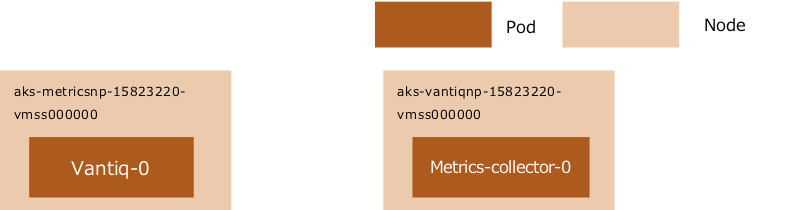

```sh
$ kubectl get pods -n app -o wide
NAME                           READY   STATUS      RESTARTS   AGE     IP              NODE                                
👉metrics-collector-0            1/1     Running     0          38m     10.19.112.33    aks-vantiqnp-15823220-vmss000000    
mongobackup-1605657600-2rtlk   0/1     Completed   0          2d13h   10.19.112.249   aks-grafananp-15823220-vmss000000   
mongobackup-1605744000-8gmnz   0/1     Completed   0          37h     10.19.112.241   aks-grafananp-15823220-vmss000000   
mongobackup-1605830400-r842f   0/1     Completed   0          13h     10.19.112.241   aks-grafananp-15823220-vmss000000   
mongodb-0                      2/2     Running     0          6d22h   10.19.113.62    aks-mongodbnp-15823220-vmss000002   
mongodb-1                      2/2     Running     0          6d22h   10.19.113.21    aks-mongodbnp-15823220-vmss000000   
mongodb-2                      2/2     Running     0          6d22h   10.19.113.36    aks-mongodbnp-15823220-vmss000001   
userdb-0                       2/2     Running     0          6d22h   10.19.113.203   aks-userdbnp-15823220-vmss000000    
userdb-1                       2/2     Running     0          6d22h   10.19.114.11    aks-userdbnp-15823220-vmss000002    
userdb-2                       2/2     Running     0          6d22h   10.19.113.223   aks-userdbnp-15823220-vmss000001    
👉vantiq-0                       1/1     Running     0          33m     10.19.112.111   aks-metricsnp-15823220-vmss000000   
vantiq-1                       1/1     Running     0          35m     10.19.112.61    aks-vantiqnp-15823220-vmss000001   
vantiq-2                       1/1     Running     0          38m     10.19.112.75    aks-vantiqnp-15823220-vmss000002   
```
Change the scale of `metrics-collector-0` and remove it  

```sh
$ kubectl scale sts -n app metrics-collector --replicas=0
statefulset.apps/metrics-collector scaled
```

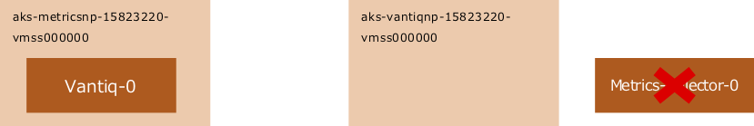

Apply `taint` to all but `aks-vantiqnp-15823220-vmss000000` in the destination

```sh
$ kubectl taint nodes --all key=value:NoSchedule
node/aks-grafananp-15823220-vmss000000 tainted
node/aks-keycloaknp-15823220-vmss000000 tainted
node/aks-keycloaknp-15823220-vmss000001 tainted
node/aks-keycloaknp-15823220-vmss000002 tainted
node/aks-metricsnp-15823220-vmss000000 tainted
node/aks-mongodbnp-15823220-vmss000000 tainted
node/aks-mongodbnp-15823220-vmss000001 tainted
node/aks-mongodbnp-15823220-vmss000002 tainted
node/aks-userdbnp-15823220-vmss000000 tainted
node/aks-userdbnp-15823220-vmss000001 tainted
node/aks-userdbnp-15823220-vmss000002 tainted
node/aks-vantiqnp-15823220-vmss000000 tainted
node/aks-vantiqnp-15823220-vmss000001 tainted
node/aks-vantiqnp-15823220-vmss000002 tainted

$ kubectl taint nodes aks-vantiqnp-15823220-vmss000000 key:NoSchedule-
node/aks-vantiqnp-15823220-vmss000000 untainted
```

Restart the `vantiq-0` to be moved (it will restart automatically when the pod is removed)

```sh
$ kubectl delete pod -n app vantiq-0
pod "vantiq-0" deleted
```

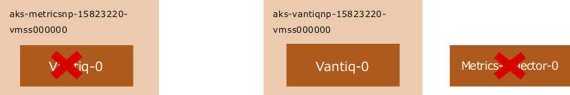

Apply `taint` to all but `aks-metricsnp-15823220-vmss000000` which is the destination of `metrics-collector-0`

```sh
$ kubectl taint nodes --all key=value:NoSchedule
node/aks-vantiqnp-15823220-vmss000000 tainted
Node aks-grafananp-15823220-vmss000000 already has key taint(s) with same effect(s) and --overwrite is false
Node aks-keycloaknp-15823220-vmss000000 already has key taint(s) with same effect(s) and --overwrite is false
Node aks-keycloaknp-15823220-vmss000001 already has key taint(s) with same effect(s) and --overwrite is false
Node aks-keycloaknp-15823220-vmss000002 already has key taint(s) with same effect(s) and --overwrite is false
Node aks-metricsnp-15823220-vmss000000 already has key taint(s) with same effect(s) and --overwrite is false
Node aks-mongodbnp-15823220-vmss000000 already has key taint(s) with same effect(s) and --overwrite is false
Node aks-mongodbnp-15823220-vmss000001 already has key taint(s) with same effect(s) and --overwrite is false
Node aks-mongodbnp-15823220-vmss000002 already has key taint(s) with same effect(s) and --overwrite is false
Node aks-userdbnp-15823220-vmss000000 already has key taint(s) with same effect(s) and --overwrite is false
Node aks-userdbnp-15823220-vmss000001 already has key taint(s) with same effect(s) and --overwrite is false
Node aks-userdbnp-15823220-vmss000002 already has key taint(s) with same effect(s) and --overwrite is false
Node aks-vantiqnp-15823220-vmss000001 already has key taint(s) with same effect(s) and --overwrite is false
Node aks-vantiqnp-15823220-vmss000002 already has key taint(s) with same effect(s) and --overwrite is false

$ kubectl taint nodes aks-metricsnp-15823220-vmss000000 key:NoSchedule-
node/aks-metricsnp-15823220-vmss000000 untainted
```

Change the scale of `Metrics-collector-0` and start it  

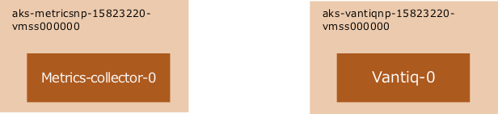

```sh
$ kubectl scale sts -n app metrics-collector --replicas=1
statefulset.apps/metrics-collector scaled
NAME                           READY   STATUS      RESTARTS   AGE     IP              NODE                                
👉metrics-collector-0            1/1     Running     0          53s     10.19.112.127   aks-metricsnp-15823220-vmss000000   
mongobackup-1605657600-2rtlk   0/1     Completed   0          2d14h   10.19.112.249   aks-grafananp-15823220-vmss000000   
mongobackup-1605744000-8gmnz   0/1     Completed   0          38h     10.19.112.241   aks-grafananp-15823220-vmss000000   
mongobackup-1605830400-r842f   0/1     Completed   0          14h     10.19.112.241   aks-grafananp-15823220-vmss000000  
mongodb-0                      2/2     Running     0          6d23h   10.19.113.62    aks-mongodbnp-15823220-vmss000002  
mongodb-1                      2/2     Running     0          6d23h   10.19.113.21    aks-mongodbnp-15823220-vmss000000
mongodb-2                      2/2     Running     0          6d23h   10.19.113.36    aks-mongodbnp-15823220-vmss000001
userdb-0                       2/2     Running     0          6d23h   10.19.113.203   aks-userdbnp-15823220-vmss000000
userdb-1                       2/2     Running     0          6d23h   10.19.114.11    aks-userdbnp-15823220-vmss000002
userdb-2                       2/2     Running     0          6d23h   10.19.113.223   aks-userdbnp-15823220-vmss000001
👉vantiq-0                       1/1     Running     0          4m47s   10.19.112.26    aks-vantiqnp-15823220-vmss000000
vantiq-1                       1/1     Running     0          79m     10.19.112.61    aks-vantiqnp-15823220-vmss000001
vantiq-2                       1/1     Running     0          82m     10.19.112.75    aks-vantiqnp-15823220-vmss000002
```
Remove taints

```sh
$ kubectl taint nodes --all key:NoSchedule-
node/aks-grafananp-15823220-vmss000000 untainted
node/aks-keycloaknp-15823220-vmss000000 untainted
node/aks-keycloaknp-15823220-vmss000001 untainted
node/aks-keycloaknp-15823220-vmss000002 untainted
node/aks-mongodbnp-15823220-vmss000000 untainted
node/aks-mongodbnp-15823220-vmss000001 untainted
node/aks-mongodbnp-15823220-vmss000002 untainted
node/aks-userdbnp-15823220-vmss000000 untainted
node/aks-userdbnp-15823220-vmss000001 untainted
node/aks-userdbnp-15823220-vmss000002 untainted
node/aks-vantiqnp-15823220-vmss000000 untainted
node/aks-vantiqnp-15823220-vmss000001 untainted
node/aks-vantiqnp-15823220-vmss000002 untainted
error: taint "key:NoSchedule" not found
```

## Confirm the correct placement of the Pod

Check Items

- For Nodes with zone redundancy, the Nodes should be located in separate zones. *failure-domain.beta.kubernetes.io/zone* should be evenly distributed among 1, 2, and 3.  
- Pods with replica is greater than or equal to 2 in *Deployment* or *ScaleSet* must be located in different Nodes.  
- The Pod must be running in the Zone where the PV (PersistentVolume) is created（`mongodb`, `grafanadb`, `influxdb`).  

Each Pod must be located on its intended Node. In particular, it is invalid for the following Pods are running on a non-specified Node. (\* can be any number or string)  

seq  | Pod  | Node  
--|---|--
1  | vantiq-* |  aks-vantiqnp-*
2  | mongodb-*  |  aks-mongodbnp-*
3  | userdb-*  |  aks-userdbnp-*
4  | influxdb-*  |  aks-grafananp-*
5  | keycloak-*  |  aks-keycloaknp-*
6  | metrics-collector-* |  aks-metricsnp-*

- As long as the above is satisfied, the Node sequence number, Pod sequence number, and AZ number do not need to match. (Example: There is `aks-vantiqnp-xxxxxxx-vmss000004` on AZ: japaneast1 and Pod `vantiq-2` running, etc.)  

- As for the `nginx-ingress-controller-xxxxxxx` and `grafana-*`, Node is not specified.  


If the pod is not placed where it should be, the following problems could occur

- Pod will not start due to insufficient CPU/Memory resources (*Pending* status).  
- The disk cannot mount to the Pod and the Pod will not start.  

Check that the Node is placed in the correct Zone

```sh
$ kubectl get nodes -L failure-domain.beta.kubernetes.io/zone
NAME                                 STATUS   ROLES   AGE   VERSION    ZONE
aks-grafananp-15823220-vmss000000    Ready    agent   25d   v1.16.15   japaneast-1
aks-keycloaknp-15823220-vmss000000   Ready    agent   25d   v1.16.15   japaneast-1
aks-keycloaknp-15823220-vmss000001   Ready    agent   25d   v1.16.15   japaneast-2
aks-keycloaknp-15823220-vmss000002   Ready    agent   25d   v1.16.15   japaneast-3
aks-metricsnp-15823220-vmss000000    Ready    agent   25d   v1.16.15   japaneast-1
aks-mongodbnp-15823220-vmss000000    Ready    agent   25d   v1.16.15   japaneast-1
aks-mongodbnp-15823220-vmss000001    Ready    agent   25d   v1.16.15   japaneast-2
aks-mongodbnp-15823220-vmss000002    Ready    agent   25d   v1.16.15   japaneast-3
aks-userdbnp-15823220-vmss000000     Ready    agent   9d    v1.16.15   japaneast-1
aks-userdbnp-15823220-vmss000001     Ready    agent   9d    v1.16.15   japaneast-2
aks-userdbnp-15823220-vmss000002     Ready    agent   9d    v1.16.15   japaneast-3
aks-vantiqnp-15823220-vmss000000     Ready    agent   25d   v1.16.15   japaneast-1
aks-vantiqnp-15823220-vmss000001     Ready    agent   25d   v1.16.15   japaneast-2
aks-vantiqnp-15823220-vmss000002     Ready    agent   25d   v1.16.15   japaneast-3
```

Check that the Pod is placed in the correct Node

```sh
$ kubectl get pods -A -o wide
NAMESPACE     NAME                                                READY   STATUS      RESTARTS   AGE     IP              NODE                                 NOMINATED NODE   READINESS GATES
app           metrics-collector-0                                 1/1     Running     0          2d18h   10.19.112.127   aks-metricsnp-15823220-vmss000000    <none>           <none>
app           mongobackup-1605916800-2mchr                        0/1     Completed   0          2d8h    10.19.112.244   aks-grafananp-15823220-vmss000000    <none>           <none>
app           mongobackup-1606003200-nrx22                        0/1     Completed   0          32h     10.19.112.237   aks-grafananp-15823220-vmss000000    <none>           <none>
app           mongobackup-1606089600-8gjdf                        0/1     Completed   0          8h      10.19.112.228   aks-grafananp-15823220-vmss000000    <none>           <none>
app           mongodb-0                                           2/2     Running     0          9d      10.19.113.62    aks-mongodbnp-15823220-vmss000002    <none>           <none>
app           mongodb-1                                           2/2     Running     0          9d      10.19.113.21    aks-mongodbnp-15823220-vmss000000    <none>           <none>
app           mongodb-2                                           2/2     Running     0          9d      10.19.113.36    aks-mongodbnp-15823220-vmss000001    <none>           <none>
app           userdb-0                                            2/2     Running     0          9d      10.19.113.203   aks-userdbnp-15823220-vmss000000     <none>           <none>
app           userdb-1                                            2/2     Running     0          9d      10.19.114.11    aks-userdbnp-15823220-vmss000002     <none>           <none>
app           userdb-2                                            2/2     Running     0          9d      10.19.113.223   aks-userdbnp-15823220-vmss000001     <none>           <none>
app           vantiq-0                                            1/1     Running     0          2d18h   10.19.112.26    aks-vantiqnp-15823220-vmss000000     <none>           <none>
app           vantiq-1                                            1/1     Running     0          2d19h   10.19.112.61    aks-vantiqnp-15823220-vmss000001     <none>           <none>
app           vantiq-2                                            1/1     Running     0          2d20h   10.19.112.75    aks-vantiqnp-15823220-vmss000002     <none>           <none>

(omission…)

shared        grafana-67df56d6dc-4jj57                            1/1     Running     0          9d      10.19.112.178   aks-keycloaknp-15823220-vmss000001   <none>           <none>
shared        grafanadb-mysql-85b686d65c-wgx9s                    1/1     Running     0          9d      10.19.112.166   aks-keycloaknp-15823220-vmss000001   <none>           <none>
shared        influxdb-0                                          1/1     Running     0          9d      10.19.112.236   aks-grafananp-15823220-vmss000000    <none>           <none>
shared        keycloak-0                                          1/1     Running     0          9d      10.19.112.132   aks-keycloaknp-15823220-vmss000000   <none>           <none>
shared        keycloak-1                                          1/1     Running     0          9d      10.19.112.199   aks-keycloaknp-15823220-vmss000002   <none>           <none>
shared        keycloak-2                                          1/1     Running     0          9d      10.19.113.219   aks-userdbnp-15823220-vmss000001     <none>           <none>
shared        nginx-ingress-controller-76bbccfb8f-5lc2n           1/1     Running     0          9d      10.19.112.197   aks-keycloaknp-15823220-vmss000002   <none>           <none>
shared        nginx-ingress-controller-76bbccfb8f-89wcz           1/1     Running     0          9d      10.19.112.177   aks-keycloaknp-15823220-vmss000001   <none>           <none>
shared        nginx-ingress-controller-76bbccfb8f-9gbv5           1/1     Running     0          9d      10.19.112.229   aks-grafananp-15823220-vmss000000    <none>           <none>
shared        nginx-ingress-default-backend-7fb6f95b89-kxjc7      1/1     Running     0          9d      10.19.112.174   aks-keycloaknp-15823220-vmss000001   <none>           <none>
shared        telegraf-ds-2vm8w                                   1/1     Running     0          9d      10.19.113.251   aks-userdbnp-15823220-vmss000002     <none>           <none>
shared        telegraf-ds-5lhxm                                   1/1     Running     0          9d      10.19.113.65    aks-mongodbnp-15823220-vmss000002    <none>           <none>
shared        telegraf-ds-5sxt9                                   1/1     Running     0          9d      10.19.112.196   aks-keycloaknp-15823220-vmss000002   <none>           <none>
shared        telegraf-ds-c2q9l                                   1/1     Running     0          9d      10.19.113.191   aks-userdbnp-15823220-vmss000000     <none>           <none>
shared        telegraf-ds-d6wgg                                   1/1     Running     0          9d      10.19.113.33    aks-mongodbnp-15823220-vmss000001    <none>           <none>
shared        telegraf-ds-gjjnc                                   1/1     Running     0          9d      10.19.112.239   aks-grafananp-15823220-vmss000000    <none>           <none>
shared        telegraf-ds-h2d4l                                   1/1     Running     1          9d      10.19.112.155   aks-keycloaknp-15823220-vmss000000   <none>           <none>
shared        telegraf-ds-j7sl9                                   1/1     Running     0          9d      10.19.112.120   aks-metricsnp-15823220-vmss000000    <none>           <none>
shared        telegraf-ds-l7b55                                   1/1     Running     0          9d      10.19.112.85    aks-vantiqnp-15823220-vmss000002     <none>           <none>
shared        telegraf-ds-l9b7d                                   1/1     Running     0          9d      10.19.113.9     aks-mongodbnp-15823220-vmss000000    <none>           <none>
shared        telegraf-ds-nckml                                   1/1     Running     0          9d      10.19.112.183   aks-keycloaknp-15823220-vmss000001   <none>           <none>
shared        telegraf-ds-r92hc                                   1/1     Running     0          9d      10.19.112.60    aks-vantiqnp-15823220-vmss000001     <none>           <none>
shared        telegraf-ds-sg4kg                                   1/1     Running     0          9d      10.19.112.10    aks-vantiqnp-15823220-vmss000000     <none>           <none>
shared        telegraf-ds-wvqln                                   1/1     Running     0          9d      10.19.113.232   aks-userdbnp-15823220-vmss000001     <none>           <none>
shared        telegraf-prom-6d6598f56b-dsf9n                      1/1     Running     0          9d      10.19.113.249   aks-userdbnp-15823220-vmss000002     <none>           <none>
```

Check the PV that the Pod is *Claim* and the Zone where the PV is located

```sh
$ kubectl get pv -L failure-domain.beta.kubernetes.io/zone
NAME                                       CAPACITY   ACCESS MODES   RECLAIM POLICY   STATUS   CLAIM                             STORAGECLASS   REASON   AGE   ZONE
pvc-033fa5eb-e3ed-4e87-84b7-78dfe66a5d16   500Gi      RWO            Retain           Bound    app/datadir-userdb-2              vantiq-sc               9d    japaneast-2
pvc-13d491a7-b4cf-4d0b-9f06-599a33b2d1ea   500Gi      RWO            Retain           Bound    app/datadir-mongodb-1             vantiq-sc               9d    japaneast-1
pvc-13e6c453-44a2-4c96-9044-8aca44a9d559   5Gi        RWO            Retain           Bound    shared/grafana                    vantiq-sc               9d    japaneast-2
pvc-2be552e9-ef10-47f7-a4e7-e932cac292ed   500Gi      RWO            Retain           Bound    app/datadir-userdb-0              vantiq-sc               9d    japaneast-1
pvc-461fd9ca-d9c8-48d3-bf39-215503ec07b0   150Gi      RWO            Retain           Bound    shared/influxdb-data-influxdb-0   vantiq-sc               9d    japaneast-1
pvc-85001e7e-0a3b-4594-961a-ed069073ee30   8Gi        RWO            Retain           Bound    shared/grafanadb-mysql            vantiq-sc               9d    japaneast-2
pvc-97ca324b-a7cd-458f-ad0c-b4d4b9ed08e2   500Gi      RWO            Retain           Bound    app/datadir-mongodb-2             vantiq-sc               9d    japaneast-2
pvc-b2711b97-94b5-4591-afdf-433c86e1f52c   500Gi      RWO            Retain           Bound    app/datadir-userdb-1              vantiq-sc               9d    japaneast-3
pvc-f1fd088d-3704-465a-bba8-1c6eff6ae701   500Gi      RWO            Retain           Bound    app/datadir-mongodb-0             vantiq-sc               9d    japaneast-3
```


## Check for announcements about infrastructure failures

Check the status of infrastructure failures  

<https://status.azure.com/status/>

Check Items

- No infrastructure failures have occurred
- Each Availability Zone is up and running
- Nodes are distributed across availability zones（if running correctly, zone balance should be maintained)    
   <https://docs.microsoft.com/en-us/azure/virtual-machine-scale-sets/virtual-machine-scale-sets-use-availability-zones#zone-balancing>

## Check Grafana and Error Logs

Find out what causes alerts and failures with VANTIQ Platform\'s Monitor.  

Check Items and Remediation Actions for System Admin
seq  |  Check Items | Privilege  |  Remediation Actions
--|---|---|--
1  | Is it possible to log in to the VANTIQ IDE?  | system admin  |  If internal errors occur when logging into the VANTIQ IDE, there is a problem between keycloak and VANTIQ. Restart the appropriate service.
2  |  Whether the usage of VANTIQ resources is abnormally high（if CPU utilization, memory utilization, GC time, etc., is more than double the average value for about one week, or if the CPU utilization exceeds 200%）. | system admin  |  Ask Org Admin to check if there is any process that is consuming a lot of resources or any operation that triggered it. If it does not recover spontaneously after removing the cause, restart the service.
3  | Whether the usage rate of mongoDB is abnormally high（the number of requests, CPU usage, memory usage, etc., is more than double the average value for about one week, or if the CPU utilization exceeds 200%）.  | system admin  |  Ask Org Admin to check if there is any process that is consuming a lot of resources or any operation that triggered it. If it does not recover spontaneously after removing the cause, restart the service.
4  | Whether the data volume has temporarily increased.  | system admin  |  Ask Org Admin to resolve the cause of the sudden increase in data volume (requests).
5  | Whether Quota Violation or Credit Exhaustion has occurred (if any errors have occurred).  | system admin  |  Ask Org Admin to resolve the cause of the sudden increase in data volume (requests). If it does not recover spontaneously after removing the cause, restart the service.
6  | Whether the amount of data or the number of events has increased (if the processing time is more than 10 seconds).  | system admin  |  Identify Apps and Resources where the number of events or processing time has significantly increased and request the Application Maintenance Team to remediate the situation.
7  | Whether Quota Violation or Credit Exhaustion has occurred (if any errors have occurred).  |  system admin |  Work with the Application Maintenance Team to identify the cause process and data source, and request remediation.
8  | Whether timeout errors have occurred (processing for more than 2 minutes). Whether any events with a long processing time have took (a few seconds to 2 minutes).  | system admin  |  Work with the Application Maintenance Team to identify the cause process and data source, and request remediation.
9  | Whether a Drop is occurring. | system admin  |  Identify Apps and Resources where the number of events or processing time has significantly increased and request the Application Maintenance Team to remediate the situation.


Check Items and Remediation Actions for Org Admin  
seq  |  Check Items | Privilege  |  Remediation Actions
--|---|---|--
6  | Whether the amount of data or the number of events has increased (if the processing time is more than 10 seconds). | org admin  |  Identify Apps and Resources where the number of events or processing time has significantly increased and request the Application Maintenance Team to remediate the situation.
7  | Whether Quota Violation or Credit Exhaustion has occurred (if any errors have occurred).  |  org admin |  Work with the Application Maintenance Team to identify the cause process and data source, and request remediation.
8  | Whether timeout errors have occurred (processing for more than 2 minutes). Whether any events with a long processing time have took (a few seconds to 2 minutes). | org admin  |  Work with the Application Maintenance Team to identify the cause process and data source, and request remediation.
9  | Whether a Drop is occurring. | org admin  |  Identify Apps and Resources where the number of events or processing time has significantly increased and request the Application Maintenance Team to remediate the situation.

#### How to use Grafana

Go to [Administer] → [Grafana] (The figure shows an example of System Admin privilege.)


Select [Home]

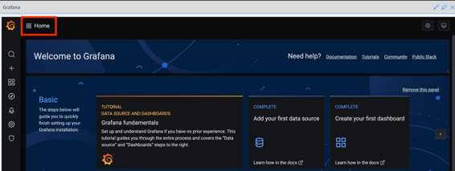

Select [Dashboards]  
 \- Dashboards varies by permission level.  

After selecting Dashboard, set the date, etc. to be checked.    
- Set the time range and refresh interval.

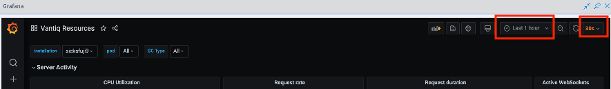  
[Relative time ranges] allows to select preset time ranges. (depending on the configured time zone)  
Also possible to select the refresh interval.  

[Absolute time range] allows to set a custom time range.   
\- Enter the date and time into [From] and [To], and then select [Apply time range]


The values set here are listed in [Recently used absolute ranges] and are available for reuse.

- Enlarged view is available in two ways

Select [View] from the pull-down menu of the panel title.   
Drag the area on the graph that is desired to be enlarged.


#### Examples of checking items with System Admin privilege

Dashboard with System Admin privilege


1.  Is it possible to log in to the VANTIQ IDE?    
Whether or not error messages such as authentication are displayed when logging in.  


2.  Whether the usage of VANTIQ resources is abnormally high (CPU utilization, memory utilization, GC time, etc.）  
`Vantiq Resources`


3.  Whether the usage rate of mongoDB is abnormally high (the number of requests, CPU usage, memory usage）  
`MongoDB Monitoring Dashboard`

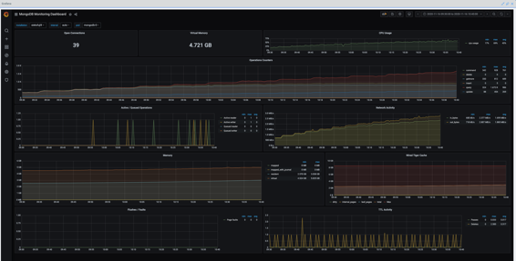

4.  Whether the data volume has temporarily increased.    
`Organization Activity`

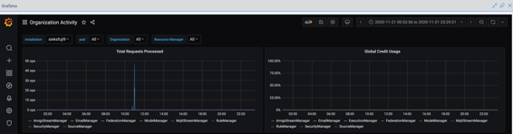

5.  Whether Quota Violation or Credit Exhaustion has occurred.   
`Organization Activity`


It is also possible to check in the error pane of the VANTIQ IDE.


6.  Whether timeout errors have occurred. Whether any events with a long processing time have took.  
`Vantiq Resources` -- `Request Duration`


7.  If an anomaly is found, check the performance of each organization, identify the organization with the problem, and instruct its administrator accordingly.


#### Examples of checking items with Organization Admin privilege

Dashboard with Organization Admin privilege

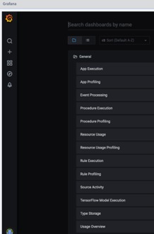

6.  Whether the amount of data or the number of events has increased.    
`App Execution`

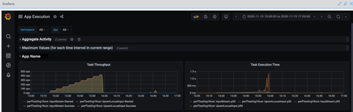

7.  Whether Quota Violation or Credit Exhaustion has occurred.     
`Usage Overview`

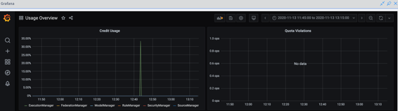

8.  Whether timeout errors have occurred. Whether any events with a long processing time have took.  
`Rule Execution`, `Procedure Execution`


9.  Whether a Drop is occurring.  
`Event Processing` -- `Drops`


10. If an anomaly is found, identify the namespace with the problem and instruct the namespace administrator accordingly.  

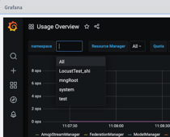

## Request a response from the Application Maintenance Team

Ask the Application Maintenance Team to verify the problematic application and correct the problem. If the problem is not caused by a constant increase in data volume, the application will resolve the issue.  

Check Items and Remediation Actions

seq  | Check Items  |  Responsible for checking |  Remediation Actions
--|---|---|--
1  | Is it possible to log in to the VANTIQ IDE? Is the event processing working?  | Application Maintenance Team  |  If internal errors occur when logging into the VANTIQ IDE, there is a problem between keycloak and VANTIQ. Restart the appropriate service. On the other hand, if only login is disabled but event processing is running behind it, the timing of the restart should be coordinated with the Operations Team.
2  | Whether the amount of data or the number of events has increased rapidly (if the processing time is more than 10 seconds）.  |  Application Maintenance Team |  Identify Apps and Resources where the number of events or processing time has significantly increased, and do temporarily deactivate, block the data source, and deploy emergency fixes.
3  | Whether timeout errors have occurred (processing for more than 2 minutes).Whether any events with a long processing time have took (a few seconds to 2 minutes).  | Application Maintenance Team  |  Identify the processing of the cause and data source, temporarily shut it down, and take temporary responses, etc. A common cause is response delays due to synchronous calls from the point-to-point system to which the VANTIQ application is linked, and the asynchronous design needs to be reviewed.
4  | Whether any changes to the application have been released recently.  | Application Maintenance Team  |  If there is a problem with a recently deployed application, redeploy the previous version.
5  | Whether a large number of errors have occurred.  | Application Maintenance Team  |  Identify Apps and Resources where the number of events or processing time has significantly increased, and do temporarily deactivate, block the data source, and deploy emergency fixes. If the problem is with the logic of the application, it is necessary to verify that there are no problems in the development environment. If the problem is related to quota, it is necessary to adjust the number of events and the amount of data, and reconsider the design.
6  | Whether a large amount of data has recently been injected into Type.  | Application Maintenance Team  |  Suspend the data input.


#### Example of checking items with Developer privilege

Dashboard with Developer privilege  


1.  Is it possible to log in to the VANTIQ IDE? Is the event processing working?  


2.  Whether the amount of data or the number of events has increased rapidly.    
`App Execution`  

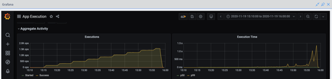

3.  Whether timeout errors have occurred. Whether any events with a long processing time have took.   
`Procedure Execution`, `Rule Execution`  

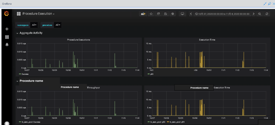

4.  Whether any changes to the application have been released recently.    
Confirm release information, etc.  

5.  Whether a large number of errors have occurred.    
It is also possible to check in the error pane of the VANTIQ IDE.


6.  Whether a large amount of data has recently been injected into Type.    
It is possible to confirm through interviews or in the error pane of the VANTIQ IDE.


## Escalate to the Support team

For VANTIQ application issues, follow the template below.

[Support-Issue-Submission-Template.docx](https://community.vantiq.com/forums/topic/support-issue-submission-template/) _(login required)_

For issues related to the VANTIQ infrastructure, follow the template below to provide information.

To  jp-customersuccess \<jp-customersuccess\@vantiq.com

- Cluster Name / Cluster number
- Incident Description / Resource / Incident description, resources with problems   
- Submission Type {Defect, Enhancement, Developer Support, Infrastructure}
- Severity Affected infrastructure  {1, 2, 3, 4}
- Screenshots
- Diagnosis Information
  - `kubectl get pods -A -o wide`
  - `kubectl get nodes -o wide`
  - `kubectl logs`
  - `kubectl describe`
  - etc.
- Recovery actions already taken.
