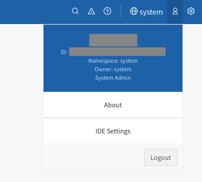
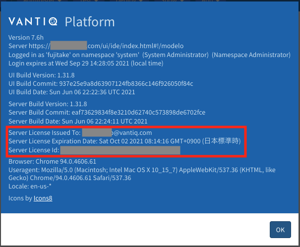
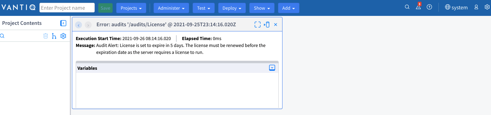

## この記事について

Vantiq Private Cloudにてライセンス有効期間を確認する手順を案内します。

## 前提条件

System Admin権限を有していること

## 本文

ライセンス有効期間を確認したいVantiq Private Cloudにアクセスします。

System Namespaceに移動します。

Navigation Bar右側にあるUser(人)アイコンをクリックします。

表示されるメニューからAboutをクリックします。

表示される項目の`Server License Expiration Date`がライセンスの有効期間となります。

ライセンスが有効期間を超過する前にライセンス更新をご手配下さい。

## ライセンス失効の通知

ライセンス期間が残り少なくなると、System Namespaceにはaudit errorが記録されます。

## ライセンスの更新について

担当営業にご相談下さい。
