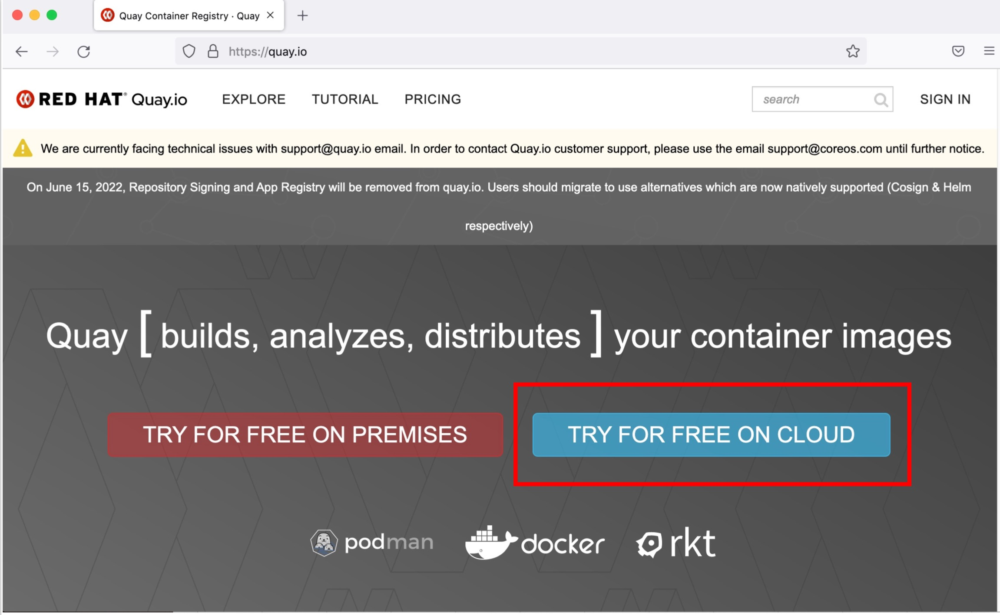
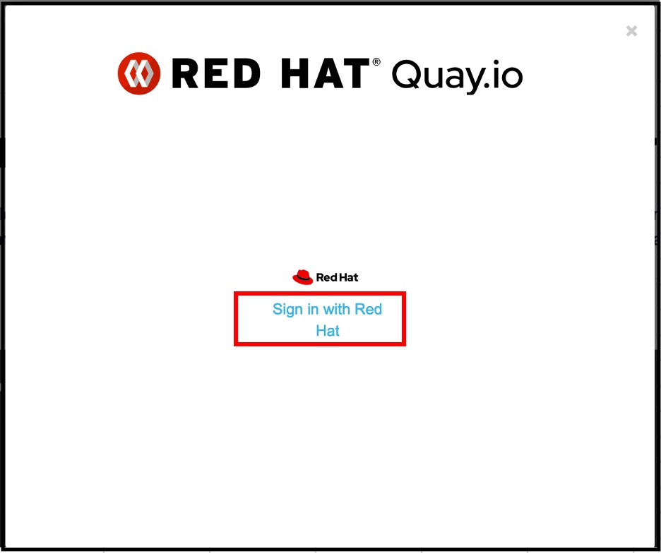
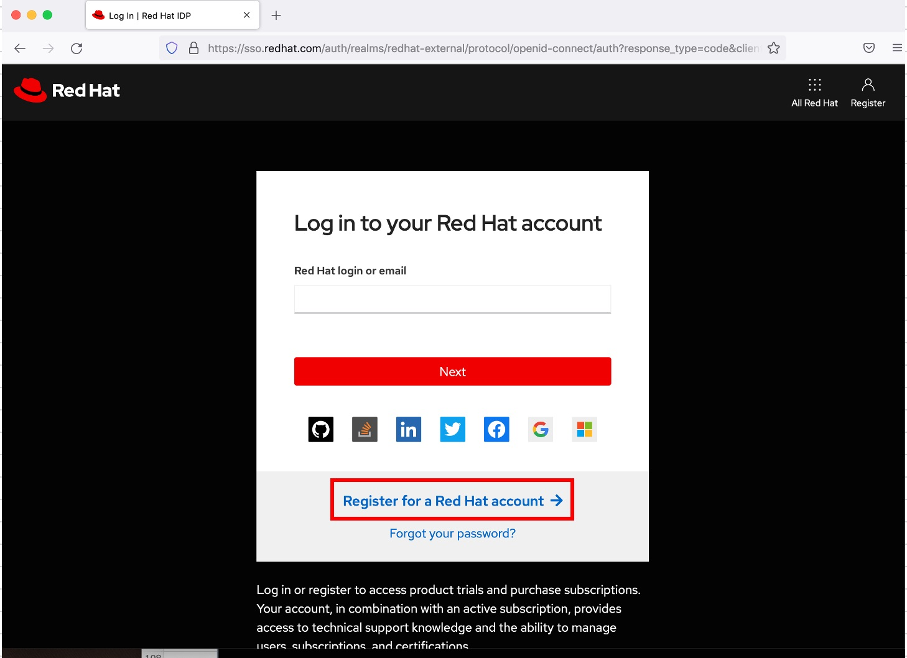
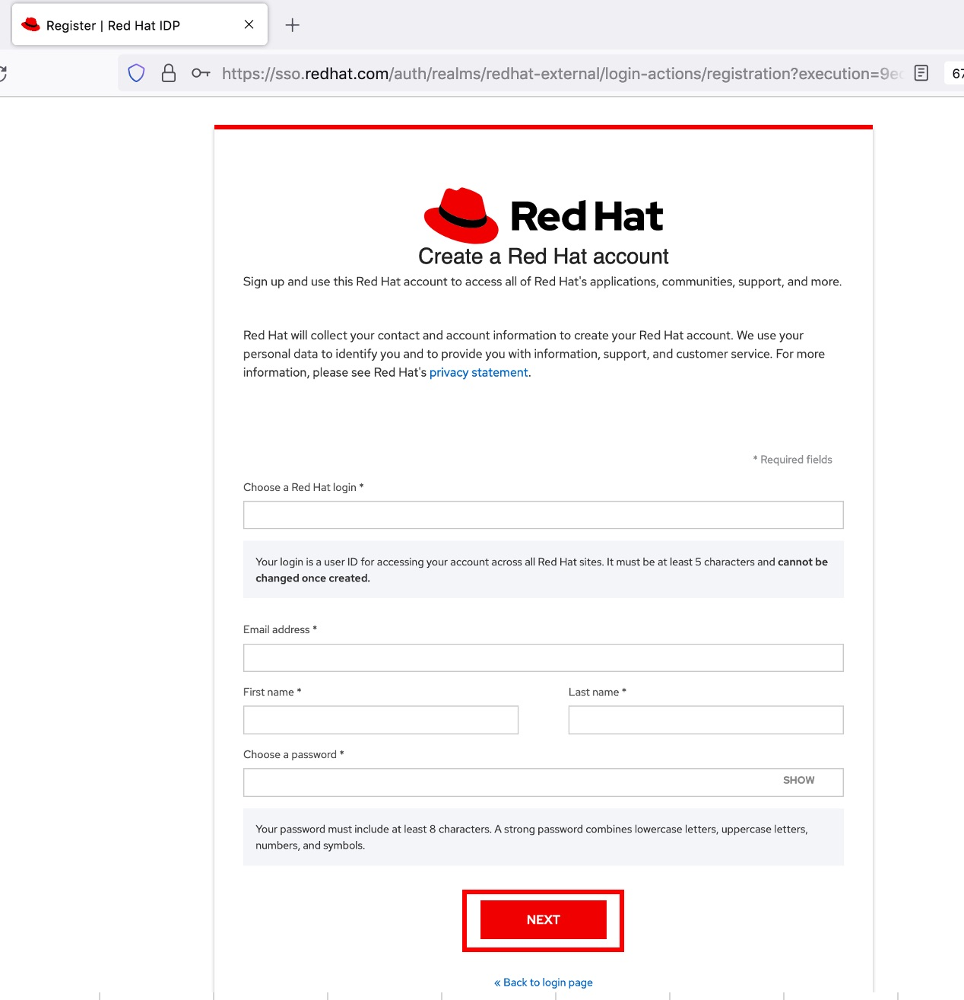
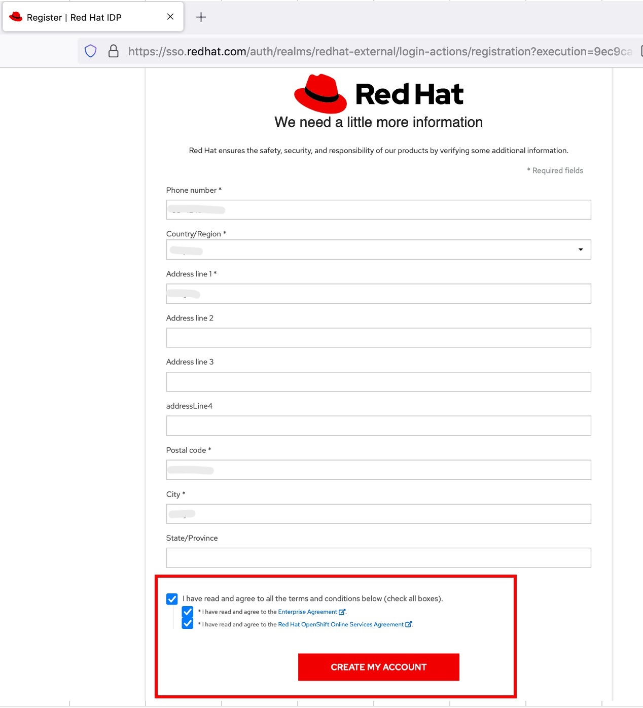
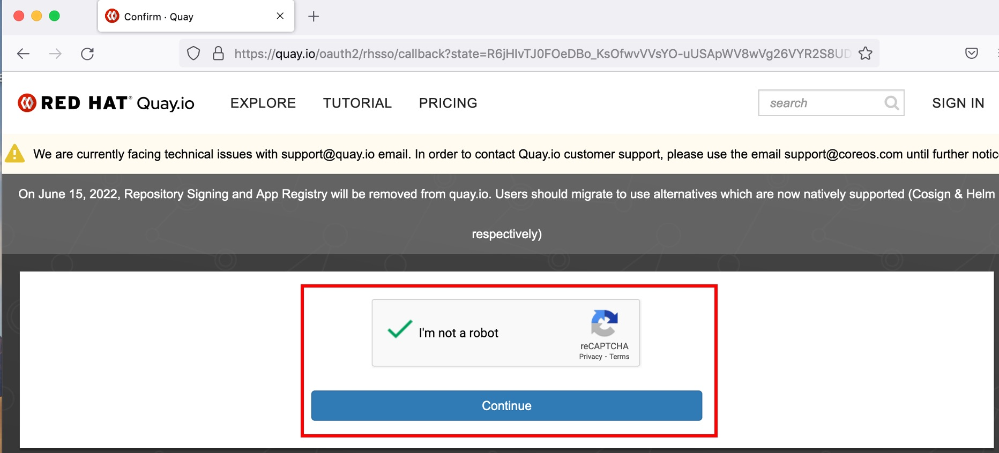
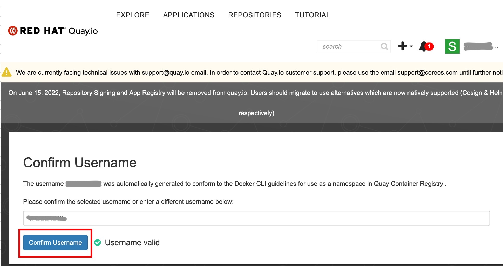
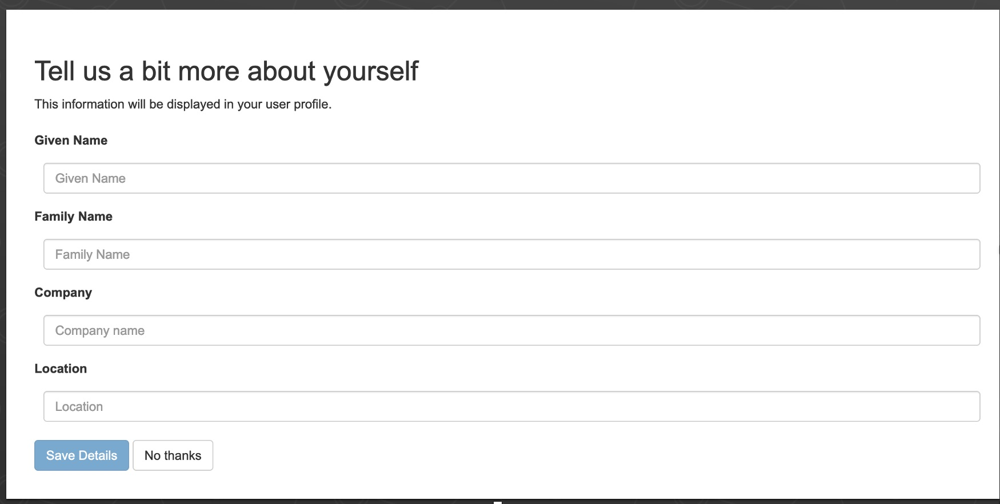
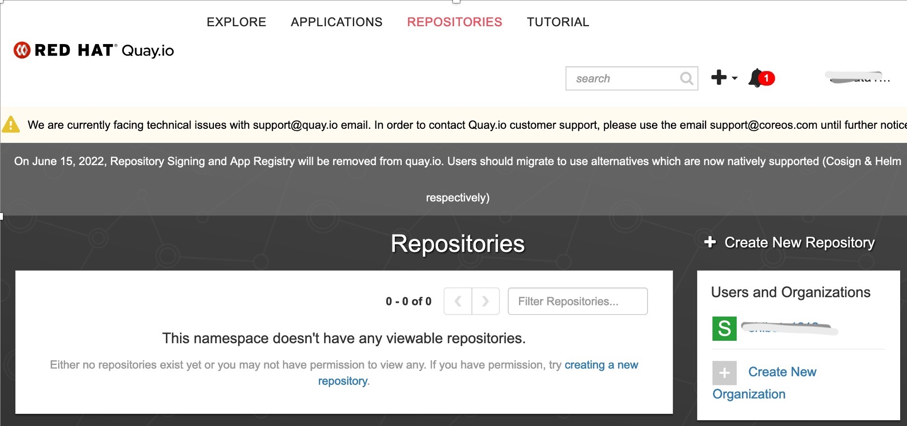
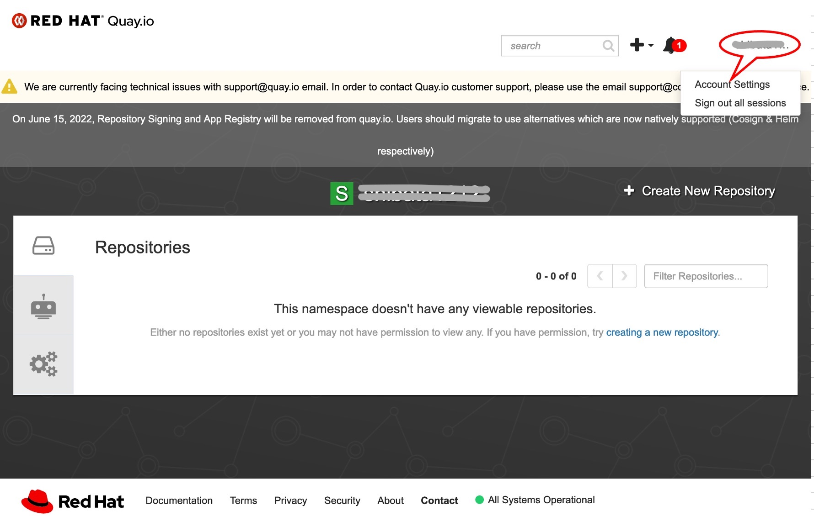

## この記事について

Quay.io に新規アカウントを作成する手順について記述します。

## Quay.io の新規アカウント作成手順

  RED HAT アカウントにて Quay.io に Sing in することができます。    
  ここでは、新規に作成する手順を記載します。  

## https://quay.io/ にアクセスします

### 1. [TRY FOR FREE ON CLOUD] を選択します  

### 2. いずれかのプランの [Start Free Traial] を選択します

### 3. RED HAT の画面において、[Sign in with Red Hat] を選択します

### 4. [Register for a Red Hat account] を選択します

### 5. すべての項目を入力し、[NEXT] を選択します

  

### 6. 必須の項目を入力し、チェックボックにチェックをいれて、[CREATE MY ACCOUNT] を選択します

  

### 7. [I'm not a robot] チェックボックスにチェックをいれ、[Continue] を選択します

  

### 8. Username を確認したら、[Confirm Username] を選択します  

  

### 9. 次のダイアログは [No thanks] を選択しても構いません

  

### 10. これで [Quay.io] のレポジトリにはいることができました

  

### 11. Username をクリックすると、Sign out などができます

  
