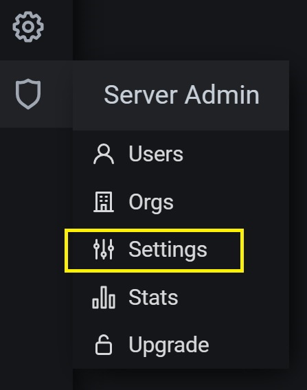
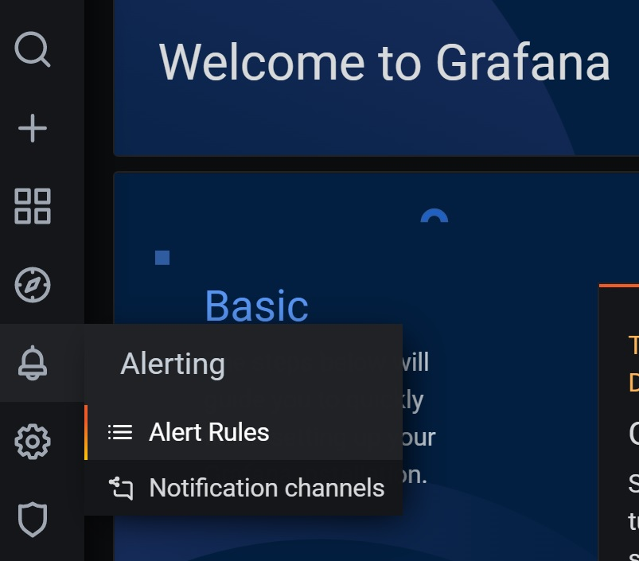
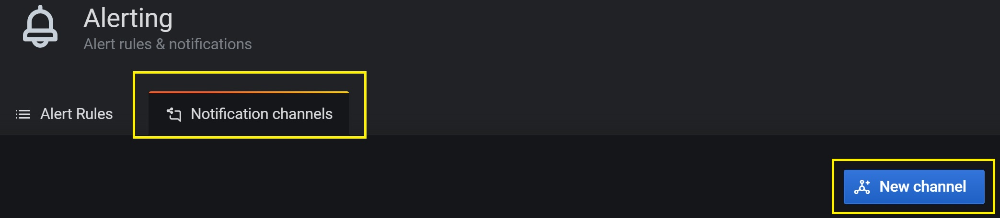
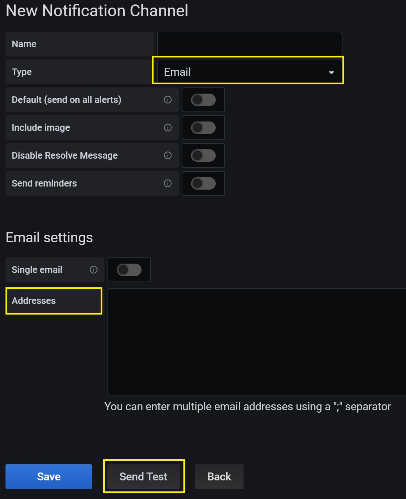

## Grafana 環境構築全般
- ここでは Grafana の環境構築にまつわるトピックを全般的扱う
## Table Of Contents
- [Email Notification のための設定](#email_notification)

## Email Notification のための設定 <a id="email_notification"></a>
### 1. deploy.yaml の編集
- 以下の項目を適宜書き換える

|項目|内容|
----|----
|&lt;smtp server host name&gt;|SMTP サーバの名称|
|&lt;from address&gt;|誰から転送されたのか（メールアドレス）|
|&lt;user&gt;|ユーザ名称|
|&lt;password&gt;|パスワード|

- deploy.yaml を以下の様に構成する
<pre>
grafana:
  grafana.ini:
    smtp:
      enabled: true
      host: &lt;smtp server host name&gt;
      from_address &lt;from address&gt;
      user: &lt;user name&gt;
      password: &lt;password&gt;git
</pre>

### 2. Task deployVantiq の実行
- 以下の項目を適宜書き換える

|項目|内容|
----|----
|&lt;cluster name&gt;|クラスタ名称|
```
cd ~/k8sdeploy_tools
./gradlew -Pcluster=<cluster name> deployVantiq
```

### 3. Vantiq IDE の設定
- 以下に手順を示す

|項目|内容|
----|----
|ログイン|・system admin アカウントでログイン|
||・SMTP の設定結果を確認|
|Grafana 表示|・TOP Menu > Administer > grafana|
||・Alert Rules 選択|
||・Notification Channel 選択<br>・New channel をクリック|
||・Email を選択<br>・Addresses: 転送先のメールアドレスを設定（複数可能）<br>・Send Test で確認|
