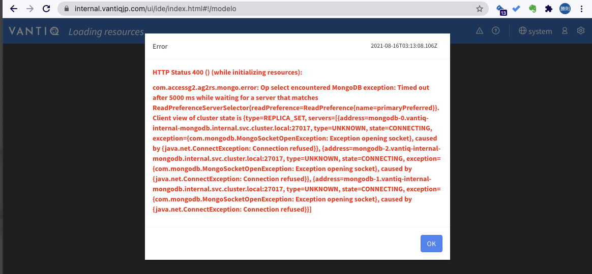
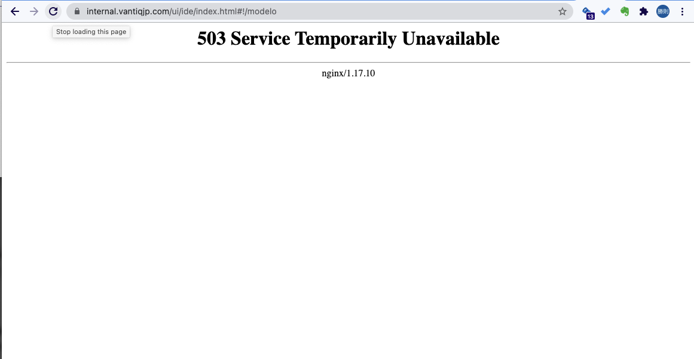

# Vantiqのmongodb構成について

## Vantiqで構成しているMongoDBの可用性について

### TL;DR
3台のミラー構成のうち最低2台が稼働していることが必要である。

### Details
Vantiqのmongodbは3台のミラー構成になっていますが、内訳は以下の通りです。

- 3台稼働の場合: Primary + Secondary + Secondary
- 2台稼働の場合: Primary + Secondary
- 1台稼働の場合: Secondary

Primaryは書き込み専用, Secondaryは読み込み専用です。
AZ障害等で1台になると、読み込みしかできないので、書き込みしようとするとタイムアウトエラーとなります。


数分後、Vantiq podが定期的な書き込みができず（ここは推測）、PodのContainer自体が`Ready`でなくなります。
その結果 `503 Service Temporary Unavailable`となります。




## userdbを構成する
ISVモデルでマルチテナントに展開する場合、`userdb`を構成する。
`deploy.yaml`に`vanntiq.userdb`プロパティを追加する。
以下は、さらに`userdb`のバックアップと意図したNodeにスケジュールされるよう`affinity`を追加した例。
```yaml
vantiq:
  userdb:
    enabled: true
    backup:
      enabled: true
      provider: azure
      schedule: "@daily"
      bucket: userdbbackup

    affinity: |
      nodeAffinity:
        {{- if eq .Values.workloadPreference "hard" }}
        requiredDuringSchedulingIgnoredDuringExecution:
          nodeSelectorTerms:
          - matchExpressions:
            - key: vantiq.com/workload-preference
              operator: In
              values:
              - userdb
        {{- else }}
        preferredDuringSchedulingIgnoredDuringExecution:
        - weight: 50
          preference:
            matchExpressions:
            - key: vantiq.com/workload-preference
              operator: In
              values:
              - userdb
        {{- end }}
      podAntiAffinity:
        requiredDuringSchedulingIgnoredDuringExecution:
          - labelSelector:
              matchExpressions:
                - key: app
                  operator: In
                  values:
                    - userdb
                    - vantiq
                    - vision-analytics
                    - metrics-collector
                    - influxdb-influxdb
                    - influxdb
            topologyKey: kubernetes.io/hostname
```

## mongodb backup jobの削除のタイミング

`mongodbbackup`のcronjobの中に、`successfulJobsHistoryLimit: 3`　が設定されている。

```sh
kubectl get cj -n internal mongobackup -o yaml
```
```yaml
apiVersion: batch/v1beta1
kind: CronJob
metadata:
  annotations:
...
schedule: '@daily'
successfulJobsHistoryLimit: 3
suspend: false
```

それにより、実行済みのJobは３世代以上は自動的に削除される。

```sh
$ kubectl get pods -n internal
NAME                           READY   STATUS      RESTARTS   AGE
metrics-collector-0            1/1     Running     6          81d
mongobackup-1630195200-z8ztx   0/1     Completed   0          2d11h
mongobackup-1630281600-q76jh   0/1     Completed   0          35h
mongobackup-1630368000-f6wjk   0/1     Completed   0          11h
mongodb-0                      2/2     Running     0          15d
mongodb-1                      2/2     Running     0          15d
```
