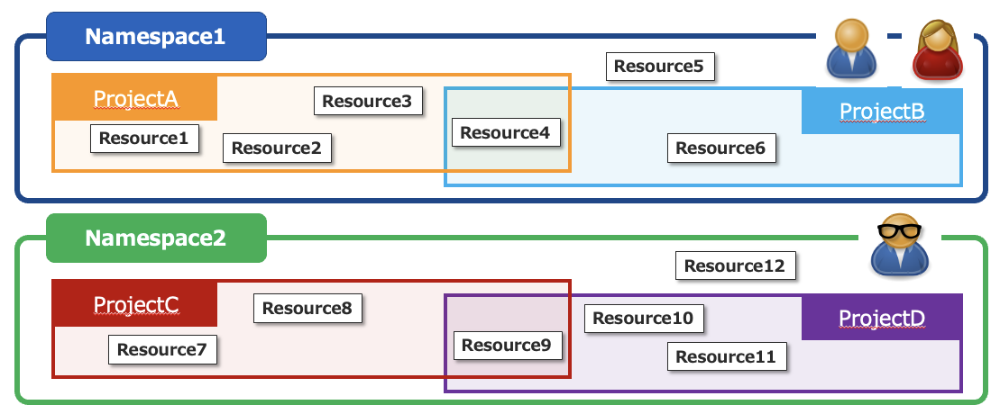
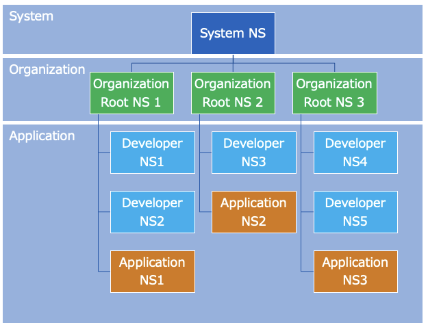
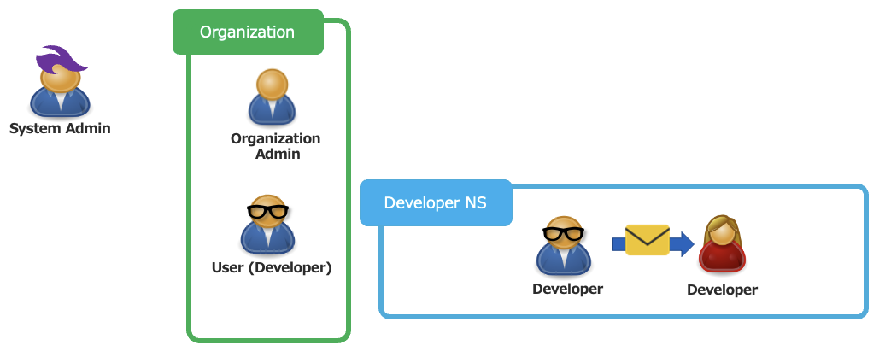
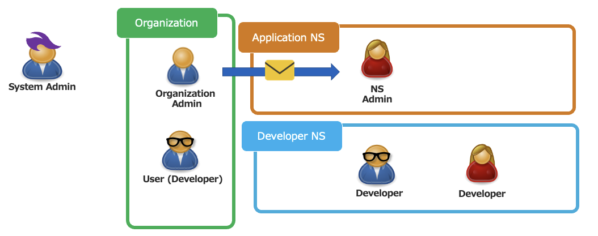
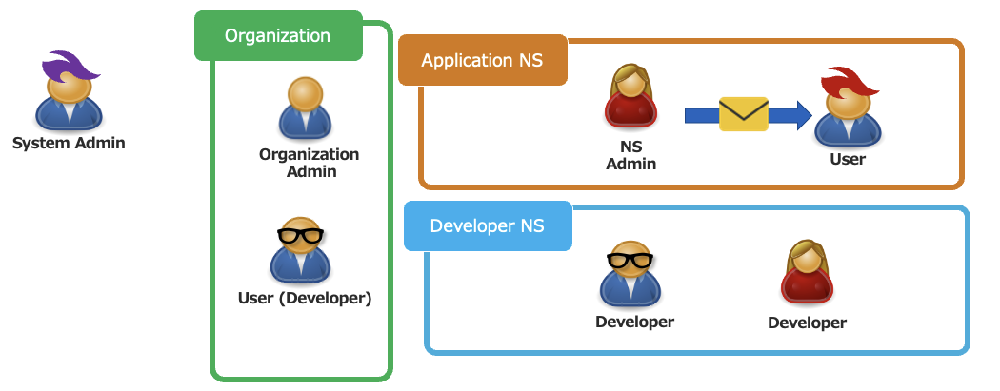
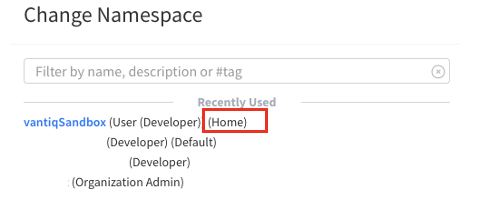

# Vantiq Organization, Namespace, User Role の関係

### Namespace とは
- Namespace は開発リソースを排他的に分離することを保証します。
- 開発 Resource とは、App、Procedure、Rule、Client、Project そしてUser等を含みます。
- ユーザーは、招待されたNamespaceへアクセスすることができます。

- Namespaceには４種類あり、用途が異なります。
  - **System NS** – Vantiqクラスタ全体に関するリソースを管理する
  - **Organization Root NS** – Organization（テナント）を管理する
  - **Developer NS** – 開発者がアプリケーションを開発（開発リソースを作成）する
  - **Application NS** – 運用者がアプリケーションのユーザーを管理し、アプリケーションをデプロイ、運用する
- Note: ユーザーにはNamespaceの種類は表示されません。

### Roleの種類とNamespaceとの関係
- それぞれのNamespaceの種類について取りうるRoleが定義されており、ユーザーはRoleをアサインされることで、操作を行うことができます。

NSの種類 | Role | 主な責任 | 新規ユーザー作成 | 新規NS作成 | 開発リソース作成
--|---|---|---|---|--
System NS | System Admin |- システム全体の管理  - Organizationの作成、管理  | **Yes (1)** | **Yes (2)**  | **Yes (3)** |  
Organization Root NS | Organization Admin  | - Organization全体の管理  | **Yes** | **Yes**  | **Yes (3)**
 Organization Root NS | User(Developer)  | - Developer NSの管理  | No  | **Yes**  | No  
Developer NS  | Developer  | - 開発・保守作業  | No  | **Yes**  | **Yes**
Application NS  | NS Admin  | - アプリケーションの運用   - エンドユーザー管理  | **Yes** | No | No
Application NS  | User  | - アプリケーションの利用 | No | No | No

- (1) System Adminを新規に招待できる。また、Organization作成時にOrganization Adminを新規に招待できる。
- (2) Organization Root NSのみ作成できる。
- (3) 作成はできるが推奨しない。

### Namespace へ招待する
- 権限を持ったユーザーは、招待メールを送ることでNSへのアクセスを与えることができます。

#### 新規Userを招待する
- 管理 >> ユーザー >> New)

#### 既存UserにNSへ権限を付与する
- 管理 >> Namespace >> Manage Authorization

### ユーザー利用開始シナリオ

#### 1) System AdminはOrganizationを作成する
- System AdminはOrganizationを作成し、同時にOrganization Adminを招待、割り当てます。

#### 2) Organization AdminはDeveloperを招待する

- Organization AdminはDeveloperを User (Developer)というロールで招待します。

#### 3) Developerは開発用のNamespaceを作成する

- Developerは開発用のNamespaceを作成し、Developerとなります。

#### 4) Developerは開発用のNamespaceに他の開発者を招待する

- Developerに既存ユーザーをDeveloperとして招待します。

#### 5) Organization AdminはNS Adminを招待する

- Organization AdminはApplication NSを作成します。そのNSにユーザーをNS Adminとして招待します

#### 6) NS AdminはUserを招待する

- NS AdminはユーザーをUserとして招待します。

### Home Namespace と Current Namespace

- **Home Namespace** - ユーザーのアカウント作成時（初めてNSに招待された時）のNamespaceで、ユーザー情報はHome Namespaceで管理されます。変更をすることができません。

- **Current Namespace** – 現在作業中のNamespaceです。

## References
- [Administrators Reference Guide](https://internal.vantiqjp.com/docs/system/namespaces/index.html)
