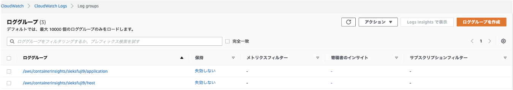
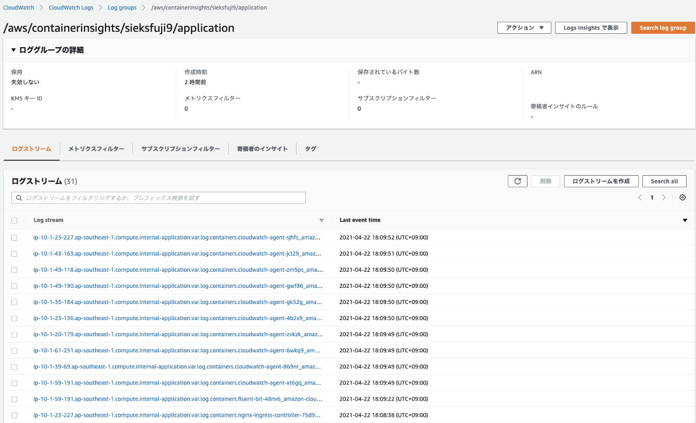
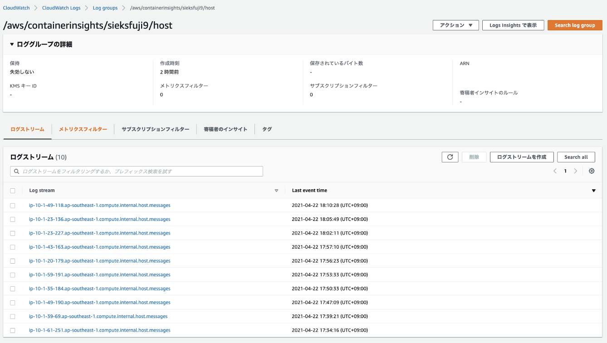
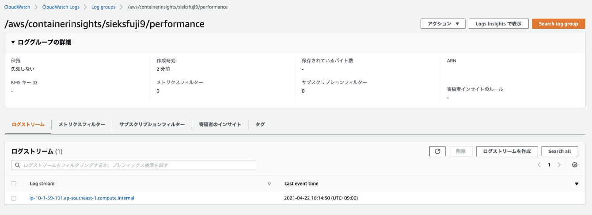
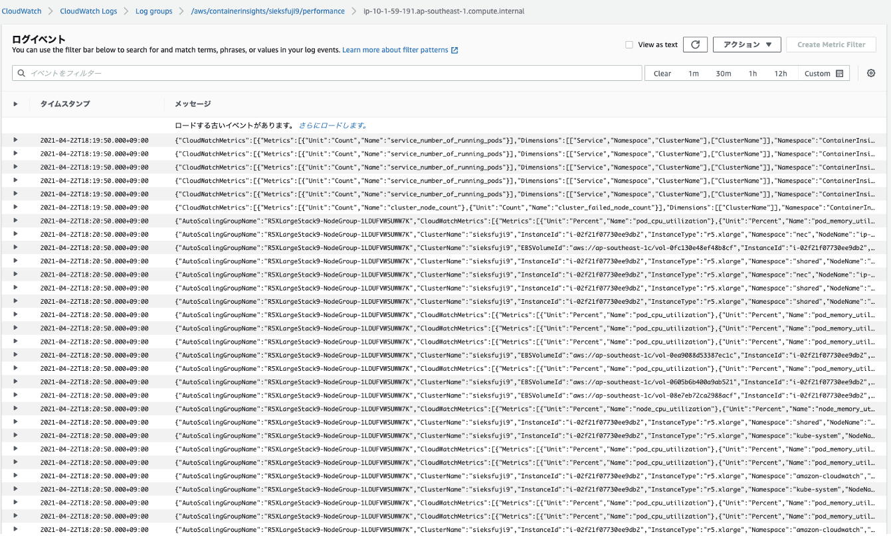

# Vantiq Cloudwatch Logs

本セクションでは、[CloudWatch Logs へログを送信する DaemonSet として Fluent Bit を設定する](https://docs.aws.amazon.com/ja_jp/AmazonCloudWatch/latest/monitoring/Container-Insights-setup-logs-FluentBit.html)に従い、EKSクラスタ上のVantiqを含むコンテナログや、メトリクスをCloudWatchに出力する手順を説明します。

#### ワーカーノードのIAMロールにCloudWatchAgentServerPolicyポリシーをアタッチする。
[前提条件を確認する](https://docs.aws.amazon.com/ja_jp/AmazonCloudWatch/latest/monitoring/Container-Insights-prerequisites.html)の「ワーカーノードの IAM ロールに必要なポリシーをアタッチするには」を参照する。

#### amazon-cloudwatch namespaceを作成

`amazon-cloudwatch` という名前の名前空間がまだない場合は、次のコマンドを入力して作成します。
```sh
kubectl apply -f https://raw.githubusercontent.com/aws-samples/amazon-cloudwatch-container-insights/latest/k8s-deployment-manifest-templates/deployment-mode/daemonset/container-insights-monitoring/cloudwatch-namespace.yaml
```

#### fluent-bit-cluster-info Configmapを作成する
次のコマンドを実行して、クラスター名とログを送信するリージョンを持つ `cluster-info` という名前の ConfigMap を作成します。`cluster-name` と `cluster-region` をクラスターの名前とリージョンに置き換えます。
```sh
ClusterName=<cluster-name>
RegionName=<cluster-region>
FluentBitHttpPort='2020'
FluentBitReadFromHead='Off'
[[ ${FluentBitReadFromHead} = 'On' ]] && FluentBitReadFromTail='Off'|| FluentBitReadFromTail='On'
[[ -z ${FluentBitHttpPort} ]] && FluentBitHttpServer='Off' || FluentBitHttpServer='On'
kubectl create configmap fluent-bit-cluster-info \
--from-literal=cluster.name=${ClusterName} \
--from-literal=http.server=${FluentBitHttpServer} \
--from-literal=http.port=${FluentBitHttpPort} \
--from-literal=read.head=${FluentBitReadFromHead} \
--from-literal=read.tail=${FluentBitReadFromTail} \
--from-literal=logs.region=${RegionName} -n amazon-cloudwatch
```

#### FluentBit最適化設定でDaemonSetをデプロイする
```sh
kubectl apply -f https://raw.githubusercontent.com/aws-samples/amazon-cloudwatch-container-insights/latest/k8s-deployment-manifest-templates/deployment-mode/daemonset/container-insights-monitoring/fluent-bit/fluent-bit.yaml
```

#### デプロイされていることを確認
```sh
kubectl get pods -n amazon-cloudwatch
NAME               READY   STATUS    RESTARTS   AGE
fluent-bit-48nv6   1/1     Running   0          20s
fluent-bit-4tnbc   1/1     Running   0          20s
fluent-bit-6tnmt   1/1     Running   0          20s
fluent-bit-8v8ks   1/1     Running   0          20s
fluent-bit-bjvkw   1/1     Running   0          20s
fluent-bit-cgzqz   1/1     Running   0          20s
fluent-bit-d6mlw   1/1     Running   0          20s
fluent-bit-dhpmb   1/1     Running   0          20s
fluent-bit-l2wk5   1/1     Running   0          20s
fluent-bit-qkmvc   1/1     Running   0          20s
```

#### ロググループが作成されていることを確認する。



Application（Pod）のコンテナのログ



ワーカーノードのログ




# Vantiq Cloudwatch Metrics

本セクションでは、[クラスターメトリクスを収集するよう CloudWatch エージェントをセットアップする](https://docs.aws.amazon.com/ja_jp/AmazonCloudWatch/latest/monitoring/Container-Insights-setup-metrics.html)に従い、EKSクラスタ上のVantiqを含むコンテナのメトリクスをCloudWatchに出力する手順を説明します。


#### CloudWatchエージェントのサービスアカウントを作成する
```sh
kubectl apply -f https://raw.githubusercontent.com/aws-samples/amazon-cloudwatch-container-insights/latest/k8s-deployment-manifest-templates/deployment-mode/daemonset/container-insights-monitoring/cwagent/cwagent-serviceaccount.yaml
```

####  サービスアカウントを確認する
```sh
kubectl get sa -n amazon-cloudwatch
NAME               SECRETS   AGE
cloudwatch-agent   1         119s
default            1         31m
fluent-bit         1         25m
```

#### CloudWatchエージェントのConfigMapを作成する

Configmapのテンプレートをダウンロードする
```sh
curl -O https://raw.githubusercontent.com/aws-samples/amazon-cloudwatch-container-insights/latest/k8s-deployment-manifest-templates/deployment-mode/daemonset/container-insights-monitoring/cwagent/cwagent-configmap.yaml
```

テンプレートを編集する。`cluster_name`を実際のクラスタ名に置換する。
```sh
# create configmap for cwagent config
apiVersion: v1
data:
  # Configuration is in Json format. No matter what configure change you make,
  # please keep the Json blob valid.
  cwagentconfig.json: |
    {
      "logs": {
        "metrics_collected": {
          "kubernetes": {
            "cluster_name": "<cluster_name>",
            "metrics_collection_interval": 60
          }
        },
        "force_flush_interval": 5
      }
    }
kind: ConfigMap
metadata:
  name: cwagentconfig
  namespace: amazon-cloudwatch
```

#### ConfigMapをデプロイする
```sh
kubectl apply -f cwagent-configmap.yaml
```

#### DaemonSetをデプロイする
```sh
kubectl apply -f https://raw.githubusercontent.com/aws-samples/amazon-cloudwatch-container-insights/latest/k8s-deployment-manifest-templates/deployment-mode/daemonset/container-insights-monitoring/cwagent/cwagent-daemonset.yaml
```

#### デプロイされていることを確認
```sh
kubectl get pods -n amazon-cloudwatch
NAME                     READY   STATUS    RESTARTS   AGE
cloudwatch-agent-4b2x9   1/1     Running   0          14s
cloudwatch-agent-6wkq9   1/1     Running   0          14s
cloudwatch-agent-869nr   1/1     Running   0          14s
cloudwatch-agent-gk52g   1/1     Running   0          14s
cloudwatch-agent-gwf86   1/1     Running   0          14s
cloudwatch-agent-jcl29   1/1     Running   0          14s
cloudwatch-agent-sjhfs   1/1     Running   0          14s
cloudwatch-agent-xt6gq   1/1     Running   0          14s
cloudwatch-agent-zm5ps   1/1     Running   0          14s
cloudwatch-agent-zvkzk   1/1     Running   0          14s
```

#### ロググループが作成されていることを確認する






### ログを確認するためのIAM権限設定

ユーザーとしてVantiq関連のリソースの出力されたログをCloudWatchのコンソールで確認するためには、以下の権限が必要である。
```json
{
    "Version": "2012-10-17",
    "Statement": [
        {
            "Sid": "VisualEditor0",
            "Effect": "Allow",
            "Action": [
                "resource-groups:List*",
                "eks:List*",
                "cloudwatch:*",
                "ec2:Describe*",
                "logs:*",
                "events:*",
                "ec2:Get*",
                "ec2:Search*",
                "eks:AccessKubernetesApi",
                "autoscaling:Describe*",
                "synthetics:*",
                "eks:Describe*",
                "elasticloadbalancing:*",
                "applicationinsights:*"
            ],
            "Resource": "*"
        }
    ]
}
```

### 費用
Vantiq標準構成で使用した月額の目安 - 約$210
- 457 metrics - $137
- PutLogEvents 103GB - $72
