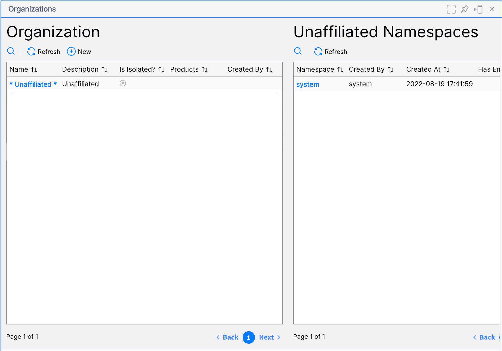
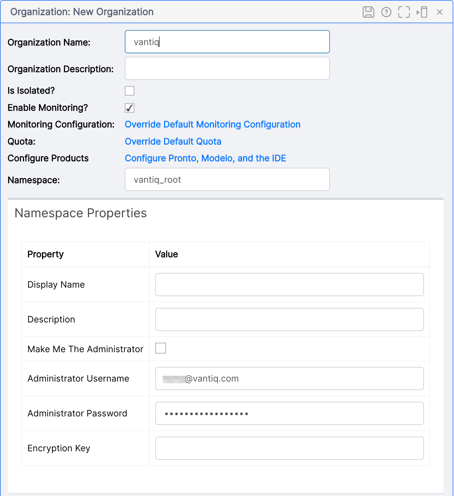
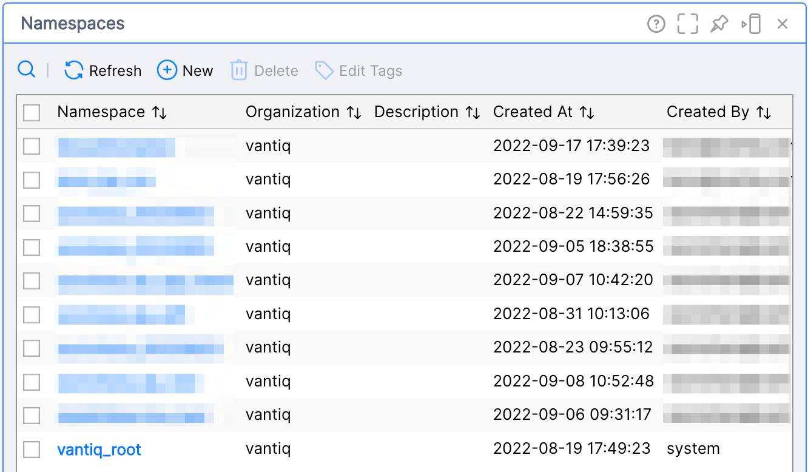
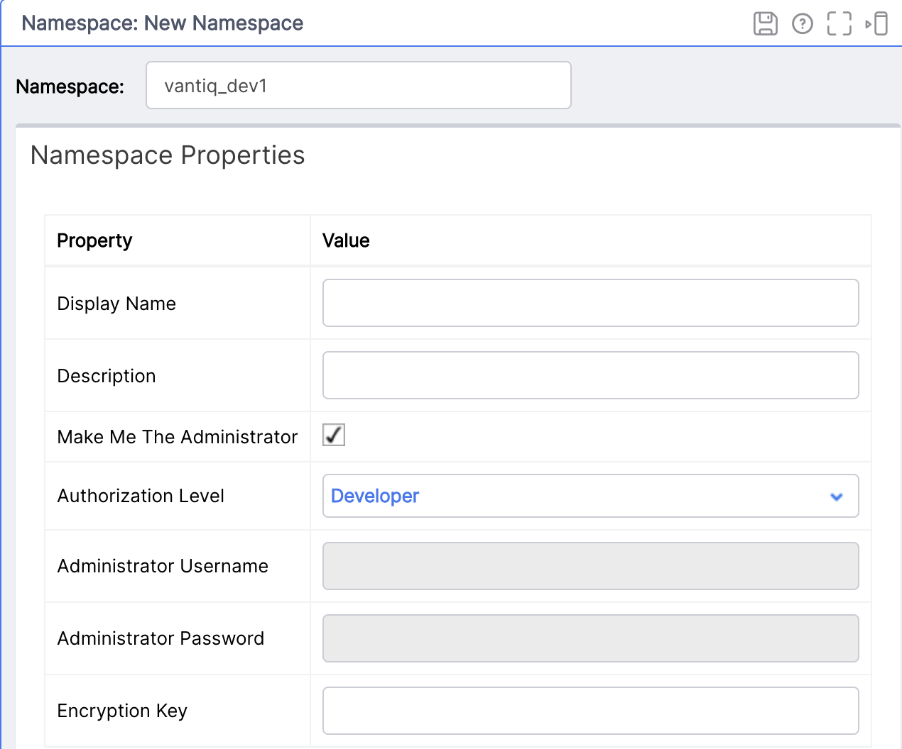
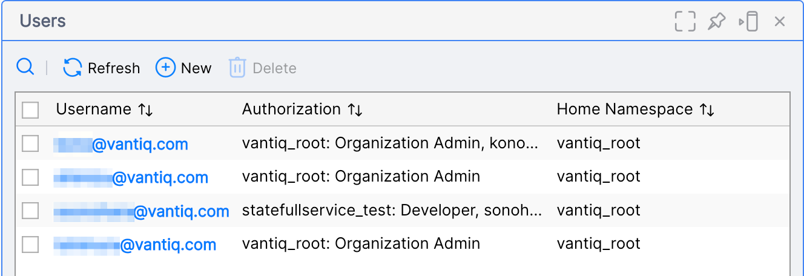
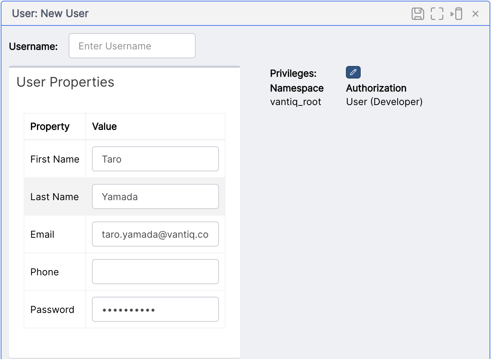
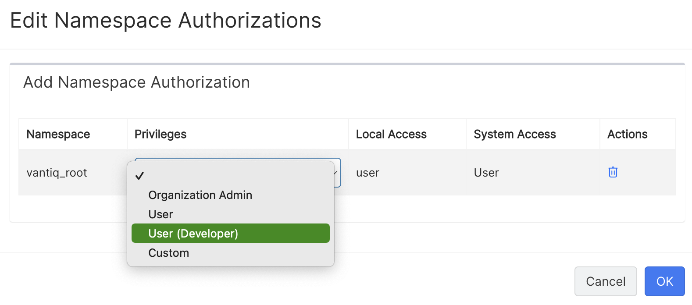
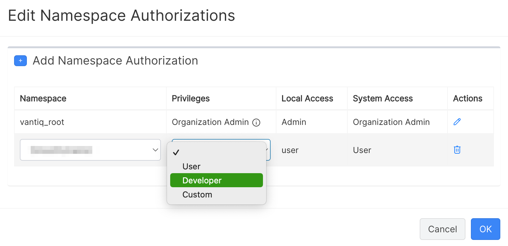

# Vantiq Edge Adminタスク

この記事では、Vantiq Edgeのインストール作業、初期設定、ライセンス更新作業をガイドします。

## Vantiq Edge をインストールする

[Vantiq Edgeインストールガイド](https://community.vantiq.com/wp-content/uploads/2022/06/edge-install-ja-2.html)を参照し、環境の準備とインストールを行います。

## インストール時設定

Vantiq Organization や User の作成を行います。 Organization, Namespace, Role, Userについての説明は、[Vantiq Organization, Namespace, User Role の関係](./org_user_management.md)を参照してください。

### System Admin による設定

System Admin として、以下のタスクを行います。
1. Organization を作成する
2. Organization Admin を作成する

#### 手順
1. Vantiq Edgeに System Admin ユーザーでログインします。
2. メニューから 管理 >> Organizations を選択し、Organization ペインを開きます。


3. [新規] をクリックします。
4. 必要な情報を追加し、保存します。
   1. _Organization Name_ - 組織名（会社名、プロジェクト名など、一意となる名前）
   2. _Namespace_ -  Organization RootとなるNamespace. 慣例的に `<Organization Name>_root`としておくとよいです。
   3. _Administrator Username_ - Organization Adminのユーザー名 - このユーザーが作成されます。
   4. _Administrator Password_ - Organization Adminのパスワード
   
4. Organization Admin のパスワードを再入力します。
5. メニュー右上の人物アイコンをクリック >> Logout で System Admin をログアウトします。

### Organization Admin による設定

Organization Adminとして、以下のタスクを行います。
1. アプリ作業用 Namespace を作成する
2. 新規ユーザーを作成する (optional)
3. 作成済みユーザーに Namespace へのアクセスを付与する (optional)

#### 手順 1. アプリ作業用 Namespace を作成する
1. Vantiq Edgeに **Organization Admin** ロールを持つユーザーでログインします。
2. メニューから 管理 >> Namespaces を選択し、Namespace ペインを開きます。


3. [新規] をクリックします。
4. 必要な情報を追加し、保存します。
   1. _Namespace_ - アプリ作業用 Namespaceの名前
   2. _Make me The Administrator_ - ログインユーザー自身をこの新規 Namespace の管理者にします。
   3. _Authorization Level_ - アプリを作成、保守するためには `Developer` とします。
   

5. Namespace が作成されます。 メニュー右上の地球儀アイコンをクリックし、Namespaceの切り替えができます。 以後、アプリ作業に関してはそれ専用の Namespace を使用します。

#### 手順 2. 新規ユーザーを作成する (optional)
1. Vantiq Edgeに **Organization Admin** ロールを持つユーザーでログインします。
2. メニュー右上の地球儀アイコンをクリックし、`<Organization Name>_root` Namespace へ切り替えます。
3. メニューから 管理 >> Users を選択し、Users ペインを開きます。


4. [新規] をクリックします。
5. 必要な情報を追加します。
   1. _Username_ - ユーザー名。Emailなど一意になる名前。
   2. _First Name_
   3. _Last Name_
   4. _Email_
   5. _Password_
   

6. New User ペインの右側の Authorization にある鉛筆のアイコンをクリックし、Edit Namespace Authorization ダイアログを開きます。
7. Privlige を設定します。 新規ユーザーが一般ユーザーであれば、`User (Developer)`, 管理者であれば `Organization Admin`とします。

8. 保存します。 新規ユーザーのパスワードを再入力します。

#### 手順 3. 作成済みユーザーに Namespace へのアクセスを付与する (optional)
1. Vantiq Edgeに **Organization Admin** ロールを持つユーザーでログインします。
2. メニューから 管理 >> Users を選択し、Users ペインを開きます。


3. ユーザーを選択し、青字のユーザー名をクリックします。
4. User ペインの右側の Authorization にある鉛筆のアイコンをクリックし、Edit Namespace Authorization ダイアログを開きます。
5. [Add Namespace Authorization] をクリックし、行を追加します。


6. アクセスを与える Namespace をドロップダウンから選択します。また、Privilegesを `Developer`と設定します。
7. [OK]でダイアログを閉じます。 User ペインの 右上のディスクアイコンをクリックし、Userを保存します。

## 運用

### ライセンスファイルを差し替える

ライセンスファイルを差し替え、再起動を行います。
[Vantiq Edgeインストールガイド](https://community.vantiq.com/wp-content/uploads/2022/06/edge-install-ja-2.html)に従い、インストールが完了していることが前提となります。

以下は Docker 環境における手順です。非Docker環境についてはインストールガイドを参照し、適宜該当部分を読み替えてください。

1. 有効日付が更新されたライセンス (`license.key`, `public.pem`) を取得する。
2. `componse.yaml` が配置されているディレクトリに移動する。
3. 以下のコマンドを実行して、Vantiq Edgeを停止 `docker compose down``
4. `config/license.key`, `config/public.pem`をそれぞれ新しいものに置き換える。
5. 以下のコマンドを実行して、Vantiq Edgeを起動 `docker compose up -d`
6. (少し起動完了まで待ち) 以下にWebブラウザ経由でアクセスできることを確認 `http://<Vantiq Edgeホスト>:8080/ui/ide/index.html`


### Vantiqバージョン更新 (Docker環境)

バージョンの更新は以下の2種類があります。

マイナーバージョン更新は、古いバージョンから新しいバージョンへの更新のみ可能です。
（古いバージョンへの切り戻しは古いバージョン時のデータベースのバックアップが必要となります。）

[Vantiq Edgeインストールガイド](https://community.vantiq.com/wp-content/uploads/2022/06/edge-install-ja-2.html)に従い、インストールが完了していることが前提となります。

1. docker-compose mongodbのバックアップを取る。
2. `componse.yaml` を開き、`image`のバージョンを編集する。（最新のバージョンについては、サポート担当にお尋ねください）

```yaml
services:
  vantiq_edge:
    image: quay.io/vantiq/vantiq-edge:1.34.9
    depends_on:
    - vantiq_edge_mongo
    ports:
    - 8080:8080
...
```
3. `componse.yaml`が配置されているディレクトリに移動し、`docker-compose down` を実行する。
4. 同ディレクトリで `docker-compse up -d` を実行する。バージョン更新して起動するまで数分かかります。
