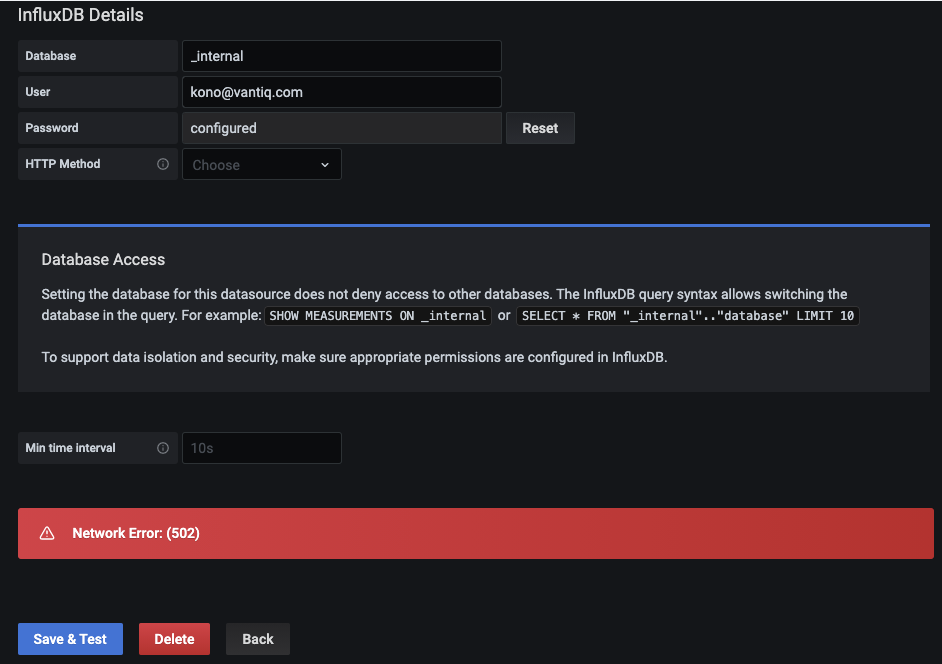
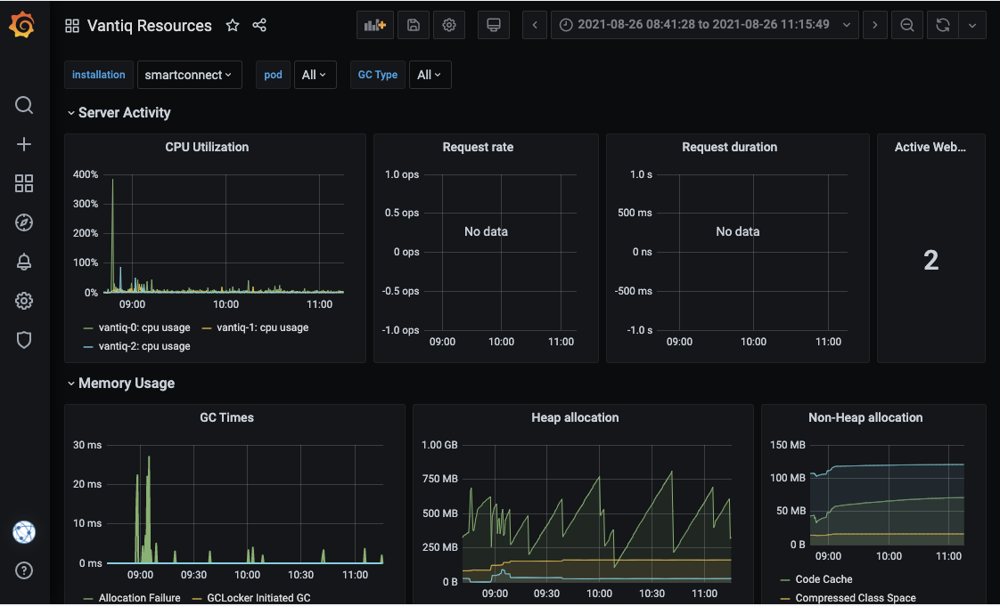
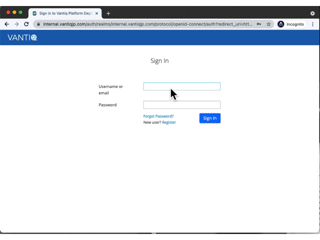
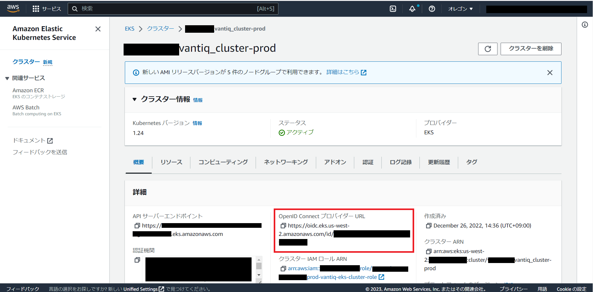
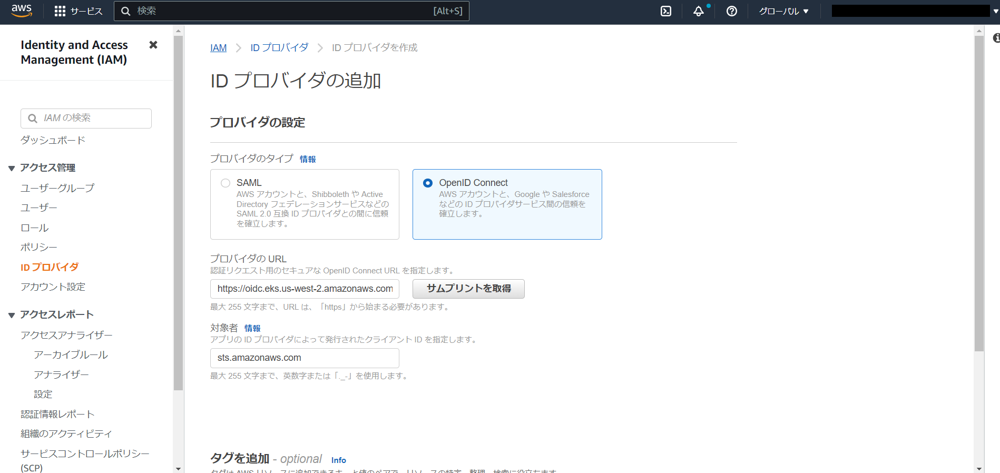
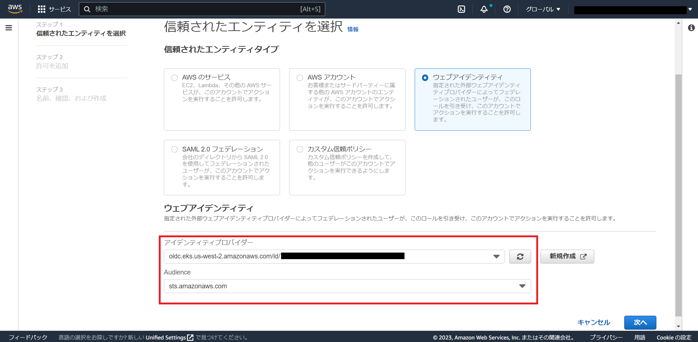
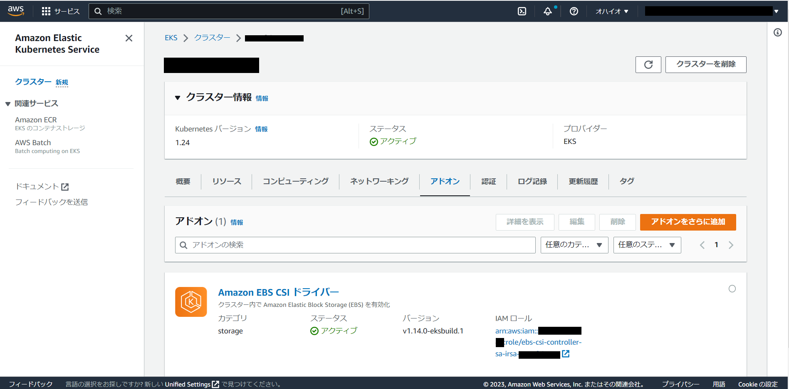

# はじめに

本記事では VANTIQ 保守作業において、[k8sdeploy_tools](https://github.com/Vantiq/k8sdeploy_tools) _(要権限)_ に関連し、構築時のトラブルシューティング方法や事例について記載する。

## 前提

- Kubectl ツールを使って k8s クラスタを操作する環境へのアクセスがあること

# 目次
- [はじめに](#はじめに)
  - [前提](#前提)
- [目次](#目次)
- [Kubernetesリソースの確認](#kubernetesリソースの確認)
  - [リソースの一覧からステータス確認](#リソースの一覧からステータス確認)
  - [各リソースの詳細表示](#各リソースの詳細表示)
  - [Pod(コンテナ)のログを確認](#podコンテナのログを確認)
    - [Podのlogにタイムスタンプを表示する](#podのlogにタイムスタンプを表示する)
    - [Podのログがエスケープシーケンスで見にくい](#podのログがエスケープシーケンスで見にくい)
  - [よくある流れ](#よくある流れ)
- [PostgreSQL DBや MongoDB, Keycloakとの接続の認証エラーが発生する ](#postgresql-dbや-mongodb-keycloakとの接続の認証エラーが発生する-)
  - [1. Podに渡されているSecretリソースを特定](#1-podに渡されているsecretリソースを特定)
  - [2. Secretリソースの値を確認](#2-secretリソースの値を確認)
  - [補足: Podに渡されているSecretリソースを特定 - ファイルマウントバージョン](#補足-podに渡されているsecretリソースを特定---ファイルマウントバージョン)
- [Vantiq MongoDB の回復をしたい](#vantiq-mongodb-の回復をしたい)
- [Grafana Data Source を追加する時、エラーとなる](#grafana-data-source-を追加する時エラーとなる)
      - [Solution](#solution)
      - [Solution 2](#solution-2)
- [Azure で Backup の設定ができない](#azure-で-backup-の設定ができない)
- [undeployとdeployを繰り返したら、PVがReleaseされてしまった。再利用したい。](#undeployとdeployを繰り返したらpvがreleaseされてしまった再利用したい)
      - [リカバリー手順](#リカバリー手順)
      - [リカバリーに関する留意事項](#リカバリーに関する留意事項)
- [Grafana でメトリクスが表示されない](#grafana-でメトリクスが表示されない)
  - [InfluxDB にメトリクスが存在するか診断する](#influxdb-にメトリクスが存在するか診断する)
  - [telegraf でエラーが出ているか診断する](#telegraf-でエラーが出ているか診断する)
    - [telegraf-dsで「no space left on device」、といったエラーが発生する](#telegraf-dsでno-space-left-on-deviceといったエラーが発生する)
    - [telegrafでServiceAcoountに関連した403エラーが発生する](#telegrafでserviceacoountに関連した403エラーが発生する)
  - [その他](#その他)
    - [Vantiq Resources](#vantiq-resources)
        - ["Pod" Variable](#pod-variable)
        - [CPU utilization](#cpu-utilization)
    - [MongoDB Monitoring Dashboard](#mongodb-monitoring-dashboard)
      - ["installation" and "Pod" Variable](#installation-and-pod-variable)
      - [CPU utilization](#cpu-utilization-1)
- [VantiqバージョンアップしたらGrafanaのDashboardがすべて消えてしまった ](#vantiqバージョンアップしたらgrafanaのdashboardがすべて消えてしまった-)
      - [診断：データベースmysqlが正しく設定されているか確認する](#診断データベースmysqlが正しく設定されているか確認する)
      - [リカバリー: sqlite3からmysqlへのデータ移行を行う](#リカバリー-sqlite3からmysqlへのデータ移行を行う)
      - [リカバリー手順について補足](#リカバリー手順について補足)
- [Keycloak pod が起動しない](#keycloak-pod-が起動しない)
      - [Azure Database for PostgreSQL が起動せずエラーになる場合](#azure-database-for-postgresql-が起動せずエラーになる場合)
      - [その他](#その他-1)
- [Podが再起動を繰り返し、起動できない](#podが再起動を繰り返し起動できない)
      - [kubernetesワーカーノード間で通信ができているか](#kubernetesワーカーノード間で通信ができているか)
      - [Readiness Probeのタイムアウトまでの時間を長くする](#readiness-probeのタイムアウトまでの時間を長くする)
- [Vantiq IDE にログインしようとすると、エラーが出る](#vantiq-ide-にログインしようとするとエラーが出る)
      - [SSL 証明書が有効かどうか診断する](#ssl-証明書が有効かどうか診断する)
      - [サーバー間の時刻同期ができてきるか診断する](#サーバー間の時刻同期ができてきるか診断する)
    - [Vantiq IDEにログインしようとするとエラーメッセージが出てループする](#vantiq-ideにログインしようとするとエラーメッセージが出てループする)
- [System Admin 用の key を紛失した、期限切れになった](#system-admin-用の-key-を紛失した期限切れになった)
- [ライセンスの有効期限を確認したい ](#ライセンスの有効期限を確認したい-)
- [ライセンス更新を適用したが、更新されない ](#ライセンス更新を適用したが更新されない-)
- [EKS アップグレード時の必要作業 ](#eks-アップグレード時の必要作業-)
  - [v1.23(v1.22 -\> v1.23へ更新する場合) ](#v123v122---v123へ更新する場合-)
    - [a. AWS Management Consoleから行う場合](#a-aws-management-consoleから行う場合)
    - [b. Terraformで行う場合](#b-terraformで行う場合)
- [IP制限を行っている外部システムにVantiqからの通信をIP指定で許可したい](#ip制限を行っている外部システムにvantiqからの通信をip指定で許可したい)
  - [前提](#前提-1)
  - [EKSの場合](#eksの場合)
  - [AKSの場合](#aksの場合)
- [データの暗号化がどうなっているか知りたい](#データの暗号化がどうなっているか知りたい)
- [特殊環境 (EKS, AKS以外の環境）でのトラブルシューティング事例  ](#特殊環境-eks-aks以外の環境でのトラブルシューティング事例--)
  - [Vantiq Podが起動しない ](#vantiq-podが起動しない-)
    - [keycloak-initでFailedとなる ](#keycloak-initでfailedとなる-)
  - [MongoDB Podが起動しない ](#mongodb-podが起動しない-)
    - [bootstrap init ContainerがRunningのままになる ](#bootstrap-init-containerがrunningのままになる-)
    - [mongodb-2 の bootstrap init ContainerがRunningのままになる ](#mongodb-2-の-bootstrap-init-containerがrunningのままになる-)
  - [telegraf-ds / telegraf-promでメトリクスを収集できない ](#telegraf-ds--telegraf-promでメトリクスを収集できない-)
  - [Vantiqへの通信がタイムアウト(502/504エラー)し、keycloakのadminコンソールは正常に表示される ](#vantiqへの通信がタイムアウト502504エラーしkeycloakのadminコンソールは正常に表示される-)

# Kubernetesリソースの確認<a id="kubectl_resource_check"></a>
構築時や保守時の基本的な確認としてkubectl コマンドを利用したリソースの確認がある  
主に以下のような確認ができる    

- リソースの一覧からステータス確認
- 各リソースの詳細を確認
- 各Pod(コンテナ)のログを確認

## リソースの一覧からステータス確認
kubectl コマンドでKubernetesの各リソースの確認は以下のように行う
```bash
# <resource>: 表示したいリソースの種類でよく使うものは以下
# pod / deployment / statefulset / job / cronjob / service / pv / pvc / secret / configmap 
kubectl get <resource>

# -n <Namespace名>: Namespaceを指定
# -A: すべてのNamespaceのリソースを表示 
# -o wide: 詳細出力
# shared Namespace のPodを表示
kubectl get pod -n shared

# すべてのNamespaceのPodを表示
kubectl get pod -A

# すべてのNamespaceのPodの詳細も表示
kubectl get pod -A -o wide
```

※Namespace指定の-n / -A オプションはkubectl コマンド共通のオプション


## 各リソースの詳細表示
kubectl describeコマンドで各リソースの詳細を表示することができる

```bash
# <resource>: 表示したいリソースの種類
# <name>: 表示したいリソースの名前(kubectl get から確認可能)
kubectl describe <resource> <name>

# shared Namespaceのkeycloak-0 Podの詳細を表示
kubectl describe pod keycloak-0 -n shared

# shared Namespaceのkeycloakdb Secretの詳細を表示
kubectl describe secret keycloakdb -n shared
```

## Pod(コンテナ)のログを確認
```bash
# <pod-name>: 表示したいPodの名前(kubectl get から確認可能)
# -c: コンテナ名を指定(Pod内に複数コンテナが有る場合)
kubectl logs <pod-name> -c <コンテナ名>

# mongodb-0 の mongodbコンテナのログを確認
kubectl logs -n your-namespace mongodb-0 -c mongo
```

### Podのlogにタイムスタンプを表示する  
keycloakなどは以下のように`--timestamps`オプションで日付を表示する  
```bash
kubectl logs -n shared keycloak-0 --timestamps
```

### Podのログがエスケープシーケンスで見にくい
keycloakのlogが以下のように`ESC[...m`といった文字列が表示され見にくい
```log
ESC[0mESC[33m06:08:45,145 WARN  [org.wildfly.extension.elytron] ...
```

これは色文字のエスケープシーケンスのため、以下のようにlessの`-R`オプションでエスケープシーケンスを認識させて表示すると見やすくなる  
(上記の例は黄色文字のエスケープシーケンス)
```bash
kubectl logs -n shared keycloak-0 --timestamps | less -R
```

## よくある流れ
上記で紹介したコマンドを利用し、Podが正常起動していないときにどのように確認していくのか一例を紹介する  

まずPod一覧から正常起動していないPodを確認
```bash
$ kubectl get pod -n your-namespace -o wide
NAME                         READY   STATUS               RESTARTS   AGE    IP            NODE                     NOMINATED NODE   READINESS GATES
・・・
mongodb-0                    2/2     Running              0          40h    10.1.48.220   aks-mongodbnp-vmssxxxx   <none>           <none>
mongodb-1                    2/2     Running              0          40h    10.1.48.155   aks-mongodbnp-vmssxxxx   <none>           <none>
mongodb-2                    2/2     Running              0          40h    10.1.48.191   aks-mongodbnp-vmssxxxx   <none>           <none>
vantiq-0                     0/1     CrashLoopBackOff     0          36h    10.1.48.20    aks-vantiqnp-vmssxxxx    <none>           <none>
```

上記の場合`vantiq-0` Podの`STATUS`が異常(CrashLoopBackOff)なことが確認できたので、kubectl describeコマンドで詳細を確認する  
PodのSTATUSに関しては[Podのライフサイクル | Kubernetes](https://kubernetes.io/ja/docs/concepts/workloads/pods/pod-lifecycle/#pod-phase)を参照
```bash
$ kubectl describe pod -n your-namespace vantiq-0
Name:         vantiq-0
・・・
Containers:
  vantiq:
    State:          CrashLoopBack
    Ready:          False
・・・
Events:                      
  FirstSeen	LastSeen	Count	From					                  SubobjectPath		        Type		  Reason		Message
  ---------	--------	-----	----					                  -------------		        --------	------		-------
  <Events>
```

`Containers`フィールドからコンテナのステータス、`Events`フィールドからエラーメッセージなどを確認  
(複数コンテナが起動しているPodではエラーが発生しているコンテナをContainersフィールドのStateから特定する)  
Eventsから原因が特定できない場合などはkubectl logs コマンドでコンテナログを確認  

Pod起動前に初期化処理などを行うinitコンテナで処理が失敗する場合もあり、その場合はkubectl get コマンドで以下のように表示されたりする  
initコンテナに関するSTATUSについては[Initコンテナのデバッグ | Kubernetes](https://kubernetes.io/ja/docs/tasks/debug/debug-application/debug-init-containers/#understanding-pod-status)を参照
```bash
$ kubectl get pod -n your-namespace -o wide
NAME                         READY   STATUS               RESTARTS   AGE    IP            NODE                     NOMINATED NODE   READINESS GATES
・・・
mongodb-0                    2/2     Running              0          40h    10.1.48.220   aks-mongodbnp-vmssxxxx   <none>           <none>
mongodb-1                    2/2     Running              0          40h    10.1.48.155   aks-mongodbnp-vmssxxxx   <none>           <none>
mongodb-2                    2/2     Running              0          40h    10.1.48.191   aks-mongodbnp-vmssxxxx   <none>           <none>
vantiq-0                     1/3     Init:Error           0          36h    10.1.48.20    aks-vantiqnp-vmssxxxx    <none>           <none>
```

この場合も同様にkubectl describe コマンドでPodの詳細を確認
```bash
$ kubectl describe pod -n your-namespace vantiq-0
Name:         vantiq-0
・・・
Init Containers:
  keycloak-init:
    State:          Terminated
      Reason:       Completed
      Exit Code:    0
    Ready:          True
  mongo-available:
    ・・・
    State:          Waiting
      Reason:       CrashLoopBackOff
    State:          Terminated
      Reason:       Error
    Ready:          False
    ・・・
  load-model:
    ・・・
    State:          Waiting
      Reason:       PodInitializing
    Ready:          False
・・・
Events:                      
  FirstSeen	LastSeen	Count	From					                  SubobjectPath		        Type		  Reason		Message
  ---------	--------	-----	----					                  -------------		        --------	------		-------
  <Events>
```

initコンテナで起動に失敗している場合は、`Init Containers`フィールドを確認する  
上記の場合は`mongo-available` initコンテナでエラーが発生しているため、`Events`フィールドや以下のようにkubectl logsコマンドでエラー内容を確認し対応する  

```bash
# initコンテナの場合も-cオプションで対象のコンテナ名を指定すれば良い
kubectl logs -n your-namespace vantiq-0 -c mongo-available
```

# PostgreSQL DBや MongoDB, Keycloakとの接続の認証エラーが発生する <a id="db_auth_error_caused_by_secret"></a>
keycloak PodでPostgreSQL DBに対して、Vantiq PodでMongoDBやkeycloakに対して接続の認証エラーが発生することがある  
よくある原因としてはdeploy.yamlで指定している認証情報のコピペ・指定ミスがある  

接続情報はKubernetesのSecretリソースとして作成され、各Podにファイルや環境変数やファイルとして渡されている  
正しく渡されているかは以下のように確認する
1. Podに渡されているSecretリソースを特定
2. Secretリソースの値を確認

確認後、必要に応じてSecretの変更を行う  
**その際に以下の点に注意**  
- Secretリソースを更新しただけだと、Podの環境変数として利用しているSecret値に反映しない  
  ファイルとしてマウントしているSecretは更新される(反映までの遅延発生の可能性あり)
- コンテナの起動時にのみConfig情報(環境変数/ファイルとしてマウントされているSecretの情報)を読み込むケースが多い  
  ConfigmapやSecretをデプロイ後、それらに依存するPodの再起動(rollout start)が必要


## 1. Podに渡されているSecretリソースを特定
kubectl describe コマンドで確認可能  
一例として、Vantiq Podに渡されているkeycloakに対しての資格情報の確認の流れを紹介する  

```bash
$ kubectl describe pod -n your-namespace vantiq-0
Name:         vantiq-0
・・・
Init Containers:
  keycloak-init:
    State:          Terminated
      Reason:       Completed
      Exit Code:    0
      Started:      Mon, 28 Nov 2022 14:19:57 +0000
      Finished:     Mon, 28 Nov 2022 14:20:04 +0000
    Ready:          True
    Restart Count:  0
    Environment:
      ・・・
      KEYCLOAK_PASSWORD:  <set to the key 'password' in secret 'keycloak'>       Optional: false
      ・・・
Events:                      
  FirstSeen	LastSeen	Count	From					                  SubobjectPath		        Type		  Reason		Message
  ---------	--------	-----	----					                  -------------		        --------	------		-------
  <Events>
```

`Init Containers`フィールドの`keycloak-init`コンテナに注目する  
`Environment`フィールドを見ると、`KEYCLOAK_PASSWORD`という環境変数に`keycloak` Secretの`password`というkeyの値が渡されていることが分かる  

kubectl get コマンドで対象のSecretが存在することを確認  
```bash
$ kubectl get secret -n your-namespace keycloak
NAME       TYPE     DATA   AGE
keycloak   Opaque   2      62d
```

次の手順でこのSecretに格納されている値を確認していく  

## 2. Secretリソースの値を確認
Secretリソースはkubectl describeコマンドでは格納されている値が表示されない  
```bash
$ kubectl describe secret -n your-namespace keycloak
Name:         keycloak
Namespace:    your-namespace
Labels:       <none>
Annotations:  <none>

Type:  Opaque

Data
====
password:       10 bytes
smtp.password:  64 bytes
```

そのため、kubectl getコマンドの-oオプションを利用し値を確認する  
```bash
$ kubectl get secret -n your-namespace keycloak -o yaml
apiVersion: v1
data:
  password: ZHVtbXlwYXNzd29yZA==
  smtp.password: ZHVtbXlwYXNzd29yZGR1bW15cGFzc3dvcmQ=
kind: Secret
metadata:
  ・・・
  name: keycloak
  namespace: your-namespace
type: Opaque
```

`data`フィールドに値が格納されている  
今回確認するのは`password` Keyの値のため、`ZHVtbXlwYXNzd29yZA==`が対象の値である  
なおSecretリソースは値をbase64エンコードして作成するため、実際に渡される値は上記で確認できた値をbase64デコードすることで確認できる  
よってPodに渡されている値は`dummypassword`という値  

この値が間違ったものである場合は、deploy.yamlを修正して再デプロイを行う  

※Secretの値を確認する場合は以下のように確認することもできる
```bash
# keycloakのpasswordの確認
kubectl get secret -n your-namespace keycloak -o jsonpath='{.data.password}' | base64 -d

# SSL証明書ファイルの確認
kubectl get secret -n your-namespace vantiq-ssl-cert -o jsonpath="{.data['tls\.crt']}" | base64 -d
# SSL証明書の内容確認
kubectl get secret -n your-namespace vantiq-ssl-cert -o jsonpath="{.data['tls\.crt']}" | base64 -d | openssl x509 -text -noout
```

## 補足: Podに渡されているSecretリソースを特定 - ファイルマウントバージョン
上記の例では環境変数にSecretが利用されている場合だったが、ファイルとしてPodにマウントされる場合もある。  
Vantiq のライセンスファイルなどが該当するが、どのSecretがPodにマウントされているかは以下のようにkubectl describeコマンドで確認する  

```bash
$ kubectl describe po -n internal vantiq-0
Name:         vantiq-0
・・・
Containers:
  vantiq:
    ・・・
    Mounts:
      /etc/default from vantiq-defaults (rw)
      /opt/vantiq/config/license from vantiq-license (rw)
  ・・・
Volumes:
  ・・・
  vantiq-license:
    Type:        Secret (a volume populated by a Secret)
    SecretName:  vantiq-license
    Optional:    false
  vantiq-defaults:
    Type:      ConfigMap (a volume populated by a ConfigMap)
    Name:      vantiq-config
    Optional:  false
  ・・・
Events:                      <none>
```

各コンテナの`Mountsフィールド`に注目する  
vantiq-0 Podの`/opt/vantiq/config/license`ディレクトリに`vantiq-license` Volumeがマウントされていることを確認できる  

続いて`vantiq-license` Volumeの確認を行うため、`Volumes`フィールドを確認する  
対象の`vantiq-license`フィールドを確認すると`vantiq-license` Secretが利用されていることが分かる  
(`vantiq-defaults`のようにVolumesにはSecret以外にもConfigMapも指定できる)  
ここまで確認できたら前述のkubectl getコマンドでSecretが存在しているかといったことや、値があっているかといったことを確認することができる  


# Vantiq MongoDB の回復をしたい<a id="recovery_of_vantiq_mongoDB"></a>

1. vantiq サービスを scale=0 にする
```
kubectl scale sts -n xxxx vantiq --replicas=0
```
2. mongorestore を実行する
```
kubectl create job mongorestore --from=cronjob/mongorestore -n xxx
```
3. userdbrestore を実行する（userdb を使用する場合)
```
kubectl create job userdbrestore --from=cronjob/userdbrestore -n xxx
```
4. vantiq サービスのスケールを戻す
```
kubectl scale sts -n xxx vantiq --replicas=3
```


# Grafana Data Source を追加する時、エラーとなる<a id="error_when_adding_grafana_data_source"></a>
InfluxDB を追加する時、URLを `http://influxdb-influxdb:8086` としたが、エラーとなる。  


#### Solution
URL を`http://influxdb:8086`とする。

#### Solution 2
`Vantiq_system_version: 3.10.1`以降は、InfluxdbのUser/Passwordの設定が必要で入力値は`secrets.yaml`に記載した内容になる。

# Azure で Backup の設定ができない<a id="unable_to_configure_backup_in_azure"></a>

mongodb backup を設定する追加の手順 (Azure)。
`secrets.yaml` の `vantiq` キーの下に、次の設定を追加 (またはコメントアウト) する。

```yaml
vantig:
  dbbackup-creds:
    files:
      credentials: deploy/sensitive/azure_storage_credentials.txt
```
`deploy/sensitive` の下に、`azure_store_credentials.txt` を作成し、次の設定を追加する。
```
export AZURE_STORAGE_ACCOUNT=<ストレージアカウント名>
export AZURE_STORAGE_KEY=<ストレージキー>
```
例)
```
export AZURE_STORAGE_ACCOUNT=vantiqbackupstorage
export AZURE_STORAGE_KEY=XXXXXXX7CGqYriw9X3jwojPiHlc/3Jjhn3/MIEKYAJq0KwJZ9fd6zf9nMNt0DmIJcYfqaGmaM1isY3tayXXXXXXX==
```
`deploy.yaml` の `vantiq` のキーの下に、次を追加する。<bucket名> は任意。

```yaml
vantiq:
  mongodb:
    backup:
    enabled: true
    provider: azure
    schedule: "@daily"
    bucket: <bucket名>
```

# undeployとdeployを繰り返したら、PVがReleaseされてしまった。再利用したい。<a id="reuse_old_pv"></a>

`undeploy`と`deploy`を繰り返すと、新しいPVが作られ、古いPVに入った情報が見れなくなる。(status = `Released`)
```
$ kubectl get pv
pvc-a6d5da12-7e3e-4a32-a5b3-bbbbbbbbbbbb   5Gi        RWO            Retain           Bound      shared/grafana                    vantiq-sc               5d21h
pvc-ec37c469-782a-473f-a6f9-aaaaaaaaaaaa   5Gi        RWO            Retain           Released   shared/grafana                    vantiq-sc               247d
```
#### リカバリー手順
1. PV, PVCをマウントしているdeploy or stsのpodを削除する。
```
$ kubectl scale deploy -n shared grafana --replicas=0
deployment.apps/grafana scaled
```
2. PVのclaimRefをクリアする -> PVのStatusが`Available`になり、再利用可。
```
kubectl patch pv pvc-ec37c469-782a-473f-a6f9-aaaaaaaaaaaa -p '{"spec":{"claimRef": null}}'
```
3. PVを要求するPVCを作成する。 PVCはimmutableなのでeditできない。そのため、Volumeを入れ替えたい場合は別途PVCを再作成する。

```sh
vi old-grafana-pvc.yaml
```
```yaml
kind: PersistentVolumeClaim
apiVersion: v1
metadata:
  name: old-grafana-pv
  namespace: shared
spec:
  accessModes:
  - ReadWriteOnce
  resources:
    requests:
      storage: 5Gi          
  volumeName: pvc-ec37c469-782a-473f-a6f9-aaaaaaaaaaaa
  storageClassName: vantiq-sc
  volumeMode: Filesystem
```
4. PVCを適用する。
```sh
kubectl apply -f old-grafana-pvc.yaml
```
5. deployment or statefulsetのPVCの参照部分を書き換える。 (`claimName`の部分）
```sh
kubectl edit deploy -n shared grafanna
```
```yaml
...
volumes:
- configMap:
    defaultMode: 420
    name: grafana
  name: config
- name: storage
  persistentVolumeClaim:
    claimName: old-grafana-pv
...
```
6. PV, PVCをマウントしているdeploy or stsのpodを起動する。
```sh
$ kubectl scale deploy -n shared grafana --replicas=1
deployment.apps/grafana scaled
```

#### リカバリーに関する留意事項
- 上記の例においてgrafanaとgrafanadbは依存関係があり、同じnodeでないと起動しない。つまり、grafana, grafanadbのPVが同じAZにある必要がある。PVを意図したAZに再度作成するために、既存のPVCを削除しなければならない場合もある。
- PVやPVCを消してしまったら、必要な特定のモジュールのみデプロイし直すこともできる。例えばGrafanaDB
```sh
./gradlew -Pcluster=vantiq-vantiqjp-internal deployGrafanaDB
```

# Grafana でメトリクスが表示されない<a id="metrics_not_showing_up_in_grafana"></a>
`Vantiq Resources` の `Request rate`、`Request duration` が表示されない。`MongoDB Monitoring Dashboard` が表示されない。



## InfluxDB にメトリクスが存在するか診断する
データが表示されていないパネルのクエリを調べると、`kubernetes` データベースの `nginx_ingress_controller_requests` が使われているが、これが InfluxDB にあるか確認する。

```sh
# influx-0 の pod のシェルに入る
$ kubectl exec -it influxdb-0 -n shared -- /bin/sh

# influx のシェルに入る
$ influx
Connected to http://localhost:8086 version 1.8.1
InfluxDB shell version: 1.8.1

# データベースの切り替え
> use kubernetes
Using database kubernetes

# 保存されているメトリクスを確認
> show measurements
name: measurements
name
----
cpu
disk
diskio
docker
docker_container_blkio
docker_container_cpu
docker_container_mem
docker_container_status
go_gc_duration_seconds
...
```

## telegraf でエラーが出ているか診断する
メトリクスがない場合やある時期を境に途切れている場合は、telegraf 側でエラーが出ているか確認する。
以下に発生しうるエラー例とその対応を記述する。  

### telegraf-dsで「no space left on device」、といったエラーが発生する

- エラーログ例
```sh
2023-03-06T01:29:53Z E! [outputs.influxdb] When writing to [http://influxdb:8086]: 500 Internal Server Error: engine: error writing WAL entry: write /var/lib/influxdb/wal/kubernetes/autogen/126/_00005.wal: no space left on device
2023-03-06T01:29:53Z E! [agent] Error writing to outputs.influxdb: could not write any address
```


InfluxDBのPVの空き容量がなくなると上記のようなエラーがtelegraf-dsで発生する。  
この場合はInfluxDBのPVを拡張することで対処可能。手順については[InfluxDB PV拡張手順](./resize_influxdb_pv.md)を参照


### telegrafでServiceAcoountに関連した403エラーが発生する

- エラーログ例
```sh
$ stern -n shared telegraf-* -s 1s

telegraf-prom-86c55969cb-fxmnx telegraf 2021-08-25T23:33:35Z E! [inputs.prometheus] Unable to watch resources: kubernetes api: Failure 403 pods is forbidden: User "system:serviceaccount:shared:telegraf-prom" cannot watch resource "pods" in API group "" at the cluster scope
telegraf-prom-86c55969cb-fxmnx telegraf 2021-08-25T23:33:36Z E! [inputs.prometheus] Unable to watch resources: kubernetes api: Failure 403 pods is forbidden: User "system:serviceaccount:shared:telegraf-prom" cannot watch resource "pods" in API group "" at the cluster scope
telegraf-prom-86c55969cb-fxmnx telegraf 2021-08-25T23:33:37Z E! [inputs.prometheus] Unable to watch resources: kubernetes api: Failure 403 pods is forbidden: User "system:serviceaccount:shared:telegraf-prom" cannot watch resource "pods" in API group "" at the cluster scope
telegraf-prom-86c55969cb-fxmnx telegraf 2021-08-25T23:33:38Z E! [inputs.prometheus] Unable to watch resources: kubernetes api: Failure 403 pods is forbidden: User "system:serviceaccount:shared:telegraf-prom" cannot watch resource "pods" in API group "" at the cluster scope

```
AWS や Azure で、kubernetes クラスタの RBAC を有効にすると、デフォルトでは Cluster レベルの情報にアクセスする権限がない。`Service Account` を作成し、明示的に `telegraf` に対して権限をつける必要がある。

```sh
kubectl apply -f k8s-additional-roles.yaml
```
**k8s-additional-roles.yaml**
```yaml
kind: ClusterRole
apiVersion: rbac.authorization.k8s.io/v1
metadata:
  name: influx:cluster:viewer
  labels:
    rbac.authorization.k8s.io/aggregate-view-telegraf: "true"
rules:
  - apiGroups: [""]
#    resources: ["persistentvolumes", "nodes"]
    resources: ["*"]   # 2021/10/7 changed so that kubernetes.cpu_usage_nanocores measurement be obtained
    verbs: ["get", "list"]

---
kind: ClusterRole
apiVersion: rbac.authorization.k8s.io/v1
metadata:
  name: influx:telegraf
aggregationRule:
  clusterRoleSelectors:
    - matchLabels:
        rbac.authorization.k8s.io/aggregate-view-telegraf: "true"
    - matchLabels:
        rbac.authorization.k8s.io/aggregate-to-view: "true"
rules: [] # Rules are automatically filled in by the controller manager.
---
apiVersion: rbac.authorization.k8s.io/v1
kind: ClusterRoleBinding
metadata:

  name: influx:telegraf:viewer
roleRef:
  apiGroup: rbac.authorization.k8s.io
  kind: ClusterRole
  name: influx:telegraf
subjects:
- kind: ServiceAccount
  name: telegraf-ds
  namespace: shared
- kind: ServiceAccount
  name: telegraf-prom
  namespace: shared
```
Reference: https://stackoverflow.com/questions/53908848/kubernetes-pods-nodes-is-forbidden/53909115

## その他
AKS 1.19からコンテナランタイムが`dockerd`から`containerd`に切り替わったことにより、取得できるメトリクスが変わっている。それに合わせgrafana側のクエリを変更しなければいけない。
`Vantiq Resource`と`MongoDB Monitoring Dashboard`が影響を受ける。

### Vantiq Resources
##### "Pod" Variable
Dashboard settings > Variables  

Old
```sh
show tag values with key = "io.kubernetes.pod.name" where component = 'vantiq-server' AND release =~ /^vantiq-$installation$/
```
To-Be
```sh
show tag values from "kubernetes_pod_container" with key="pod_name" where pod_name =~ /vantiq-/
```

##### CPU utilization
Old
```sh:
SELECT mean("usage_percent") AS "cpu usage" FROM "docker_container_cpu" WHERE ("io.kubernetes.pod.name" =~ /^$pod$/ AND "io.kubernetes.pod.namespace" =~ /^$installation$/ AND component = '' and container_name =~ /^k8s_vantiq_vantiq/) AND $timeFilter GROUP BY time($__interval), "io.kubernetes.pod.name" fill(none)
```
To-Be
```sh:
SELECT mean("cpu_usage_nanocores") / 10000000 AS "cpu usage" FROM "kubernetes_pod_container" WHERE (pod_name =~ /^$pod$/ AND namespace =~ /^$installation$/ and container_name =~ /^vantiq/) AND $timeFilter GROUP BY pod_name, time($__interval) fill(none)
```

パネルの凡例の編集も行う。`Alias by`を以下のように編集する。  
Old
```sh
[[tag_io.kubernetes.pod.name]]: $col
```
To-Be
```sh
$tag_pod_name: $col
```

### MongoDB Monitoring Dashboard
#### "installation" and "Pod" Variable
Old
```sh
# installation
show tag values with key = "installation"
# Pod
show tag values with key = "io.kubernetes.pod.name" where "io.kubernetes.pod.name" =~ /^mongodb/ AND "io.kubernetes.pod.namespace" = '$installation'
```
To-Be
```sh
# installation
show tag values with key = namespace
# Pod
show tag values from "kubernetes_pod_container" with key="pod_name" where pod_name =~ /mongodb-/
```

#### CPU utilization
Old
```sh:
SELECT mean("usage_percent") FROM "docker_container_cpu" WHERE ("io.kubernetes.pod.name" =~ /^$pod$/ AND "io.kubernetes.container.name" = 'mongodb' AND "io.kubernetes.pod.namespace" =~ /^$installation$/) AND $timeFilter GROUP BY time($__interval) fill(none)
```
To-Be
```sh:
SELECT mean("cpu_usage_nanocores") / 10000000 AS "cpu usage" FROM "kubernetes_pod_container" WHERE ("pod_name" =~ /^$pod$/ AND "container_name" = 'mongodb' AND "namespace" =~ /^$installation$/) AND $timeFilter GROUP BY time($__interval) fill(none)
```

# VantiqバージョンアップしたらGrafanaのDashboardがすべて消えてしまった <a id="metrics_gone_after_vantiq_update"></a>

#### 診断：データベースmysqlが正しく設定されているか確認する
`deploy.yaml`の設定が正しくないと、正しく設定値がgrafana起動時に参照されず、grafanaの既定値であるsqlite3になっている可能性がある。`grafana` configmapの`grafana.ini`項目中の、`[database]`以下の状態を確認する。

```bash
kubectl get cm -n shared grafana
```
```
Name:         grafana
Namespace:    shared
Labels:       app.kubernetes.io/instance=grafana
              app.kubernetes.io/managed-by=Helm
              app.kubernetes.io/name=grafana
              app.kubernetes.io/version=7.1.3
              helm.sh/chart=grafana-5.5.5
Annotations:  meta.helm.sh/release-name: grafana
              meta.helm.sh/release-namespace: shared

Data
====
grafana.ini:
----
[analytics]
check_for_updates = true
[auth]
disable_login_form = true
[auth.basic]
enabled = false
[auth.proxy]
auto_sign_up = false
enable_login_token = true
enabled = true
header_name = X-WEBAUTH-USER
header_property = username
[database] # このセクションにmysqlが正しく設定されていない
[grafana_net]
```
正しくはこうなるはず。
```
[database]
host = grafanadb-mysql:3306
type = mysql     # ここが mysql になっている事を確認
user = grafana
```
`grafana-mysql` podのmysqlに入り、テーブルが正しく作成されているか確認する。

```bash
kubectl get po -n shared
```
```
NAME                                             READY   STATUS             RESTARTS   AGE
grafana-yyyyyyyyy-bbbbbb                         1/1     Running            0          3d18h
grafanadb-mysql-xxxxxxxxx-aaaaaa                 1/1     Running            0          3d18h # これが Pod 名称
influxdb-0                                       1/1     Running            0          3d18h
ingress-nginx-controller-6568c69569-ncmhs        1/1     Running            0          13d
```
```bash
kubectl exec -n shared -it grafanadb-mysql-xxxxxxxxx-aaaaaa -- bash
```
```
root@<pod name>:/# mysql -u grafana -p
Enter password:
Welcome to the MySQL monitor. Commands end with ; or \g.
Your MySQL connection id is 2985
Server version: 5.7.35 MySQL Community Server (GPL)

Copyright (c) 2000, 2021, Oracle and/or its affiliates.

Oracle is a registered trademark of Oracle Corporation and/or its
affiliates. Other names may be trademarks of their respective
owners.

Type 'help;' or '\h' for help. Type '\c' to clear the current input statement.

mysql> show databases;
+--------------------+
| Database           |
+--------------------+
| information_schema |
| grafana            |
+--------------------+
2 rows in set (0.01 sec)

mysql> use grafana;
Database changed
mysql> show tables;
Empty set (0.00 sec) # テーブルが存在しない
```

#### リカバリー: sqlite3からmysqlへのデータ移行を行う
（これ以降の作業は、mysqlシェルと作業端末のシェルで並行に行うので、ターミナルを2つ用意しておくとよい）
1. `deploy.yaml`の設定を正しくする。`grafana.ini`以下をブランクで残すと既定値がブランクで上書きされてしまう。以下の例では`grafana.ini`自体をコメントアウトする。
```yaml
grafanadb:
  persistence:
    size: 8Gi

grafana:
  persistence:
    size: 5Gi

#  grafana.ini:
#    database:
      # The value here must match the value chosen for the MySQL database password.
#      password: <must match grafanadb.mysqlPassword>
```
2. `./gradlew -Pcluster=<cluster name> deployShared`で、grafana podを更新する。-> grafanaのdatabaseがmysqlに切り替わり、初期化によりmysqlにテーブルが作成されていることを確認する。
```
mysql> show tables;
+----------------------------+
| Tables_in_grafana          |
+----------------------------+
| alert                      |
| alert_configuration        |
| alert_instance             |
| alert_notification         |
| alert_notification_state   |
| alert_rule                 |
| alert_rule_tag             |
| alert_rule_version         |
| annotation                 |
| annotation_tag             |
| api_key                    |
| cache_data                 |
| dashboard                  |
| dashboard_acl              |
| dashboard_provisioning     |
| dashboard_snapshot         |
| dashboard_tag              |
| dashboard_version          |
| data_source                |
| library_element            |
| library_element_connection |
| login_attempt              |
| migration_log              |
| org                        |
| org_user                   |
| playlist                   |
| playlist_item              |
| plugin_setting             |
| preferences                |
| quota                      |
| server_lock                |
| session                    |
| short_url                  |
| star                       |
| tag                        |
| team                       |
| team_member                |
| temp_user                  |
| test_data                  |
| user                       |
| user_auth                  |
| user_auth_token            |
+----------------------------+
```
3. sqlite3 からデータをダンプする。`grafana-insert-less-migration.sql`がダンプされたデータ。

```bash
# 作業端末にsqlite3をインストールする
sudo apt install sqlite3

# 既存のデータをgrafana podからローカルにコピーする
kubectl cp -n shared grafana-yyyyyyyyy-bbbbbb:/var/lib/grafana/grafana.db ./grafana.db

# SQL文の形式でダンプする
sqlite3 grafana.db .dump > grafana.sql

# SQL文のうち、INSERT文のみ抽出する、またその際、migration_logテーブルデータを省く（なぜかは後述）
cat grafana.sql  sed -n '/INSERT/p' > grafana-insert.sql
cat grafana-insert.sql | sed '/migration_log/d' > grafana-insert-less-migration.sql
```
4. ダンプしたデータをmysqlにデータを投入する
```bash
# grafana-mysql podにデータをコピーする
kubectl cp grafana-insert-less-migration-log.sql -n shared grafanadb-mysql-xxxxxxxxx-aaaaaa:/tmp/
```
mysqlシェルから作業
```sql
-- テーブルのレコードをすべて削除するスクリプトを作る。migration_logを除く。
SELECT CONCAT ('DELETE FROM `', table_name, '`;') as statement from information_schema.tables where table_schema ='grafana' and table_name != 'migration_log';
-- スクリプトを適用する
DELETE FROM `alert`;                      
DELETE FROM `alert_configuration`;        
DELETE FROM `alert_instance`;             
DELETE FROM `alert_notification`;         
DELETE FROM `alert_notification_state`;   
DELETE FROM `alert_rule`;                 
DELETE FROM `alert_rule_tag`;             
DELETE FROM `alert_rule_version`;         
DELETE FROM `annotation`;                 
DELETE FROM `annotation_tag`;             
DELETE FROM `api_key`;                    
DELETE FROM `cache_data`;                 
DELETE FROM `dashboard`;                  
DELETE FROM `dashboard_acl`;              
DELETE FROM `dashboard_provisioning`;     
DELETE FROM `dashboard_snapshot`;         
DELETE FROM `dashboard_tag`;              
DELETE FROM `dashboard_version`;          
DELETE FROM `data_source`;                
DELETE FROM `library_element`;            
DELETE FROM `library_element_connection`;
DELETE FROM `login_attempt`;                            
DELETE FROM `org`;                        
DELETE FROM `org_user`;                   
DELETE FROM `playlist`;                   
DELETE FROM `playlist_item`;              
DELETE FROM `plugin_setting`;             
DELETE FROM `preferences`;                
DELETE FROM `quota`;                      
DELETE FROM `server_lock`;                
DELETE FROM `session`;                    
DELETE FROM `short_url`;                  
DELETE FROM `star`;                       
DELETE FROM `tag`;                        
DELETE FROM `team`;                       
DELETE FROM `team_member`;                
DELETE FROM `temp_user`;                  
DELETE FROM `test_data`;                  
DELETE FROM `user`;                       
DELETE FROM `user_auth`;                  
DELETE FROM `user_auth_token`;
-- INSERT文を適用する
source /tmp/grafana-insert-less-migration-log.sql
```

- いくつかのINSERTが失敗する。古いバージョンとスキーマが一致しないことが原因。Insertのエラーはここでは無視する。

5. system adminのdashboardをjsonから再度インポートする
ここまでの作業で、namespace admin用とorganization admin用のdashboardのインポートが完成するが、system adminのいくつかのdashboardについて失敗している。それらについて再度インポートする。
    - Organization Activity
    - InfluxDB Internals
以上。

#### リカバリー手順について補足
- `migration_log`はテーブルスキーマの更新を記録しているらしく、このテーブルのデータを消すと次回の起動時に不要なスキーマ変更を適用しようとしてエラーになる。そのため、このテーブルのデータは変更しない。
- リカバリー作業の途中で失敗した場合、mysqlのテーブルを全削除し、手順2からやり直せばよい。

```sql
-- DROP文を生成
SELECT CONCAT('DROP TABLE ',
  GROUP_CONCAT(CONCAT('`', table_name, '`')), ';') AS statement
  FROM information_schema.tables
  WHERE table_schema = '<table schema name>';
```
- grafana podを再起動
```sh
kubectl rollout restart deploy -n shared grafana
```

# Keycloak pod が起動しない<a id="keycloak_pod_will_not_start"></a>

Keycloak が短い周期でエラーとなり、起動しない。
```
shared         keycloak-0                                       0/1     Error                        2          107s
shared         keycloak-1                                       0/1     Error                        2          113s
shared         keycloak-2                                       0/1     Error                        2          104s
shared         keycloak-0                                       0/1     CrashLoopBackOff             2          113s
shared         keycloak-1                                       0/1     CrashLoopBackOff             2          118s
shared         keycloak-2                                       0/1     CrashLoopBackOff             2          113s
```
初期インストール時によくある問題として、資格情報が正しく設定されてない可能性がある。`kubectl logs` で調べると、次のようなエラーが出ていることがある。

```
$ kubectl logs -n shared keycloak-0 -f
Picked up JAVA_TOOL_OPTIONS: -XX:+UseContainerSupport -XX:MaxRAMPercentage=50.0
Added 'keycloak' to '/opt/jboss/keycloak/standalone/configuration/keycloak-add-user.json', restart server to load user
=========================================================================

  Using PostgreSQL database

=========================================================================

Picked up JAVA_TOOL_OPTIONS: -XX:+UseContainerSupport -XX:MaxRAMPercentage=50.0
12:12:33,661 INFO  [org.jboss.modules] (CLI command executor) JBoss Modules version 1.10.0.Final

...
12:13:01,951 WARN  [org.jboss.jca.core.connectionmanager.pool.strategy.OnePool] (ServerService Thread Pool -- 65) IJ000604: Throwable while attempting to get a new connection: null: javax.resource.ResourceException: IJ031084: Unable to create connection
	at org.jboss.ironjacamar.jdbcadapters@1.4.20.Final//org.jboss.jca.adapters.jdbc.local.LocalManagedConnectionFactory.createLocalManagedConnection(LocalManagedConnectionFactory.java:345)

...

Caused by: org.postgresql.util.PSQLException: FATAL: password authentication failed for user "keycloak"
	at org.postgresql.jdbc@42.2.5//org.postgresql.core.v3.ConnectionFactoryImpl.doAuthentication(ConnectionFactoryImpl.java:514)
	at org.postgresql.jdbc@42.2.5//org.postgresql.core.v3.ConnectionFactoryImpl.tryConnect(ConnectionFactoryImpl.java:141)
	at org.postgresql.jdbc@42.2.5//org.postgresql.core.v3.ConnectionFactoryImpl.openConnectionImpl(ConnectionFactoryImpl.java:192)
```

#### Azure Database for PostgreSQL が起動せずエラーになる場合
Azure Database for PostgreSQL の場合、`keycloak.keycloak.persistence` の下に、`dbHost` と `dbUser` をそれぞれ設定する必要がある。

```yaml
keycloak:
  keycloak:
    # This is the password for the initial Keycloak admin user ('keycloak').  This user has
    # complete access to all of the Keycloak realms, so you want to make sure to use a secure
    # value.
#    password: <enter password to use for the Keycloak admin user>

    # This is the connection information used by Keycloak to connect with the PostgreSQL database
    # used to store all user identities.  The host is the DNS name for the PostgreSQL server and
    # the password is the password that was chosen to secure the "keycloak" database (the DB admin
    # user is assumed to be "keycloak").
    persistence:
      dbHost: keycloakvantiqjpinternalprod.postgres.database.azure.com
      dbUser: keycloak@keycloakvantiqjpinternalprod
```

#### その他
[`alpine-f` ツール](./alpine-f.md) を使って、直接 Postgres に繋げてみて、問題を切り分ける。

# Podが再起動を繰り返し、起動できない<a id="pod-cannot-start"></a>
Podが以下のように`Readiness probe failed`により、Restartを繰り返してしまう場合。

```sh
$ kubectl describe pod -n shared grafana-7fcf76474b-wxhqf

...
Events:
  Type     Reason                  Age                   From                     Message
  ----     ------                  ----                  ----                     -------
  Normal   Scheduled               11m                   default-scheduler        Successfully assigned shared/grafana-7fcf76474b-wxhqf to aks-keycloaknp-11492742-vmss000000
  Normal   SuccessfulAttachVolume  11m                   attachdetach-controller  AttachVolume.Attach succeeded for volume "pvc-60e0ab5a-a211-4d27-bc78-5f5a9f5bc97e"
  Normal   Pulling                 10m                   kubelet                  Pulling image "busybox:1.31.1"
  Normal   Pulled                  10m                   kubelet                  Successfully pulled image "busybox:1.31.1" in 20.642042592s
  Normal   Created                 10m                   kubelet                  Created container init-chown-data
  Normal   Started                 10m                   kubelet                  Started container init-chown-data
  Normal   Pulling                 10m                   kubelet                  Pulling image "grafana/grafana:8.1.8"
  Normal   Pulled                  10m                   kubelet                  Successfully pulled image "grafana/grafana:8.1.8" in 12.858959459s
  Normal   Created                 9m34s (x2 over 10m)   kubelet                  Created container grafana
  Normal   Pulled                  9m34s                 kubelet                  Container image "grafana/grafana:8.1.8" already present on machine
  Normal   Started                 9m33s (x2 over 10m)   kubelet                  Started container grafana
  Warning  Unhealthy               8m57s (x14 over 10m)  kubelet                  Readiness probe failed: Get "http://192.168.14.69:3000/api/health": dial tcp 192.168.14.69:3000: connect: connection refused
  Warning  BackOff                 52s (x24 over 8m43s)  kubelet                  Back-off restarting failed container

```
#### kubernetesワーカーノード間で通信ができているか
Security Groupの設定ミス等で、同じsubnet内であっても通信ができていない可能性がある。
[`alpine-f` ツール](./alpine-f.md) を使って、直接ワーカーノード内から通信の疎通状況を確認し、問題を切り分ける。

#### Readiness Probeのタイムアウトまでの時間を長くする
起動シーケンスが長くかかり、readiness probeやliveness probeが失敗し、強制終了されている可能性がある。その場合、起動が完了するまでprobeのチェックを遅らせる。
例) grafana podの場合、`kubectl edit deploy -n shared grafana`で編集モードで、`livenessProbe.failureThreshold`、`readinessProbe.failureThreshold`、`readinessProbe.initialDelaySeconds`等の値を大きくする。
```yaml
...
        readinessProbe:
          failureThreshold: 6
          httpGet:
            path: /api/health
            port: 3000
            scheme: HTTP
          periodSeconds: 10
          successThreshold: 1
          timeoutSeconds: 1
          initialDelaySeconds: 30
...
```

# Vantiq IDE にログインしようとすると、エラーが出る<a id="error_when_trying_to_login_to_vantiq_ide"></a>

エラーが出てログインできない。
```
{"code":"io.vantiq.server.error","message":"Failed to complete authentication code flow. Please contact your Vantiq administrator and have them confirm the health/configuration of the OAuth server. Request failed due to exception: javax.net.ssl.SSLHandshakeException: Failed to create SSL connection","params":[]}
```

Vantiq pod と keycloak 間で認証の通信がうまく行っていないことが原因である。

#### SSL 証明書が有効かどうか診断する

デフォルトでは自己署名の証明書 (self-signed certificate) を信頼しない。開発環境などで一時的に自己署名の証明書を使用する場合は、明示的に指定する。

```yaml
nginx:
  controller:
    tls:
      cert: cert.perm
      key: key.perm
      # this is sued if you use self-signed SSL
      selfSigned: true
```

#### サーバー間の時刻同期ができてきるか診断する

サーバー間で時刻同期ができていないと、pod 間 の token が無効と見なされてエラーとなる。閉域網で構成する際、時刻同期サービスへ通信ができないと時刻はズレる。
[時刻同期確認ツール](./timestamp_ds.md) を使用し、サーバー間で時刻が同期されているかを確認する。


### Vantiq IDEにログインしようとするとエラーメッセージが出てループする



Keycloakにfront-end URLが設定されていないため。
Keycloakの`Frontend URL`を設定する。
1. 対象のRealmの Realm Settings -> Generalタブ に移動する
1. Frontend URLに`https://<ドメイン名>/auth/`と設定する


# System Admin 用の key を紛失した、期限切れになった<a id="lost_or_expired_key_for_system_admin"></a>

System Admin 用 の key は Vantiq pod の再起動時や、48時間で失効するので、DNS レコード登録等の作業で手間取ると初回のログインができなくなる。

Vantiq のデプロイからやり直す必要がある

- `undeplyVantiq` を実施
- `MongoDB` の `pv` と `pvc` を削除
- `deployVantiq` を実施

# ライセンスの有効期限を確認したい <a id="check-license-expiration"></a>

System Admin でログイン >> メニュー右上のユーザーアイコン >> About と進むと、ライセンス有効期限が表示されます。


# ライセンス更新を適用したが、更新されない <a id="license_not_updating"></a>
`generateSecrets`, `deployVantiq` を適用したものの、ライセンスが更新されない。（同様の現象がSSL証明書更新でも起こる場合がある）。以下を確認する。
1. 何らかの原因で、`generateSecrets`が失敗している可能性がある。
    `targetCluster/deploy/secrets` 配下にある当該ファイル (`vantiq-license.yaml`, `vantiq-ssl-dert.yaml` など）のタイムスタンプを確認し、更新されているか確認する。更新されていない場合、当該ファイルを削除し、`generateSecrets` を再実行する。

1. `kubectl get secrets -n <namespace> vantiq-license -o yaml` を実行し、Secretリソースがデプロイされているか（デプロイした時間）、また内容が反映されているか確認する。 Secretに反映されているならば、`vantiq-server`を再起動する。（Secretリソースを更新しても自動的に反映しない）

# EKS アップグレード時の必要作業 <a id="required-operation-before-eks-upgrade"></a>
EKSのバージョン更新に伴い対応が必要な作業について説明します。  
なお、実施前に公式の以下のドキュメントを必ず参照してください。  
[Amazon EKS Kubernetes versions - Amazon EKS](https://docs.aws.amazon.com/eks/latest/userguide/kubernetes-versions.html)

## v1.23(v1.22 -> v1.23へ更新する場合) <a id="check-license-expiration"></a>
MasterをUpdateする前に`EBS CSI Driver`をEKSクラスタに追加する必要があります。  
**すでに追加されている場合は対応の必要はありません。**  

以下の手順でAWS EBS CSI DriverアドオンをEKSに追加します。  
1. AWS EBS CSI Driver用のIRSA(IAM Roles for Service Accounts, kubernetesのService Accountに適用するIAM Role)の作成  
   [Creating the Amazon EBS CSI driver IAM role for service accounts - Amazon EKS](https://docs.aws.amazon.com/eks/latest/userguide/csi-iam-role.html)
2. EKS Managed アドオンとしてAWS EBS CSI Driverをデプロイ  
   [Managing the Amazon EBS CSI driver as an Amazon EKS add-on - Amazon EKS](https://docs.aws.amazon.com/eks/latest/userguide/managing-ebs-csi.html#adding-ebs-csi-eks-add-on)

上記手順実施にあたって以下の2パターンについて説明します。
- a. AWS Management Consoleから行う場合
- b. Terraformで行う場合

### a. AWS Management Consoleから行う場合
詳細な手順は公式ドキュメントを参照してください。本ドキュメントではスクリーンショットを用いて手順の概要について説明しています。  
1. AWS EBS CSI Driver用のIRSA(IAM Roles for Service Accounts, kubernetesのService Accountに適用するIAM Role)の作成  
ドキュメントにある通り、まずはIAM OIDC プロバイダの作成を行います。  
参照: [Creating an IAM OIDC provider for your cluster - Amazon EKS](https://docs.aws.amazon.com/eks/latest/userguide/enable-iam-roles-for-service-accounts.html)  
対象のクラスタを選択し、`OpenID Connect プロバイダー URL`をコピーしておきます。  
  
IAM > IDプロバイダからプロバイダを以下のように追加します。  
  

続いてIAM Roleを作成します。以下のように作成したIDプロバイダを指定します。    


1. EKS Managed アドオンとしてAWS EBS CSI Driverをデプロイ  
EKS > クラスター > 対象のクラスタ > アドオン から EBS CSI Driver をクラスタに追加します。  
追加する際のIAMロールの選択では1で作成したRoleを選択してください。  
追加が完了すると以下のようにManagement Consoleから確認できます。  


また、以下のようにkubectl コマンドでアドオンがデプロイされたことを確認します。  
```bash
$ kubectl get deployment,daemonset,pod -n kube-system -l app.kubernetes.io/component=csi-driver
NAME                                 READY   UP-TO-DATE   AVAILABLE   AGE
deployment.apps/ebs-csi-controller   2/2     2            2           23h

NAME                                  DESIRED   CURRENT   READY   UP-TO-DATE   AVAILABLE   NODE SELECTOR              AGE
daemonset.apps/ebs-csi-node           4         4         4       4            4           kubernetes.io/os=linux     23h
daemonset.apps/ebs-csi-node-windows   0         0         0       0            0           kubernetes.io/os=windows   23h

NAME                                      READY   STATUS    RESTARTS   AGE
pod/ebs-csi-controller-776884c99b-qpc4d   6/6     Running   0          23h
pod/ebs-csi-controller-776884c99b-rrrg6   6/6     Running   0          23h
pod/ebs-csi-node-2d9tk                    3/3     Running   0          23h
pod/ebs-csi-node-6bc6t                    3/3     Running   0          23h
pod/ebs-csi-node-96wj5                    3/3     Running   0          23h
pod/ebs-csi-node-lwkj4                    3/3     Running   0          23h
```

### b. Terraformで行う場合
本リポジトリのサンプルTerraformコードを参考にしてください。  
[ebs_csi_driver Module](../../../vantiq-cloud-infra-operations/terraform_aws/new/modules/eks_addon/ebs_csi_driver/csi_driver.tf)がEBS CSI Driverのモジュールです。  
[20_main > main.tf](../../../vantiq-cloud-infra-operations/terraform_aws/new/env-prod/20_main/main.tf)で上記モジュールを呼び出しています。  


# IP制限を行っている外部システムにVantiqからの通信をIP指定で許可したい<a id="ip-blocking-from-vantiq"></a>
## 前提<a id="ip-blocking-from-vantiq_pre"></a>
- 本リポジトリで公開しているサンプルterraformの構成
- EKS/AKSどちらもv1.24

## EKSの場合<a id="ip-blocking-from-vantiq_on-eks"></a>
NAT Gateway経由となるため、NAT Gatewayに関連付けられたElastic IPを指定する。  
各AZごとにNAT Gatewayが存在するため、デフォルト構成の場合3AZ分、3つのElastic IPを外部システムの許可リストに追加する。  
コンソール上などでのリソース名は`xxx-eip-az-0/1/2`となっている。  

## AKSの場合<a id="ip-blocking-from-vantiq_on-aks"></a>
ロードバランサー経由となっているため、ロードバランサーに関連付けられたパブリックIPアドレスを指定する。  
`rg-xxx-aks-node`リソースグループ内の「xxx-xxx-xxx-xxx」というようにIDの羅列となっているパブリックIPアドレスを外部システムの許可リストに追加する。  
「kubernetes-」と頭についているパブリックIPアドレスの方ではないため注意。  


# データの暗号化がどうなっているか知りたい<a id="data-encryption-matrix"></a>

本リポジトリで公開しているサンプル構成の場合、暗号化は以下のようになっています。

- AKSの場合

| 対象 | アプリケーション側 | サーバ側 | ストレージ側 |
|:-:|:-:|:-:|:-:|
| MongoDB |  一部暗号化有(Secrets)<br>※typeもプロパティ単位で暗号化可能 | 暗号化無 | 暗号化有(Azure Managed) |
| Keycloak(PostgreSQL) | 暗号化無 | 暗号化有(Azure Managed) | 暗号化有(Azure Managed) |

- EKSの場合

| 対象 | アプリケーション側 | サーバ側 | ストレージ側 |
|:-:|:-:|:-:|:-:|
| MongoDB |  一部暗号化有(Secrets)<br>※typeもプロパティ単位で暗号化可能 | 暗号化無 | 暗号化無 |
| Keycloak(PostgreSQL) | 暗号化無 | 暗号化無 | 暗号化無 |

ストレージ側(EBS)とKeycloakのサーバ側(RDS)はオプションを有効にすることで暗号化可能です。

- 参考  
  - https://learn.microsoft.com/ja-jp/azure/virtual-machines/disk-encryption  
  - https://learn.microsoft.com/ja-jp/azure/postgresql/single-server/concepts-security  
  - https://docs.aws.amazon.com/ja_jp/AWSEC2/latest/UserGuide/EBSEncryption.html
  - https://docs.aws.amazon.com/ja_jp/AmazonRDS/latest/UserGuide/Overview.Encryption.html  


# 特殊環境 (EKS, AKS以外の環境）でのトラブルシューティング事例  <a id="env_dependency_problem"></a>
以下はKubernetesクラスタの環境が特殊であったり制限を設定していたりした場合に発生した事例。

## Vantiq Podが起動しない <a id="vantiq_pod_will_not_start"></a>

### keycloak-initでFailedとなる <a id="vantiq_pod_will_not_start_public_ip_node"></a>

`keycloak-init` init containerで失敗している理由を調べるため、当該コンテナログを出力する。
```sh
ubuntu@ip-172-50-0-246:~$ kubectl logs -n dev vantig-0 -c keycloak-init -f
Logging into http://keycloak-http.shared.svc.cluster.local/auth as user keycloak of realm master
HTTPS required [invalid request]
```
上記の場合、エラーメッセージとして `HTTPS required [invalid request]`と出ていた。これの原因は、Kubernetesのワーカーノードに割り当てられたIPレンジがグローバルIPアドレスとなっているため、プライベートIPからのアドレスを想定しているkeycloakサーバーに拒絶されている。
よって、kubernetesクラスタを構成し直す必要がある。


## MongoDB Podが起動しない <a id="mongodb_pod_will_not_start"></a>
### bootstrap init ContainerがRunningのままになる <a id="mongodb_pod_will_not_start_cluster_default_domain"></a>

以下のようにbootstrap init Containerの処理が完了せず、Init:2/3のままになり、Podが起動しない。
```bash
$ kubectl get po -n <your-ns>
NAME                               READY   STATUS     RESTARTS   AGE
mongodb-0                          0/2     Init:2/3   0          3m
```

kubectl describe podで確認すると以下のようにStateがRunningのままになっている。
```bash
Init Containers:
  ・・・
  bootstrap:
    Image:         mongo:4.2.5
    Command:
      /work-dir/peer-finder
    Args:
      -on-start=/init/on-start.sh
      -service=vantiq-omc-mongodb
    State:          Running
      Started:      Tue, 29 Nov 2022 10:19:36 +0900
    Ready:          False
    Restart Count:  0
  ・・・
```

bootstrap init Containerのログを調べても何も出力されない。
```bash
$ kubectl logs -n <your-ns> mongodb-0 -c bootstrap
$
```

上記は`Kubernetesクラスタのデフォルトドメインが cluster.local ではない`ために発生した。デフォルトドメインを`cluster.local`にするように設定変更することで回避できる。  

### mongodb-2 の bootstrap init ContainerがRunningのままになる <a id="mongodb_pod_will_not_start_dns_tcp_fallback"></a>

以下のようにmongodb-2のbootstrap init Containerの処理が完了せず、Init:2/3のままになり、Podが起動しない。  
ただし、mongodb-0,1 Podは正常に起動する。  
```bash
$ kubectl get po -n <your-ns>
NAME                               READY   STATUS     RESTARTS   AGE
mongodb-0                          2/2     Running    0          3m
mongodb-1                          2/2     Running    0          7m
mongodb-2                          0/2     Init:2/3   0          12m
```

bootstrap init Containerのログを調べると以下のように表示される。  
```bash
$ kubectl logs -n <your-ns> mongodb-2 –c bootstrap​
2022/08/08 08:47:33 Determined Domain to be vantiq-your-namespace.svc.cluster.local​
2022/08/08 08:47:43 lookup vantiq-your-namespace-mongodb on x.x.x.x:53: no such host​
2022/08/08 08:47:54 lookup vantiq-your-namespace-mongodb on x.x.x.x:53: no such host​
2022/08/08 08:48:05 lookup vantiq-your-namespace-mongodb on x.x.x.x:53: no such host​
2022/08/08 08:48:16 lookup vantiq-your-namespace-mongodb on x.x.x.x:53: no such host
```
 
上記は当該環境で`MongoDBのnamespace名(Vantiqのホスト名部分)が長く、クラスタ内部DNSへのtcp通信の疎通ができない(udp通信は疎通可能)`ために発生した。
`クラスタ内部DNSへのtcp通信の疎通ができるようにするように設定変更` or `namespace名(Vantiqのホスト名部分)を短くする`ことで回避できる。  

原因はDNSからの応答メッセージのサイズが大きくなることによりTCPフォールバックが発生してしまうためである。  
bootstrap内の処理でMongoDBのHeadless Serviceを利用し各PodのIPアドレスを取得しているが、MongoDBのNamespace部分がある程度の長さを超えるとTCPに切り替わってしまい、TCPの疎通が制限されていると取得できなくなってしまう。  
TCPフォールバックが発生しているかどうかはdigコマンドやtcpdumpなどのパケットキャプチャで確認できる。  

## telegraf-ds / telegraf-promでメトリクスを収集できない <a id="telegraf_pod_not_collect"></a>

telegraf-dsで以下のようにログが発生しているとメトリクスが取得できていない。  
```bash
$ kubectl logs -n <your-ns> telegraf-ds-xxxx
2022-07-13T02:34:30Z W! [inputs.kubernetes] Collection took longer than expected; not complete after interval of 30s
```

telegraf-promでは以下のようにログが発生しているとメトリクスが取得できていない。  
```bash
2022-07-13T05:38:03Z E! [inputs.prometheus] Error in plugin: error making HTTP request to http://xx.xx.xx.xx:xxxx/metrics: Get "http://xx.xx.xx.xx:xxxx/metrics": dial tcp xx.xx.xx.xx:xxxx: i/o timeout (Client.Timeout exceeded while awaiting headers)
```

以下のような疎通の問題が原因で上記が発生していた、疎通できるように設定する必要が有る。  
- telegraf-ds  
  `telegraf-ds Pod -> スケジュールされたNode(のkubelet)`への疎通ができない
- telegraf-prom  
  `telegraf-prom Pod -> MongoDB,Ingress Nginx Controller`への疎通ができない


## Vantiqへの通信がタイムアウト(502/504エラー)し、keycloakのadminコンソールは正常に表示される <a id="only_vantiq_timeout"></a>
Podは正常に起動しているが、ブラウザからアクセスするとVantiq IDEはタイムアウトで表示できないがkeycloakのadminコンソールは正常にアクセスできる場合がある。  
上記は`PodにアサインされているIPを利用したPod間通信ができないように制限されている`場合に発生する。  

Ingress Nginx Contollerの動作でIngressによるルーティングの宛先には各PodのIP(endpoint)が利用される。  
ただし、Ingressで設定している宛先のServiceがExternalNameの場合はService経由の通信になる。  
VantiqのIngressではkeycloakへの宛先にはExternalName、Vantiqへの宛先にはClusterIP Serviceが指定されているため上記のような現象が発生する。  

`PodにアサインされているIPを利用したPod間通信ができる`ようにすることで対処可能。
