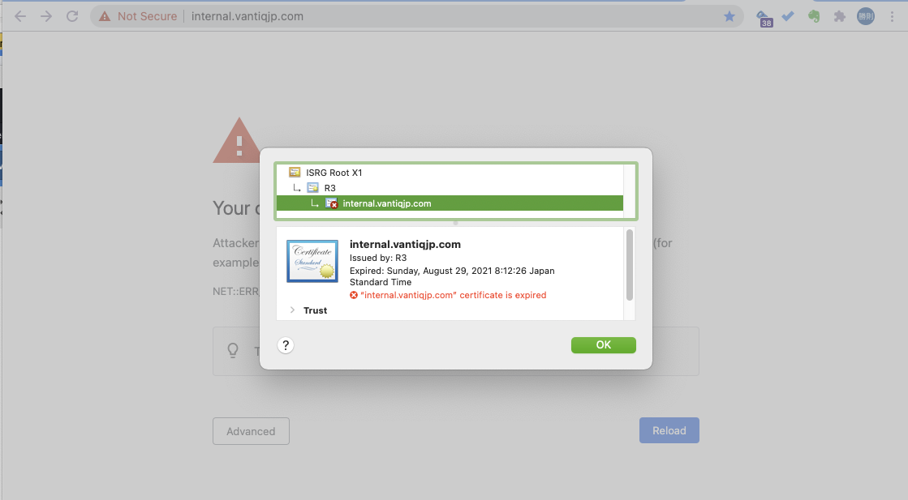

# はじめに

本記事では VANTIQ 保守作業において、[k8sdeploy_tools](https://github.com/Vantiq/k8sdeploy_tools) _(要権限)_ でカバーされていない補足の説明について記載する。

## 前提

- Kubectl ツールを使って k8s クラスタを操作する環境へのアクセスがあること

# 目次
[初回構築作業](#quick_reference)  
  - [事前準備 (アクセス権限等)](#preparation_access_permissions)  
  - [事前準備 (作業環境)](#preparation_work_environment)  
- [構築作業](#the_build_work)  

[保守作業](#the_maintenance_operations)  
  - [Minor Version Upgrade](#minor_version_upgrade)  
  - [Patch_Version_Upgrade](#patch_version_upgrade)  
  - [SSL 証明書を更新する](#renew_ssl_certificate)  
  - [License ファイルを更新する](#renew_license_files)  
  - [Vantiq MongoDB の回復をしたい](#recovery_of_vantiq_mongoDB)  


# 初回構築作業 (Quick Reference)<a id="quick_reference"></a>

### 事前準備 (アクセス権限等)<a id="preparation_access_permissions"></a>
- SSL 証明書ファイル (Customer より入手)
- 有効な Vantiq License ファイル (`license.key`、`public.pem`) (Vantiq Support より入手)
- DNS Zone の管理権限、もしくは即時対応可能な更新依頼先 (Customer より入手)  
   DNS 管理者が外部の方の場合、事前に相談しておくこと  
   既存の zone であれば、15分程度で有効になる(実際には数分で有効になるはず)  
   新規の zone であれば、最大 48時間程度かかることになる  
- `k8sdeploy_tools`、`k8sdeploy` リポジトリへのアクセス権限 (Vantiq Support より入手)
- `k8sdeploy_clusters_jp` リポジトリへのアクセス権限 (JapanVirtualSRE より入手。Vantiq社内管理の場合のみ。)
- *quay.io* への vantiq リポジトリへのアクセス権限（Vantiq Support より入手)
- SMTPサービスのエンドポイント、および資格情報
- APNs認証キー、FCM用アクセストークン（iOS, AndroidのVantiq Mobileを使用する場合のみ）
- 踏み台サーバのIPアドレス、ユーザー名、ssh秘密鍵（本記事のこれ以降の作業は踏み台サーバ上で行うことを想定する。）
- 作業対象のkubernetesクラスタへのアクセス権


### 事前準備 (作業環境)<a id="preparation_work_environment"></a>
踏み台サーバ上で行うことを想定する。
- java8 - Oracle or OpenJDK 最新バージョン
- git
- kubectl - 有効なバージョン (Cloud 側の K8s バージョン ± 1以内)
- helm 3 - 最新バージョン
- docker CE - 最新バージョン
- [git-secret](https://github.com/Vantiq/PStools/tree/main/git-secret) _(要権限)_ - secret、senstive ファイルを git にアップロードする際に必要
- stern - ログを pod 横断的に確認するのに便利


## 構築作業<a id="the_build_work"></a>

1. 最新バージョンの k8sdeploy_tools を取得する。`git clone https://github.com/Vantiq/k8sdeploy_tools.git` _(要権限)_
1. `k8sdeploy_tools` に移動する。
1. `./gradlew configureClient`を実行する。（この手順はエラーになっても、`helm repo list`を実行してvantiq repoが取得できていればよい。。。）
1. `.gradle/gradle.properties` の github の k8sdeploy にアクセスし、`username` と `password` を設定する。2段階認証を有効にしている場合、password は "personal access token" となる。
1. `targetCluster`、`vantiqSystem` がないことを確認する。
1. 次のコマンドを実行する。
   `./gradlew configureVantiqSystem`  
   `targetCluster`、`vantiqSystem` が作成されたことを確認する  
   `targetCluster` には、`cluster.properties`、`deploy.yaml` のみが生成される  
1. targetCluster に移動する。
1. クラスタ名を決定し、次のコマンドを実行する。
	 `git checkout -b <クラスタ名>`  
1. 続けて `cluster.properties` に任意の設定を行う。下記は一例。
   - #`requiredRemote`=`false` のコメントアウトを外す
   - `provider`=`aws` (azure|alicloud|openstack|kubeadm)
   - `vantiq_system_release`=`3.9.0` ([k8sdeploy repo](https://github.com/Vantiq/k8sdeploy/releases)で確認できる。K8sバやVantiqバージョンとも依存しており、不明ならばSRE または Supportに要確認)
   - `deployment`=`development` (development はシングル構成、production はトリプルクラスタ構成)
   - `vantiq.installation`=`tkeksfuji7` (クラスタのホスト名になる)
1. `~/.kube/config` を `kubeconfig` としてコピーし、必要な修正を実施する。  
1. 次のコマンドを実行し、クラスタとの接続を確認する。
	  `./gradlew -Pcluster=<クラスタ名> clusterInfo`  
	  エラーなく正常に client version、server version が返ることを確認する  
	  エラーの場合、`kubeconfig` の記述、kubectl のバージョン不整合などを確認すること  
1. 次のコマンドを実行し、設定ファイルを生成する。
	  `./gradlew -Pcluster=<クラスタ名> setupCluster`  
	  `secrets.yaml` ファイルと `deploy` というディレクトリが生成される  
1. `deploy.yaml` と `secrets.yaml` を修正する。  
1. 次のコマンドを実行し、パスワード関連ファイルを生成する。
	`./gradlew -Pcluster=<クラスタ名> generateSecrets`
1. 次のコマンドを実行し、デプロイを実施する。
  `./gradlew -Pcluster=<クラスタ名> deployNginx`  
	`./gradlew -Pcluster=<クラスタ名> deployShared`  
  `./gradlew -Pcluster=<クラスタ名> deployVantiq`  
  まとめて実行する`deploy`コマンドもあるが、podが正しいnodeに配置されるか等、スモールステップで確認する方が無難である。正常に終わらない場合は、deploy.yaml、secrets.yaml の設定を確認する。
1. 次のコマンドにて各種 pod が動作していることを確認する。
	`kubectl get pod -A`
1. Vantiq pod が動作している場合、次のコマンドにて出力される log 内から key を確認し保存する。  
	`kubectl logs pod/vantiq-0 -c vantiq -n <vantiqのnamespace>`
    ```
  	2020-05-06T16:21:57.493 [vert.x-eventloop-thread-7] INFO  i.v.c.i.l.c.VertxIsolatedDeployer - Succeeded in deploying verticle
  	2020-05-06T16:21:58.595 [vert.x-eventloop-thread-0] INFO  io.vantiq.startup - ******************************************************************
  	2020-05-06T16:21:58.595 [vert.x-eventloop-thread-0] INFO  io.vantiq.startup - *          1234567890123456789012345678901234567890=          *
  	2020-05-06T16:21:58.595 [vert.x-eventloop-thread-0] INFO  io.vantiq.startup - ******************************************************************
    ```
1. 次のコマンドを実行し、各種 pod が適切な node に乗っていることを確認する。    
	`kubectl describe nodes | egrep "^Name:|mongo-|vantiq-|metrics-|vision-|influx-|grafana-|coredns-|keycloak-|nginx-|telegraf-|zone"`  
	適切なノードに乗っていない場合は、別途手順を確認する
    ```
  	kubectl taint nodes --all key=value:NoSchedule
  	kubectl taint nodes <node名> key:NoSchedule-
  	kubectl scale <deploy or sts> -n <ns> --replicas=1
  	kubectl scale <deploy or sts> -n <ns> --replicas=3
  	kubectl taint nodes --all key:NoSchedule-
    ```
1. 次のコマンドより Load Balancer の DNS 名を確認する。  `kubectl get svc -A`  
   1. 上記DNS名が名前解決できることを確認する。  
        LB にて設定されたホスト名を CNAME (AWS CLB) もしくは Aレコード (Azure LB) で解決できるように設定する    
        Internet-facing: インターネットにて名前解決ができること    
        Internal: Internal ネットワーク内にあるホストから名前解決できること    
   1. 上記で確認した DNS 名の CNAME/Aレコードとして、計画している DNS 名を設定する。DNS Zone 管理者に確認すること。
   1. DNS 登録ができたことを確認する。
1. Keycloak で system admin ユーザーを作成する。
   1. 次にアクセスする。
	`https://<ドメイン名>/auth/`  
	Keycloak ページが表示されるので、`Administrator Console` をクリックする  
	Keycloak の管理者名とパスワード (`secrets.yaml` の `shared.keycloak.data.password` にて指定した内容) を使いログインする  
	作成するユーザーは、利用ユーザーとは違い、”System Admin” のため、取り扱いには注意が必要 (Org を自由に作成可能) となる  
   1. メニューにある Manage 配下の Users に移動する
   1. Add User ボタンをクリック
   1. Username を入力し、Save をクリック
   1. 作成したユーザーの Credential タブをクリック
   1. パスワードを設定し、Temporary を off にして Reset Password をクリック
   1. Details タブに移動し、Email verified を ON に変更し Save をクリック
   1. Role mapping タブに移動し、Client roles の realm management を選択する
   1. 全ての Available roles を選択し、Add selected ボタンをクリック
   1. 右上のユーザー名アイコンからログアウト
1. Keycloakの`Frontend URL`を設定する
   1. 対象のRealmの Realm Settings -> Generalタブ に移動する
   1. Frontend URLに`https://<ドメイン名>/auth/`と設定する
1. Vantiq IDE で system namespace の初期設定をする。
   1. 次のページにアクセスし、作成したユーザー名、パスワードでログインする。
  	`https://<ドメイン名>/`  
     #上記ステップでログアウトした画面からはログインできないため、先のページ `https://<ドメイン名>/` に移動すること。
  	作成したユーザー名とパスワードでログインする。
   1. System admin の Grafana 設定を実施する    
	    [Add Grafana dashboard for System users](https://github.com/Vantiq/k8sdeploy_tools#add_grafana_dashboards)に従い、設定を行う。
	    `k8sdeploy_tools/vantiqSystem/deploy/vantiq/dashboards` にあるファイルを設定する。
	     インポートすべきファイルは、適切な Branch を選択する必要がある (vantiq_system_release を指定)
       **それぞれのData Source設定する際、username: `vantiq_sysuser`, password: `secret4sysuser`とすること。**
      - InfluxDB Internal.json -> internals
      - MongoDB Monitoring Dashboard.json -> kubernetes
      - Organization Activitiy.json -> systemDB、kubernetes、vantiqServer
      - Vantiq Resources.json -> kubernetes、vantiqServer

   1. Source: `GenericEmailSender` を修正する  
	      Search box に ”generic” と入力し、enter を押下する。 検索結果 Window が表示されるので、[system] にチェックをつけ、"GenericEmailSender" をクリックする。 適切な email server の設定を行い、[変更の保存] をクリックする  
   1. ノードのプロパティを更新する  
	    [デプロイ] -> [Nodes] で、"self" を選択する。
	    デフォルトの http://localhost:8080 を、デプロイされているドメイン名に変更する（例：https://hr-vantiq.co.jp)
   1. ユーザー向け Organization を作成する  
	    [管理] -> [Organization] を選択し、[新規] アイコンをクリックする。
	    Org Name、Org Description、Namespace (root namespace)、Invite Destination (Org Adminのメールアドレス)、[Make Me The Administrator] をチェック（自分が Org 管理者になる場合）し、[変更の保存] をクリック
   1. Org 管理者を追加する    
	    Namespace から、作成した organization の root namespace に移動する。
      [管理] -> [ユーザー] を選択し、[新規] をクリックする。
	    Authorization プロパティのアイコンをクリックし、権限を Organization Admin にして [OK] をクリックする。追加するユーザーのメールアドレスを入力し、保存する


# 保守作業<a id="the_maintenance_operations"></a>

### Minor Version Upgrade<a id="minor_version_upgrade"></a>
Minor Version がインクレメントされるアップグレード（e.g. `1.30.10` -> `1.31.0`)  
Enhancement のための DB Schema 拡張を伴うため、ダウンタイムが必要になる。
1. 顧客の DTC にアップグレードに伴うサービス停止をアナウンスする (顧客 DTC はサービス停止による影響回避を社内で調整する)。
1. 最新の k8sdeploy_tools に更新する。k8sdeploy_tools のルートで `git pull` を実行する。
1. `deploy.yaml` の変更を行う (`vantiq.image.tag`)。
1. `cluster.properties` の `vantiq_system_release` を vantiq バージョンをサポートするものに変更する。バージョンアップに伴いその他のパラメーターが変更が必要な場合もある。
1. `cluster.properties` に変更があった場合、設定の更新を反映する。`./gradlew -Pcluster=<クラスタ名> setupCluster`
1. Vantiq pod のサービスを停止する (`metrics-collector` と `vision-analytics` は構成している場合のみ)。ここからダウンタイムが開始される。
    ```sh
    kubectl scale sts -n <namespace name> vantiq --replicas=0
    kubectl scale sts -n <namespace name> metrics-collector --replicas=0
    kubectl scale sts -n <namespace name> vision-analytics --replicas=0
    ```
1. mongodb のバックアップをする。`job name` は任意。
    ```sh
    kubectl create job -n <namespace name> <job name> --from=CronJob/mongobackup
    # jobの監視
    kubectl logs -n <namespace name> <mongobackup job pod name>
    ```
1. `deploy.yaml` の変更を適用する。 `./gradlew -Pcluster=<クラスタ名> deployVantiq`   
    **Caution:** `deployVantiq` を行うと vantiq pod のスケールが規定の数 (=3) に戻るが、バージョンアップ適用中は **必ず 1つのみ** にする必要があるため、直後にスケールを再変更する。その間、`metrics-collector`、`vision-analytics` は **必ず 0である** こと。
    ```sh
    ./gradlew -Pcluster=<クラスタ名> deployVantiq
    kubectl scale sts -n <namespace name> vantiq --replicas=1
    kubectl scale sts -n <namespace name> metrics-collector --replicas=0
    kubectl scale sts -n <namespace name> vision-analytics --replicas=0
    ```
1. スキーマ変更が正常に終了したか確認する。`kubectl logs -n <namespace name> vantiq-0 -c load-model -f`
1. `vantiq-0` pod が起動完了し、Vantiq IDE にログインできることを確認する。ここでダウンタイムが終了する。
1. スケールを元に戻す。
    ```sh
    kubectl scale sts -n <namespace name> vantiq --replicas=3
    kubectl scale sts -n <namespace name> metrics-collector --replicas=1
    kubectl scale sts -n <namespace name> vision-analytics --replicas=2
    ```
1. アップグレード作業完了を報告する。Vantiq IDE にログイン -> ナビゲーション バーの [ユーザー] アイコン -> [About] をクリックし、Platform のバージョンをコピーする。  
    例：
    ```
    Platform
    Version 7.6h
    サーバー https://internal.vantiqjp.com/ui/ide/index.html#!/modelo
    Namespace 'system' で 'masanori' としてログインしました （システム管理者） （Namespace 管理者）
    Login expires at Fri Sep 03 23:15:36 2021 (local time)

    UI Build Version : 1.31.8
    UI Build Commit : 937e25e9a8d63907124fb8366c146f926050f84c
    UI Build Date : Sun Jun 06 22:22:36 UTC 2021

    Server Build Version : 1.31.8
    Server Build Commit : eaf73629834f8e3210d62740c573898de6702fce
    Server Build Date : Sun Jun 06 22:24:11 UTC 2021

    Server License Issued To : Vantiq JP
    Server License Expiration Date: Thu Feb 24 2028 10:44:12 GMT+0900 (Japan Standard Time)
    Server License ID: a1585c60-7578-11eb-8d98-acde48001122

    ブラウザー : Chrome 92.0.4515.159
    Useragent : Mozilla/5.0 (Macintosh; Intel Mac OS X 10_15_7) AppleWebKit/537.36 (KHTML, like Gecko) Chrome/92.0.4515.159 Safari/537.36
    ロケール: ja-*-*

    ```
### Minor Version Upgrade - Rollback<a id="minor_version_upgrade_rollback"></a>
Vantiqの各コンポーネントはkubernetes上で稼働しているため、基本的には切り戻しのために古いバージョンのイメージを再デプロイすることになる。MongoDBのデータについてはバックアップ済みデータを用いてアップグレード作業開始前の状態にする。
1. Vantiq pod のサービスを停止する (`metrics-collector` と `vision-analytics` は構成している場合のみ)。
    ```sh
    kubectl scale sts -n <namespace name> vantiq --replicas=0
    kubectl scale sts -n <namespace name> metrics-collector --replicas=0
    kubectl scale sts -n <namespace name> vision-analytics --replicas=0
    ```
1. アップグレード作業中に作成したMongodbバックアップ（step 7)を用いて作業前の状態に戻す。手順については[Vantiq MongoDB の回復をしたい](./vantiq-install-maintenance-troubleshooting.md#recovery_of_vantiq_mongoDB)を参照する。
1. `deploy.yaml` の`vantiq.image.tag`をアップグレード前のバージョンに戻す。
1. `deploy.yaml` の変更を適用する。 `./gradlew -Pcluster=<クラスタ名> deployVantiq`   


### Patch Version Upgrade<a id="patch_version_upgrade"></a>
Patch Version がインクレメントされるアップグレード（e.g. `1.30.10` -> `1.30.11`)  
DB Schema 拡張を伴わないため、Vantiq Pod のみの更新となる。
1. 最新の k8sdeploy_tools に更新する。k8sdeploy_tools のルートで`git pull` を実行する。
1. `deploy.yaml` の変更を行う（`vantiq.image.tag`）。
1. `cluster.properties` の `vantiq_system_release` を vantiq バージョンをサポートするものに変更する。バージョンアップに伴いその他のパラメーターが変更が必要な場合もある。
1. `cluster.properties` に変更があった場合、設定の更新を反映する。`./gradlew -Pcluster=<クラスタ名> setupCluster`
1. `deploy.yaml` の変更を適用する。 `./gradlew -Pcluster=<クラスタ名> deployVantiq`
1. `vantiq` の rolling update が完了し、Vantiq IDE にログインできることを確認する。
1. アップグレード作業完了を報告する。Vantiq IDE にログイン -> ナビゲーション バーの [ユーザー]アイコン -> [About] をクリックし、Platform のバージョンをコピーする。  
    例：
    ```
    Platform
    Version 7.6h
    サーバー https://internal.vantiqjp.com/ui/ide/index.html#!/modelo
    Namespace 'system' で 'masanori' としてログインしました （システム管理者） （Namespace 管理者）
    Login expires at Fri Sep 03 23:15:36 2021 (local time)

    UI Build Version : 1.31.8
    UI Build Commit : 937e25e9a8d63907124fb8366c146f926050f84c
    UI Build Date : Sun Jun 06 22:22:36 UTC 2021

    Server Build Version : 1.31.8
    Server Build Commit : eaf73629834f8e3210d62740c573898de6702fce
    Server Build Date : Sun Jun 06 22:24:11 UTC 2021

    Server License Issued To : Vantiq JP
    Server License Expiration Date: Thu Feb 24 2028 10:44:12 GMT+0900 (Japan Standard Time)
    Server License ID: a1585c60-7578-11eb-8d98-acde48001122

    ブラウザー : Chrome 92.0.4515.159
    Useragent : Mozilla/5.0 (Macintosh; Intel Mac OS X 10_15_7) AppleWebKit/537.36 (KHTML, like Gecko) Chrome/92.0.4515.159 Safari/537.36
    ロケール: ja-*-*

    ```
### Patch Version Upgrade - Rollback<a id="patch_version_upgrade_rollback"></a>
Vantiqの各コンポーネントはkubernetes上で稼働しているため、基本的には切り戻しのために古いバージョンのイメージを再デプロイすることになる。
1. `deploy.yaml` の`vantiq.image.tag`をアップグレード前のバージョンに戻す。
1. `deploy.yaml` の変更を適用する。 `./gradlew -Pcluster=<クラスタ名> deployVantiq`   


### SSL 証明書を更新する<a id="renew_ssl_certificate"></a>
SSL 証明書が期限切れになると、ブラウザーでアクセス時にエラーとなるが、このようになる前に計画的に SSL 証明書を更新が必要である。


1. SSL 証明書を取得する。
  - 顧客調達の場合、必要なリードタイムを考慮し、前もって証明書の更新を依頼する。
  - Vantiq 内部で非本番用の場合、[SSLなう](https://sslnow.ml/)などを使って、"Let's Encrypt" の証明書を取得してもよい。
2.  SSL 証明書はすべての中間証明書を含む、フルチェーンであること (すべての必要な中間証明書がオリジナルの証明書のファイルにアペンドされていること)。
3. 取得した証明書と秘密鍵 (それぞれ、`fullchain.crt`、`private.key` とする) を `targetCluster/deploy/sensitive` の下の該当するファイルと置き換える。古いファイルがある場合、日付のsuffixをつけてリネームしてバックアップとする。
4. k8sdeploy_tools のルートで`./gradlew -Pcluster=<cluster name> generateSecrets` を実行する。
5. `./gradlew -Pcluster=<cluster name> deployVantiq` を実行する。`vantiq-ssl-cert` が更新される。
6. `./gradlew -Pcluster=<cluster name> deployNginx` を実行する。`-n shared default-ssl-cert` が更新される。
7. ブラウザーでアクセスし、証明書が変わっていることを確認する。

### SSL 証明書を更新する - Rollback<a id="renew_ssl_certificate_rollback"></a>
1. バックアップしておいた証明書と秘密鍵 (それぞれ、`fullchain.crt.yyyyMMdd`、`private.key.yyyyMMdd` とする) を `targetCluster/deploy/sensitive` の下にリネームして戻す。
1. k8sdeploy_tools のルートで`./gradlew -Pcluster=<cluster name> generateSecrets` を実行する。
1. `./gradlew -Pcluster=<cluster name> deployVantiq` を実行する。`vantiq-ssl-cert` が更新される。
1. `./gradlew -Pcluster=<cluster name> deployNginx` を実行する。`-n shared default-ssl-cert` が更新される。
1. ブラウザーでアクセスし、証明書が変わっていることを確認する。


### License ファイルを更新する<a id="renew_license_files"></a>

1. Vantiq Support から License ファイル (それぞれ、`public.pem`、`license.key` とする) を取得する。
2. 取得した License ファイルを `targetCluster/deploy/sensitive` の下の該当するファイルと置き換える。古いファイルがある場合、日付のsuffixをつけてリネームしてバックアップとする。
3. k8sdeploy_tools のルートで `./gradlew -Pcluster=<cluster name> generateSecrets` を実行する。
4. `./gradlew -Pcluster=<cluster name> deployVantiq` を実行する。
5. secrets を反映させるために、次のコマンドを実行し、vantiq pod の rolling restart をする。`kubectl rollout restart sts -n <vantiq namespace> vantiq`

### License ファイルを更新する - Rollback<a id="renew_license_files_rollback"></a>

1. バックアップしておいた License ファイルを `targetCluster/deploy/sensitive` の下にリネームして戻す。
1. k8sdeploy_tools のルートで `./gradlew -Pcluster=<cluster name> generateSecrets` を実行する。
1. `./gradlew -Pcluster=<cluster name> deployVantiq` を実行する。
1. secrets を反映させるために、次のコマンドを実行し、vantiq pod の rolling restart をする。`kubectl rollout restart sts -n <vantiq namespace> vantiq`


Reference: https://github.com/Vantiq/k8sdeploy_tools/blob/master/scripts/README.md _(要権限)_
