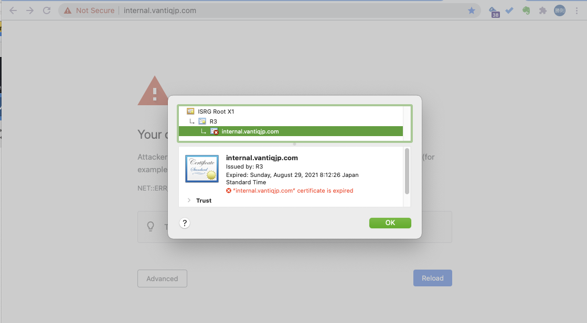

# はじめに
本記事ではVantiq保守作業において、[k8sdeploy_tools](https://github.com/Vantiq/k8sdeploy_tools) _(要権限)_ でカバーされていない補足の説明について記載する。
kubectl コマンドの簡易的な使い方については[kubectlコマンドの使い方](./kubectl-commnad.md)を参照。

Vantiqプラットフォームに関する保守項目一覧は以下の通り。

\# | 項目名                            | 説明                                                                                                                            | 適切なタイミング                                                | 準備期間の目安 | 更新時のサービス停止 | 作業者
---|-----------------------------------|---------------------------------------------------------------------------------------------------------------------------------|-----------------------------------------------------------------|----------------|----------------------|-------------------
1  | [Vantiq ライセンス更新](#renew_license_files)              | Vantiq クラスタが参照するライセンスファイル。**ライセンスが有効でない場合、Vantiq サービスが停止される。**                        | PO 発行後、ライセンス期限前                             | 1 week         | 必要なし             | Vantiq サポート
2  | [SSL 証明書更新](#renew_ssl_certificate)                     | Vantiq クラスタで使用する SSL 証明書。<br />**有効期限が切れると、Vantiq IDE にログインや、HTTPS REST でサービス接続ができなくなる。**     | 証明書の有効期限前                                     | 2 weeks        | 必要なし             | Vantiq サポート
3  | [Vantiq マイナーバージョンアップ](#vantiq_minor_version_upgrade)    | Vantiq の機能追加を伴うバージョンアップを行う。                                                                                  | 概ね 4ヶ月に一度（年3回）                                            | 1 week         | 必要                 | Vantiq サポート
4  | [Vantiq パッチバージョンアップ](#vantiq-patch-version-upgrade)      | Vantiq の現行バージョンの不具合修正を行うバージョンアップを行う。                                                                | 随時。運用上支障がある不具合修正のリリース時。                  | 2 days         | 必要なし             | Vantiq サポート
5  | service principal アカウントの更新 | （AzureでInternal Load Balancerを構成する場合のみ）<br />Vantiq を Private 構成にするため、AKS に権限を持つ Service Principal を使用している。<br />**有効期限切れ後サービスが停止する可能性ある。** | Service Principal の有効期限前。                                 | 1 week         | 必要                 | Vantiq サポート


# 目次

[保守作業](#the_maintenance_operations)  
- [はじめに](#はじめに)
- [目次](#目次)
- [保守作業](#保守作業)
  - [Vantiqバージョンアップ作業](#vantiqバージョンアップ作業)
    - [Vantiq Minor Version Upgrade](#vantiq-minor-version-upgrade)
    - [Vantiq Minor Version Upgrade - Rollback](#vantiq-minor-version-upgrade---rollback)
    - [Vantiq Patch Version Upgrade](#vantiq-patch-version-upgrade)
    - [Vantiq Patch Version Upgrade - Rollback](#vantiq-patch-version-upgrade---rollback)
  - [Kubernetesバージョンアップ作業](#kubernetesバージョンアップ作業)
    - [Kubernetes Minor Version Upgrade](#kubernetes-minor-version-upgrade)
  - [更新作業](#更新作業)
    - [SSL 証明書を更新する](#ssl-証明書を更新する)
    - [SSL 証明書を更新する - Rollback](#ssl-証明書を更新する---rollback)
    - [License ファイルを更新する](#license-ファイルを更新する)
    - [License ファイルを更新する - Rollback](#license-ファイルを更新する---rollback)
    - [InfluxDBのPVを拡張する](#influxdbのpvを拡張する)

# 保守作業<a id="the_maintenance_operations"></a>

## Vantiqバージョンアップ作業<a id="vantiq_version_upgrade_operations"></a>

### Vantiq Minor Version Upgrade<a id="vantiq_minor_version_upgrade"></a>
Vantiq の Minor Version がインクレメントされるアップグレード（e.g. `1.30.10` -> `1.31.0`)  
Enhancement のための DB Schema 拡張を伴うため、ダウンタイムが必要になる。
1. 顧客の DTC にアップグレードに伴うサービス停止をアナウンスする (顧客 DTC はサービス停止による影響回避を社内で調整する)。
1. 最新の k8sdeploy_tools に更新する。k8sdeploy_tools のルートで `git pull` を実行する。
1. `deploy.yaml` の変更を行う (`vantiq.image.tag`)。
1. `cluster.properties` の `vantiq_system_release` を vantiq バージョンをサポートするものに変更する。バージョンアップに伴いその他のパラメーターが変更が必要な場合もある。
1. `cluster.properties` に変更があった場合、設定の更新を反映する。`./gradlew -Pcluster=<クラスタ名> setupCluster`
1. Vantiq pod のサービスを停止する (`metrics-collector` と `vision-analytics` は構成している場合のみ)。ここからダウンタイムが開始される。
    ```sh
    kubectl scale sts -n <namespace name> vantiq --replicas=0
    kubectl scale sts -n <namespace name> metrics-collector --replicas=0
    kubectl scale sts -n <namespace name> vision-analytics --replicas=0
    ```
1. mongodb のバックアップをする。`job name` は任意。
    ```sh
    kubectl create job -n <namespace name> <job name> --from=CronJob/mongobackup
    # jobの監視
    kubectl logs -n <namespace name> <mongobackup job pod name>
    ```
1. `deploy.yaml` の変更を適用する。 `./gradlew -Pcluster=<クラスタ名> deployVantiq`   
    **Caution:** `deployVantiq` を行うと vantiq pod のスケールが規定の数 (=3) に戻るが、バージョンアップ適用中は **必ず 1つのみ** にする必要があるため、直後にスケールを再変更する。その間、`metrics-collector`、`vision-analytics` は **必ず 0である** こと。
    ```sh
    ./gradlew -Pcluster=<クラスタ名> deployVantiq
    kubectl scale sts -n <namespace name> vantiq --replicas=1
    kubectl scale sts -n <namespace name> metrics-collector --replicas=0
    kubectl scale sts -n <namespace name> vision-analytics --replicas=0
    ```
1. スキーマ変更が正常に終了したか確認する。`kubectl logs -n <namespace name> vantiq-0 -c load-model -f`
1. `vantiq-0` pod が起動完了し、Vantiq IDE にログインできることを確認する。ここでダウンタイムが終了する。
1. スケールを元に戻す。
    ```sh
    kubectl scale sts -n <namespace name> vantiq --replicas=3
    kubectl scale sts -n <namespace name> metrics-collector --replicas=1
    kubectl scale sts -n <namespace name> vision-analytics --replicas=2
    ```
1. アップグレード作業完了を報告する。Vantiq IDE にログイン -> ナビゲーション バーの [ユーザー] アイコン -> [About] をクリックし、Platform のバージョンをコピーする。  
    例：
    ```
    Platform
    Version 7.6h
    サーバー https://internal.vantiqjp.com/ui/ide/index.html#!/modelo
    Namespace 'system' で 'masanori' としてログインしました （システム管理者） （Namespace 管理者）
    Login expires at Fri Sep 03 23:15:36 2021 (local time)

    UI Build Version : 1.31.8
    UI Build Commit : 937e25e9a8d63907124fb8366c146f926050f84c
    UI Build Date : Sun Jun 06 22:22:36 UTC 2021

    Server Build Version : 1.31.8
    Server Build Commit : eaf73629834f8e3210d62740c573898de6702fce
    Server Build Date : Sun Jun 06 22:24:11 UTC 2021

    Server License Issued To : Vantiq JP
    Server License Expiration Date: Thu Feb 24 2028 10:44:12 GMT+0900 (Japan Standard Time)
    Server License ID: a1585c60-7578-11eb-8d98-acde48001122

    ブラウザー : Chrome 92.0.4515.159
    Useragent : Mozilla/5.0 (Macintosh; Intel Mac OS X 10_15_7) AppleWebKit/537.36 (KHTML, like Gecko) Chrome/92.0.4515.159 Safari/537.36
    ロケール: ja-*-*

    ```
### Vantiq Minor Version Upgrade - Rollback<a id="vantiq_minor_version_upgrade_rollback"></a>
Vantiqの各コンポーネントはkubernetes上で稼働しているため、基本的には切り戻しのために古いバージョンのイメージを再デプロイすることになる。MongoDBのデータについてはバックアップ済みデータを用いてアップグレード作業開始前の状態にする。
1. Vantiq pod のサービスを停止する (`metrics-collector` と `vision-analytics` は構成している場合のみ)。
    ```sh
    kubectl scale sts -n <namespace name> vantiq --replicas=0
    kubectl scale sts -n <namespace name> metrics-collector --replicas=0
    kubectl scale sts -n <namespace name> vision-analytics --replicas=0
    ```
1. アップグレード作業中に作成したMongodbバックアップ（step 7)を用いて作業前の状態に戻す。手順については[Vantiq MongoDB の回復をしたい](./vantiq-install-maintenance-troubleshooting.md#recovery_of_vantiq_mongoDB)を参照する。
1. `deploy.yaml` の`vantiq.image.tag`をアップグレード前のバージョンに戻す。
1. `deploy.yaml` の変更を適用する。 `./gradlew -Pcluster=<クラスタ名> deployVantiq`   


### Vantiq Patch Version Upgrade<a id="vantiq_patch_version_upgrade"></a>
Patch Version がインクレメントされるアップグレード（e.g. `1.30.10` -> `1.30.11`)  
DB Schema 拡張を伴わないため、Vantiq Pod のみの更新となる。
1. 最新の k8sdeploy_tools に更新する。k8sdeploy_tools のルートで`git pull` を実行する。
1. `deploy.yaml` の変更を行う（`vantiq.image.tag`）。
1. `cluster.properties` の `vantiq_system_release` を vantiq バージョンをサポートするものに変更する。バージョンアップに伴いその他のパラメーターが変更が必要な場合もある。
1. `cluster.properties` に変更があった場合、設定の更新を反映する。`./gradlew -Pcluster=<クラスタ名> setupCluster`
1. `deploy.yaml` の変更を適用する。 `./gradlew -Pcluster=<クラスタ名> deployVantiq`
1. `vantiq` の rolling update が完了し、Vantiq IDE にログインできることを確認する。
1. アップグレード作業完了を報告する。Vantiq IDE にログイン -> ナビゲーション バーの [ユーザー]アイコン -> [About] をクリックし、Platform のバージョンをコピーする。  
    例：
    ```
    Platform
    Version 7.6h
    サーバー https://internal.vantiqjp.com/ui/ide/index.html#!/modelo
    Namespace 'system' で 'masanori' としてログインしました （システム管理者） （Namespace 管理者）
    Login expires at Fri Sep 03 23:15:36 2021 (local time)

    UI Build Version : 1.31.8
    UI Build Commit : 937e25e9a8d63907124fb8366c146f926050f84c
    UI Build Date : Sun Jun 06 22:22:36 UTC 2021

    Server Build Version : 1.31.8
    Server Build Commit : eaf73629834f8e3210d62740c573898de6702fce
    Server Build Date : Sun Jun 06 22:24:11 UTC 2021

    Server License Issued To : Vantiq JP
    Server License Expiration Date: Thu Feb 24 2028 10:44:12 GMT+0900 (Japan Standard Time)
    Server License ID: a1585c60-7578-11eb-8d98-acde48001122

    ブラウザー : Chrome 92.0.4515.159
    Useragent : Mozilla/5.0 (Macintosh; Intel Mac OS X 10_15_7) AppleWebKit/537.36 (KHTML, like Gecko) Chrome/92.0.4515.159 Safari/537.36
    ロケール: ja-*-*

    ```
### Vantiq Patch Version Upgrade - Rollback<a id="vantiq_patch_version_upgrade_rollback"></a>
Vantiqの各コンポーネントはkubernetes上で稼働しているため、基本的には切り戻しのために古いバージョンのイメージを再デプロイすることになる。
1. `deploy.yaml` の`vantiq.image.tag`をアップグレード前のバージョンに戻す。
1. `deploy.yaml` の変更を適用する。 `./gradlew -Pcluster=<クラスタ名> deployVantiq`   


## Kubernetesバージョンアップ作業<a id="kubernetes_version_upgrade_operations"></a>

### Kubernetes Minor Version Upgrade<a id="k8s_minor_version_upgrade"></a>
[Kubernetesアップグレード](../../../vantiq-cloud-infra-operations/docs/jp/kubernetes-upgrade.md)を参照

## 更新作業<a id="renew_operations"></a>  

### SSL 証明書を更新する<a id="renew_ssl_certificate"></a>
SSL 証明書が期限切れになると、ブラウザーでアクセス時にエラーとなるが、このようになる前に計画的に SSL 証明書を更新が必要である。


1. SSL 証明書を取得する。
  - 顧客調達の場合、必要なリードタイムを考慮し、前もって証明書の更新を依頼する。
  - Vantiq 内部で非本番用の場合、[SSLなう](https://sslnow.ml/)などを使って、"Let's Encrypt" の証明書を取得してもよい。
2.  SSL 証明書はすべての中間証明書を含む、フルチェーンであること (すべての必要な中間証明書がオリジナルの証明書のファイルにアペンドされていること)。
3. 取得した証明書と秘密鍵 (それぞれ、`fullchain.crt`、`private.key` とする) を `targetCluster/deploy/sensitive` の下の該当するファイルと置き換える。古いファイルがある場合、日付のsuffixをつけてリネームしてバックアップとする。
4. k8sdeploy_tools のルートで`./gradlew -Pcluster=<cluster name> generateSecrets` を実行する。
5. `./gradlew -Pcluster=<cluster name> deployVantiq` を実行する。`vantiq-ssl-cert` が更新される。
6. `./gradlew -Pcluster=<cluster name> deployNginx` を実行する。`-n shared default-ssl-cert` が更新される。
7. ブラウザーでアクセスし、証明書が変わっていることを確認する。

### SSL 証明書を更新する - Rollback<a id="renew_ssl_certificate_rollback"></a>
1. バックアップしておいた証明書と秘密鍵 (それぞれ、`fullchain.crt.yyyyMMdd`、`private.key.yyyyMMdd` とする) を `targetCluster/deploy/sensitive` の下にリネームして戻す。
1. k8sdeploy_tools のルートで`./gradlew -Pcluster=<cluster name> generateSecrets` を実行する。
1. `./gradlew -Pcluster=<cluster name> deployVantiq` を実行する。`vantiq-ssl-cert` が更新される。
1. `./gradlew -Pcluster=<cluster name> deployNginx` を実行する。`-n shared default-ssl-cert` が更新される。
1. ブラウザーでアクセスし、証明書が変わっていることを確認する。


### License ファイルを更新する<a id="renew_license_files"></a>

1. Vantiq Support から License ファイル (それぞれ、`public.pem`、`license.key` とする) を取得する。
2. 取得した License ファイルを `targetCluster/deploy/sensitive` の下の該当するファイルと置き換える。古いファイルがある場合、日付のsuffixをつけてリネームしてバックアップとする。
3. k8sdeploy_tools のルートで `./gradlew -Pcluster=<cluster name> generateSecrets` を実行する。
4. `./gradlew -Pcluster=<cluster name> deployVantiq` を実行する。
5. secrets を反映させるために、次のコマンドを実行し、vantiq pod の rolling restart をする。`kubectl rollout restart sts -n <vantiq namespace> vantiq`

### License ファイルを更新する - Rollback<a id="renew_license_files_rollback"></a>

1. バックアップしておいた License ファイルを `targetCluster/deploy/sensitive` の下にリネームして戻す。
1. k8sdeploy_tools のルートで `./gradlew -Pcluster=<cluster name> generateSecrets` を実行する。
1. `./gradlew -Pcluster=<cluster name> deployVantiq` を実行する。
1. secrets を反映させるために、次のコマンドを実行し、vantiq pod の rolling restart をする。`kubectl rollout restart sts -n <vantiq namespace> vantiq`


Reference: https://github.com/Vantiq/k8sdeploy_tools/blob/master/scripts/README.md _(要権限)_

### InfluxDBのPVを拡張する<a id="resize_influxdb_pv"></a>
[InfluxDB PV拡張手順](./resize_influxdb_pv.md)を参照
