# はじめに

本書ではVANTIQ運用のうち、インシデント時の一次切り分け対応について記載する。

## 前提

- Kubectlツールを使ってk8sクラスタを操作する環境へのアクセスがあること
- VANTIQ IDEにOrg Admin以上の権限があること
- [mermaid プラグイン](https://github.com/BackMarket/github-mermaid-extension) がインストール済みでフローチャートの表示が可能であること  

# トラブルシューティングシナリオ

以下のシナリオについて、対応手順を説明する。

1.  [VANTIQ基盤のサービス異常を検出](#case-1-vantiq基盤のサービス異常を検出)
2.  [Podの異常ステータスを検出](#case-2-podの異常ステータスを検出)
3.  [Nodeの再起動イベントを検出](#case-3-nodeの再起動イベントを検出)
4.  [PodのCPU/Memoryの使用量が閾値を超える](#case-4-podのcpumemoryの使用量が閾値を超える)
5.  [NodeのCPU/Memoryの使用量が閾値を超える](#case-5-nodeのcpumemoryの使用量が閾値を超える)

オペレーションの際は以下の点を留意すること。

- この文書は運用担当のチーム向けに作成されているため、文書内で説明しているオペレーションは、構成情報の更新を行わない操作やコマンド（参照やサービス再起動など）の実行にとどめている。ただし、アカウントの権限自体がそれ以上のオペレーションが行えないよう制限されているとは限らないこと。

- この文書で説明したオペレーション以上を行う場合、構成が更新され、結果再インストール作業や復旧作業が必要になる恐れがあること。

## Case 1: VANTIQ基盤のサービス異常を検出
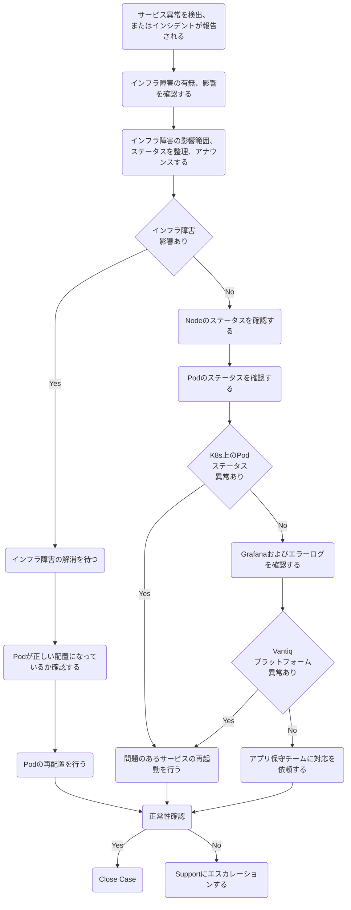

## Case 2: Podの異常ステータスを検出
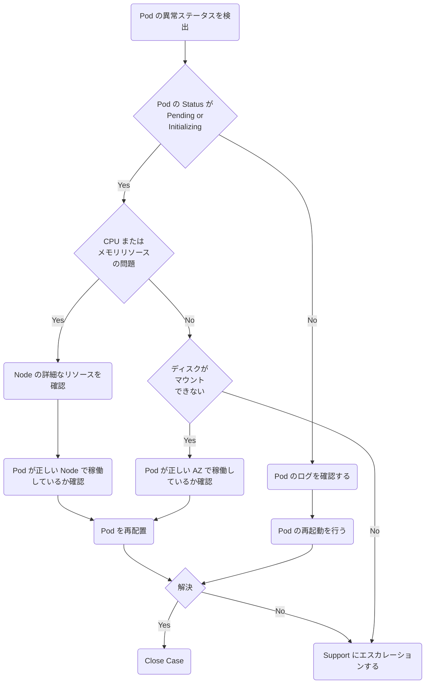

## Case 3: Nodeの再起動イベントを検出
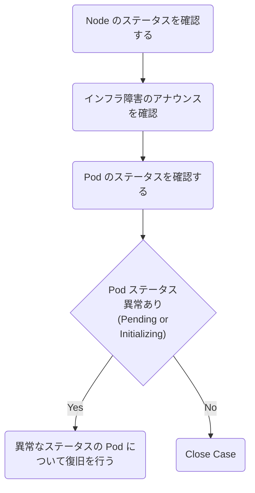

## Case 4: PodのCPU/Memoryの使用量が閾値を超える
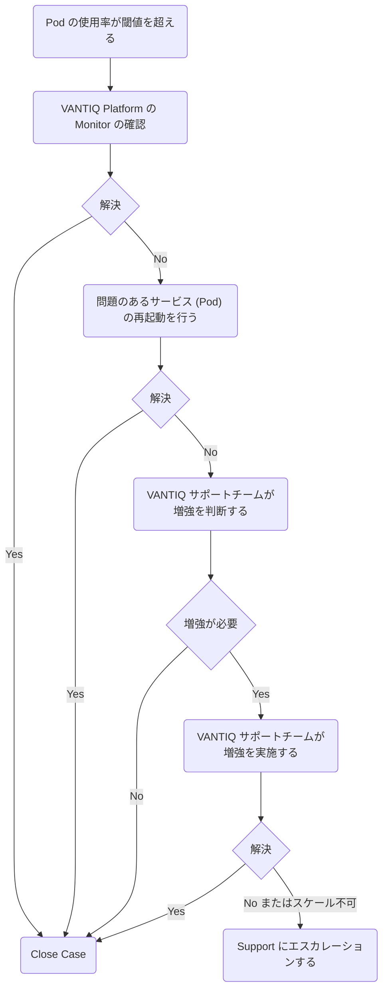

## Case 5: NodeのCPU/Memoryの使用量が閾値を超える

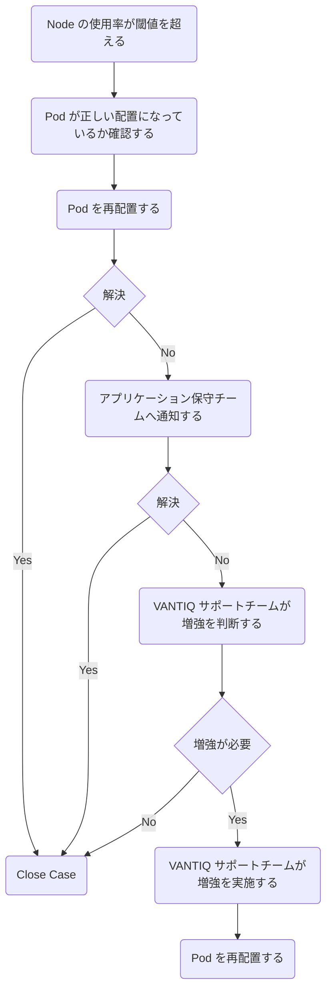

# オペレーション

フローチャートに記載したアクションについて、オペレーション方法を記載する。

## Podのステータスを確認する

チェック項目
- Podのステータス異常はないか（Running、Completed以外は異常）
- Podが異常な再起動を繰り返していないか（RESTARTSの回数、statusがCrashLoopBackOffになっている）
- Podが起動しない (statusがInit:Errorなど) 場合に、Eventsから問題の原因を探る。
- Podが正しいワーカーノードで稼働しているか

Podの一覧でステータスを確認する。
- `Namespace` -- Podが配置されているnamespace
- `Name` -- Podの名前
- `Ready` -- Pod内で稼働しているコンテナの数
- `Status` -- Podのステータス
- `Restarts` -- Podの再起動回数
- `Age` -- Podが起動してからの経過時間

```bash
$ kubectl get pod -A

NAMESPACE     NAME                                                READY   STATUS      RESTARTS   AGE
app           metrics-collector-0                                 1/1     Running     1          6d18h
app           mongobackup-1605657600-2rtlk                        0/1     Completed   0          2d9h
app           mongobackup-1605744000-8gmnz                        0/1     Completed   0          33h
app           mongobackup-1605830400-r842f                        0/1     Completed   0          9h
app           mongodb-0                                           2/2     Running     0          6d18h
app           mongodb-1                                           2/2     Running     0          6d18h
app           mongodb-2                                           2/2     Running     0          6d18h
app           userdb-0                                            2/2     Running     0          6d18h
app           userdb-1                                            2/2     Running     0          6d18h
app           userdb-2                                            2/2     Running     0          6d18h
app           vantiq-0                                            1/1     Running     0          6d18h
app           vantiq-1                                            1/1     Running     0          6d18h
app           vantiq-2                                            1/1     Running     0          6d18h
datadog       datadog-agent-2cs5z                                 2/2     Running     0          22d
datadog       datadog-agent-2p7pk                                 2/2     Running     0          6d20h
datadog       datadog-agent-9dqgv                                 2/2     Running     2          22d
datadog       datadog-agent-9sw6z                                 2/2     Running     0          22d
datadog       datadog-agent-dnj5j                                 2/2     Running     0          22d
datadog       datadog-agent-hf9hk                                 2/2     Running     0          6d20h
datadog       datadog-agent-kdhdp                                 2/2     Running     0          22d
datadog       datadog-agent-kube-state-metrics-57f847d7d4-wwv5w   1/1     Running     0          22d
datadog       datadog-agent-l87lw                                 2/2     Running     0          22d
datadog       datadog-agent-mqtzh                                 2/2     Running     0          6d20h
datadog       datadog-agent-ngjn2                                 2/2     Running     0          22d
datadog       datadog-agent-qw8pm                                 2/2     Running     0          22d
datadog       datadog-agent-sshln                                 2/2     Running     0          22d
datadog       datadog-agent-tbhql                                 2/2     Running     0          22d
datadog       datadog-agent-zxzlt                                 2/2     Running     0          22d
shared        grafana-67df56d6dc-4jj57                            1/1     Running     0          6d18h
shared        grafanadb-mysql-85b686d65c-wgx9s                    1/1     Running     0          6d18h
shared        influxdb-0                                          1/1     Running     0          6d18h
shared        keycloak-0                                          1/1     Running     0          6d15h
shared        keycloak-1                                          1/1     Running     0          6d18h
shared        keycloak-2                                          1/1     Running     0          6d18h
shared        nginx-ingress-controller-76bbccfb8f-5lc2n           1/1     Running     0          6d18h
shared        nginx-ingress-controller-76bbccfb8f-89wcz           1/1     Running     0          6d18h
shared        nginx-ingress-controller-76bbccfb8f-9gbv5           1/1     Running     0          6d15h
shared        nginx-ingress-default-backend-7fb6f95b89-kxjc7      1/1     Running     0          6d18h
shared        telegraf-ds-2vm8w                                   1/1     Running     0          6d18h
shared        telegraf-ds-5lhxm                                   1/1     Running     0          6d18h
shared        telegraf-ds-5sxt9                                   1/1     Running     0          6d18h
shared        telegraf-ds-c2q9l                                   1/1     Running     0          6d18h
shared        telegraf-ds-d6wgg                                   1/1     Running     0          6d18h
shared        telegraf-ds-gjjnc                                   1/1     Running     0          6d18h
shared        telegraf-ds-h2d4l                                   1/1     Running     1          6d18h
shared        telegraf-ds-j7sl9                                   1/1     Running     0          6d18h
shared        telegraf-ds-l7b55                                   1/1     Running     0          6d18h
shared        telegraf-ds-l9b7d                                   1/1     Running     0          6d18h
shared        telegraf-ds-nckml                                   1/1     Running     0          6d18h
shared        telegraf-ds-r92hc                                   1/1     Running     0          6d18h
shared        telegraf-ds-sg4kg                                   1/1     Running     0          6d18h
shared        telegraf-ds-wvqln                                   1/1     Running     0          6d18h
shared        telegraf-prom-6d6598f56b-dsf9n                      1/1     Running     0          6d18h
```

Podの一覧で詳細なステータスを確認する

- `IP` -- PodのIP
- `Node` -- Podが稼働しているワーカーノードの名前

```sh
$ kubectl get pod -A -o wide
NAMESPACE     NAME                                                READY   STATUS      RESTARTS   AGE     IP              NODE                                 NOMINATED NODE   READINESS GATES
app           metrics-collector-0                                 1/1     Running     1          6d18h   10.19.112.20    aks-vantiqnp-15823220-vmss000000     <none>           <none>
app           mongobackup-1605657600-2rtlk                        0/1     Completed   0          2d9h    10.19.112.249   aks-grafananp-15823220-vmss000000    <none>           <none>
app           mongobackup-1605744000-8gmnz                        0/1     Completed   0          33h     10.19.112.241   aks-grafananp-15823220-vmss000000    <none>           <none>
app           mongobackup-1605830400-r842f                        0/1     Completed   0          9h      10.19.112.241   aks-grafananp-15823220-vmss000000    <none>           <none>
app           mongodb-0                                           2/2     Running     0          6d18h   10.19.113.62    aks-mongodbnp-15823220-vmss000002    <none>           <none>
app           mongodb-1                                           2/2     Running     0          6d18h   10.19.113.21    aks-mongodbnp-15823220-vmss000000    <none>           <none>
app           mongodb-2                                           2/2     Running     0          6d18h   10.19.113.36    aks-mongodbnp-15823220-vmss000001    <none>           <none>
app           userdb-0                                            2/2     Running     0          6d18h   10.19.113.203   aks-userdbnp-15823220-vmss000000     <none>

(途中略….)
```

Podの詳細なステータスを確認する
- `Volumes` -- Podにマウントしているディスク、Configファイルなど
- `Events` -- Podの起動時のステータス、エラー理由など。リソース不足やディスクのマウント失敗時にはエラー理由がここに現れる。

```sh
$ kubectl describe pod -n <namespace> vantiq-2

Name:         vantiq-2
Namespace:    app
Priority:     0
Node:         aks-vantiqnp-15823220-vmss000002/10.19.112.69
Start Time:   Fri, 20 Nov 2020 09:20:20 +0000
Labels:       app=vantiq
              chart=vantiq-2.0.0
              component=vantiq-server
              controller-revision-hash=vantiq-5d5dfb8657
              heritage=Helm
              installation=app
              release=vantiq-app
              statefulset.kubernetes.io/pod-name=vantiq-2
Annotations:  <none>
Status:       Pending
IP:           10.19.112.87
IPs:
  IP:           10.19.112.87

(途中略……)

👉Volumes:
  loadmodel-config:
    Type:      ConfigMap (a volume populated by a ConfigMap)
    Name:      loadmodel-config
    Optional:  false
  vantiq-config:
    Type:      ConfigMap (a volume populated by a ConfigMap)
    Name:      vantiq-config
    Optional:  false
  vantiq-license:
    Type:        Secret (a volume populated by a Secret)
    SecretName:  vantiq-license
    Optional:    false
  vantiq-defaults:
    Type:      ConfigMap (a volume populated by a ConfigMap)
    Name:      vantiq-config
    Optional:  false
  keycloak-init:
    Type:      ConfigMap (a volume populated by a ConfigMap)
    Name:      keycloak-init
    Optional:  false
  provider-config:
    Type:       EmptyDir (a temporary directory that shares a pod's lifetime)
    Medium:     
    SizeLimit:  <unset>
  server-heap:
    Type:       EmptyDir (a temporary directory that shares a pod's lifetime)
    Medium:     
    SizeLimit:  <unset>
  vantiq-app-token-zwgqh:
    Type:        Secret (a volume populated by a Secret)
    SecretName:  vantiq-app-token-zwgqh
    Optional:    false
QoS Class:       Burstable
Node-Selectors:  <none>
Tolerations:     node.kubernetes.io/not-ready:NoExecute for 300s
                 node.kubernetes.io/unreachable:NoExecute for 300s
👉Events:
  Type    Reason     Age        From                                       Message
  ----    ------     ----       ----                                       -------
  Normal  Scheduled  <unknown>  default-scheduler                          Successfully assigned app/vantiq-2 to aks-vantiqnp-15823220-vmss000002
  Normal  Pulled     24s        kubelet, aks-vantiqnp-15823220-vmss000002  Container image "vantiq/keycloak:10.0.1" already present on machine
  Normal  Created    24s        kubelet, aks-vantiqnp-15823220-vmss000002  Created container keycloak-init
  Normal  Started    23s        kubelet, aks-vantiqnp-15823220-vmss000002  Started container keycloak-init
  Normal  Created    18s        kubelet, aks-vantiqnp-15823220-vmss000002  Created container mongo-available
  Normal  Pulled     18s        kubelet, aks-vantiqnp-15823220-vmss000002  Container image "mongo:4.2.5" already present on machine
  Normal  Started    17s        kubelet, aks-vantiqnp-15823220-vmss000002  Started container mongo-available
  Normal  Pulled     17s        kubelet, aks-vantiqnp-15823220-vmss000002  Container image "vantiq/vantiq-server:1.29.12" already present on machine
  Normal  Created    17s        kubelet, aks-vantiqnp-15823220-vmss000002  Created container load-model
  Normal  Started    16s        kubelet, aks-vantiqnp-15823220-vmss000002  Started container load-model
```

## Podのログを確認する

チェック項目：
- Podが稼働中 (Status = Running) にエラーが発生している場合、コンテナのログを確認してエラーの原因を探る。エラーメッセージやStackTraceがあれば内容を確認する。
- Podが再起動を繰り返す場合、稼働中に起きているエラーの原因を探る

Pod内のログを確認する。

```sh
kubectl logs -n <namespace> <pod> -f
```

```sh
$ kubectl logs -n app vantiq-0 -f

2020-11-20T09:21:30.995 [hz._hzInstance_1_vantiq-server.InvocationMonitorThread] WARN  c.h.s.i.o.impl.Invocation - [10.19.112.127]:5701 [vantiq-server] [3.12.2] Retrying invocation: Invocation{op=com.hazelcast.internal.partition.operation.PartitionStateOperation{serviceName='hz:core:partitionService', identityHash=523698796, partitionId=-1, replicaIndex=0, callId=121243, invocationTime=1605864090994 (2020-11-20 09:21:30.994), waitTimeout=-1, callTimeout=60000}, tryCount=250, tryPauseMillis=500, invokeCount=210, callTimeoutMillis=60000, firstInvocationTimeMs=1605864019357, firstInvocationTime='2020-11-20 09:20:19.357', lastHeartbeatMillis=0, lastHeartbeatTime='1970-01-01 00:00:00.000', target=[10.19.112.86]:5701, pendingResponse={VOID}, backupsAcksExpected=0, backupsAcksReceived=0, connection=null}, Reason: com.hazelcast.spi.exception.RetryableIOException: Packet not sent to -> [10.19.112.86]:5701 over null
2020-11-20T09:21:35.998 [hz._hzInstance_1_vantiq-server.InvocationMonitorThread] WARN  c.h.s.i.o.impl.Invocation - [10.19.112.127]:5701 [vantiq-server] [3.12.2] Retrying invocation: Invocation{op=com.hazelcast.internal.partition.operation.PartitionStateOperation{serviceName='hz:core:partitionService', identityHash=523698796, partitionId=-1, replicaIndex=0, callId=121253, invocationTime=1605864095998 (2020-11-20 09:21:35.998), waitTimeout=-1, callTimeout=60000}, tryCount=250, tryPauseMillis=500, invokeCount=220, callTimeoutMillis=60000, firstInvocationTimeMs=1605864019357, firstInvocationTime='2020-11-20 09:20:19.357', lastHeartbeatMillis=0, lastHeartbeatTime='1970-01-01 00:00:00.000', target=[10.19.112.86]:5701, pendingResponse={VOID}, backupsAcksExpected=0, backupsAcksReceived=0, connection=null}, Reason: com.hazelcast.spi.exception.RetryableIOException: Packet not sent to -> [10.19.112.86]:5701 over null
2020-11-20T09:21:39.504 [hz._hzInstance_1_vantiq-server.cached.thread-10] INFO  com.hazelcast.nio.tcp.TcpIpConnector - [10.19.112.127]:5701 [vantiq-server] [3.12.2] Could not connect to: /10.19.112.86:5701. Reason: SocketTimeoutException[null]
2020-11-20T09:21:39.504 [hz._hzInstance_1_vantiq-server.cached.thread-10] WARN  c.h.n.t.TcpIpConnectionErrorHandler - [10.19.112.127]:5701 [vantiq-server] [3.12.2] Removing connection to endpoint [10.19.112.86]:5701 Cause => java.net.SocketTimeoutException {null}, Error-Count: 13
2020-11-20T09:21:40.001 [hz._hzInstance_1_vantiq-server.cached.thread-9] INFO  com.hazelcast.nio.tcp.TcpIpConnector - [10.19.112.127]:5701 [vantiq-server] [3.12.2] Connecting to /10.19.112.86:5701, timeout: 10000, bind-any: true
2020-11-20T09:21:40.002 [hz._hzInstance_1_vantiq-server.InvocationMonitorThread] WARN  c.h.s.i.o.impl.Invocation - [10.19.112.127]:5701 [vantiq-server] [3.12.2] Retrying invocation: Invocation{op=com.hazelcast.internal.partition.operation.PartitionStateOperation{serviceName='hz:core:partitionService', identityHash=523698796, partitionId=-1, replicaIndex=0, callId=121263, invocationTime=1605864100002 (2020-11-20 09:21:40.002), waitTimeout=-1, callTimeout=60000}, tryCount=250, tryPauseMillis=500, invokeCount=230, callTimeoutMillis=60000, firstInvocationTimeMs=1605864019357, firstInvocationTime='2020-11-20 09:20:19.357', lastHeartbeatMillis=0, lastHeartbeatTime='1970-01-01 00:00:00.000', target=[10.19.112.86]:5701, pendingResponse={VOID}, backupsAcksExpected=0, backupsAcksReceived=0, connection=null}, Reason: com.hazelcast.spi.exception.RetryableIOException: Packet not sent to -> [10.19.112.86]:5701 over null
2020-11-20T09:21:41.515 [hz._hzInstance_1_vantiq-server.InvocationMonitorThread] WARN  c.h.s.i.o.impl.Invocation - [10.19.112.127]:5701 [vantiq-server] [3.12.2] Retrying invocation: Invocation{op=com.hazelcast.internal.partition.operation.PartitionStateOperation{serviceName='hz:core:partitionService', identityHash=523698796, partitionId=-1, replicaIndex=0, callId=121273, invocationTime=1605864101515 (2020-11-20 09:21:41.515), waitTimeout=-1, callTimeout=60000}, tryCount=250, tryPauseMillis=500, invokeCount=240, callTimeoutMillis=60000, firstInvocationTimeMs=1605864019357, firstInvocationTime='2020-11-20 09:20:19.357', lastHeartbeatMillis=0, lastHeartbeatTime='1970-01-01 00:00:00.000', target=[10.19.112.86]:5701, pendingResponse={VOID}, backupsAcksExpected=0, backupsAcksReceived=0, connection=null}, Reason: com.hazelcast.spi.exception.RetryableIOException: Packet not sent to -> [10.19.112.86]:5701 over null
2020-11-20T09:21:50.008 [hz._hzInstance_1_vantiq-server.cached.thread-9] INFO  com.hazelcast.nio.tcp.TcpIpConnector - [10.19.112.127]:5701 [vantiq-server] [3.12.2] Could not connect to: /10.19.112.86:5701. Reason: SocketTimeoutException[null]
2020-11-20T09:21:50.008 [hz._hzInstance_1_vantiq-server.cached.thread-9] WARN  c.h.n.t.TcpIpConnectionErrorHandler - [10.19.112.127]:5701 [vantiq-server] [3.12.2] Removing connection to endpoint [10.19.112.86]:5701 Cause => java.net.SocketTimeoutException {null}, Error-Count: 14

(更新を追跡表示…)
```

## Podの再起動を行う

対象のPodを再起動するまえに、「[Podのステータスを確認する](#podのステータスを確認する)」、「[Podのログを確認する](#podのログを確認する)」の内容を保全しておく。  
二通りの方法で Pod を再起動させることができる。状況に応じて使い分ける。

1.  スケールを変更する。スケール後のreplicas数により、番号が一番大きなpodが調整される  
（例：vantiq-0、vantiq-1、vantiq-2がある場合、vantiq-2から調整される）

```sh
kubectl scale sts -n <namespace> --replicas=<replica count>
```
```sh
$ kubectl scale sts -n app vantiq --replicas=2
statefulset.apps/vantiq scaled

$ kubectl get pods -n app
NAME                           READY   STATUS        RESTARTS   AGE
metrics-collector-0            1/1     Running       1          6d19h
mongobackup-1605657600-2rtlk   0/1     Completed     0          2d9h
mongobackup-1605744000-8gmnz   0/1     Completed     0          33h
mongobackup-1605830400-r842f   0/1     Completed     0          9h
mongodb-0                      2/2     Running       0          6d19h
mongodb-1                      2/2     Running       0          6d19h
mongodb-2                      2/2     Running       0          6d19h
userdb-0                       2/2     Running       0          6d19h
userdb-1                       2/2     Running       0          6d19h
userdb-2                       2/2     Running       0          6d19h
vantiq-0                       1/1     Running       0          6d19h
vantiq-1                       1/1     Running       0          6d19h
👉vantiq-2                       1/1     Terminating   0          36m
```

2. PodをDeleteする。Deleteされたpodは自動的に再度起動される。
```sh
kubectl delete pod -n <namespace> <podname>
```
```sh
$ kubectl delete pod -n app vantiq-0
pod "vantiq-0" deleted

$ kubectl get pods -n app
NAME                           READY   STATUS      RESTARTS   AGE
metrics-collector-0            1/1     Running     1          6d19h
mongobackup-1605657600-2rtlk   0/1     Completed   0          2d10h
mongobackup-1605744000-8gmnz   0/1     Completed   0          34h
mongobackup-1605830400-r842f   0/1     Completed   0          10h
mongodb-0                      2/2     Running     0          6d19h
mongodb-1                      2/2     Running     0          6d19h
mongodb-2                      2/2     Running     0          6d19h
userdb-0                       2/2     Running     0          6d19h
userdb-1                       2/2     Running     0          6d19h
userdb-2                       2/2     Running     0          6d19h
👉vantiq-0                       0/1     Init:0/3    0          3s
vantiq-1                       1/1     Running     0          6d19h
vantiq-2                       1/1     Running     0          91s
```

注： 2の方法はPodがreplicaset、daemonset、statefulsetであることを前提とするため、以下のPodのみ実行すること。

- vantiq
- mongodb
- userdb
- keycloak


## Nodeのステータスを確認する

チェック項目
- Nodeの稼働ステータスに異常がないか（Ready以外は異常）。
- 意図した数のNodeが稼働しているか。
- 最近再起動したNodeはないか (Ageを確認する)。
- Nodeが意図したAZで稼働しているか（同じVMSSで３台以上構成している場合、1、2、3のゾーンに分散して稼働しているか）。
- CPU/Memoryリソースは枯渇していないか。枯渇している場合、意図しないPodが稼働していないか。

Nodeの一覧でステータスを確認する

- `Name` -- Worker Nodeの名前 (VMの名前)
- `Status` -- Nodeのステータス
- `Roles` -- Nodeの役割
- `Age` -- Nodeが起動してからの経過時間
- `Version` -- NodeのAKSバージョン

```sh
$ kubectl get nodes
NAME                                 STATUS   ROLES   AGE   VERSION
aks-grafananp-15823220-vmss000000    Ready    agent   22d   v1.16.15
aks-keycloaknp-15823220-vmss000000   Ready    agent   22d   v1.16.15
aks-keycloaknp-15823220-vmss000001   Ready    agent   22d   v1.16.15
aks-keycloaknp-15823220-vmss000002   Ready    agent   22d   v1.16.15
aks-metricsnp-15823220-vmss000000    Ready    agent   22d   v1.16.15
aks-mongodbnp-15823220-vmss000000    Ready    agent   22d   v1.16.15
aks-mongodbnp-15823220-vmss000001    Ready    agent   22d   v1.16.15
aks-mongodbnp-15823220-vmss000002    Ready    agent   22d   v1.16.15
aks-userdbnp-15823220-vmss000000     Ready    agent   7d    v1.16.15
aks-userdbnp-15823220-vmss000001     Ready    agent   7d    v1.16.15
aks-userdbnp-15823220-vmss000002     Ready    agent   7d    v1.16.15
aks-vantiqnp-15823220-vmss000000     Ready    agent   22d   v1.16.15
aks-vantiqnp-15823220-vmss000001     Ready    agent   22d   v1.16.15
aks-vantiqnp-15823220-vmss000002     Ready    agent   22d   v1.16.15```
```

Nodeの一覧で詳細なステータスを確認する

- `Internal-IP` -- NodeのIP
- `External-IP` -- NodeのPublic IPもしくはFQDN

```sh
$ kubectl get nodes -o wide
NAME                                 STATUS   ROLES   AGE   VERSION    INTERNAL-IP     EXTERNAL-IP   OS-IMAGE             KERNEL-VERSION      CONTAINER-RUNTIME
aks-grafananp-15823220-vmss000000    Ready    agent   22d   v1.16.15   10.19.112.224   <none>        Ubuntu 16.04.7 LTS   4.15.0-1096-azure   docker://19.3.12
aks-keycloaknp-15823220-vmss000000   Ready    agent   22d   v1.16.15   10.19.112.131   <none>        Ubuntu 16.04.7 LTS   4.15.0-1096-azure   docker://19.3.12
aks-keycloaknp-15823220-vmss000001   Ready    agent   22d   v1.16.15   10.19.112.162   <none>        Ubuntu 16.04.7 LTS   4.15.0-1096-azure   docker://19.3.12
aks-keycloaknp-15823220-vmss000002   Ready    agent   22d   v1.16.15   10.19.112.193   <none>        Ubuntu 16.04.7 LTS   4.15.0-1096-azure   docker://19.3.12
aks-metricsnp-15823220-vmss000000    Ready    agent   22d   v1.16.15   10.19.112.100   <none>        Ubuntu 16.04.7 LTS   4.15.0-1096-azure   docker://19.3.12
aks-mongodbnp-15823220-vmss000000    Ready    agent   22d   v1.16.15   10.19.112.255   <none>        Ubuntu 16.04.7 LTS   4.15.0-1096-azure   docker://19.3.12
aks-mongodbnp-15823220-vmss000001    Ready    agent   22d   v1.16.15   10.19.113.30    <none>        Ubuntu 16.04.7 LTS   4.15.0-1096-azure   docker://19.3.12
aks-mongodbnp-15823220-vmss000002    Ready    agent   22d   v1.16.15   10.19.113.61    <none>        Ubuntu 16.04.7 LTS   4.15.0-1096-azure   docker://19.3.12
aks-userdbnp-15823220-vmss000000     Ready    agent   7d    v1.16.15   10.19.113.185   <none>        Ubuntu 16.04.7 LTS   4.15.0-1098-azure   docker://19.3.12
aks-userdbnp-15823220-vmss000001     Ready    agent   7d    v1.16.15   10.19.113.216   <none>        Ubuntu 16.04.7 LTS   4.15.0-1098-azure   docker://19.3.12
aks-userdbnp-15823220-vmss000002     Ready    agent   7d    v1.16.15   10.19.113.247   <none>        Ubuntu 16.04.7 LTS   4.15.0-1098-azure   docker://19.3.12
aks-vantiqnp-15823220-vmss000000     Ready    agent   22d   v1.16.15   10.19.112.7     <none>        Ubuntu 16.04.7 LTS   4.15.0-1096-azure   docker://19.3.12
aks-vantiqnp-15823220-vmss000001     Ready    agent   22d   v1.16.15   10.19.112.38    <none>        Ubuntu 16.04.7 LTS   4.15.0-1096-azure   docker://19.3.12
aks-vantiqnp-15823220-vmss000002     Ready    agent   22d   v1.16.15   10.19.112.69    <none>        Ubuntu 16.04.7 LTS   4.15.0-1096-azure   docker://19.3.12
```

Nodeが稼働しているAZ、およびLabelを確認する

```sh
$ kubectl get nodes -L failure-domain.beta.kubernetes.io/zone,vantiq.com/workload-preference
NAME                                 STATUS   ROLES   AGE   VERSION    ZONE          WORKLOAD-PREFERENCE
aks-grafananp-15823220-vmss000000    Ready    agent   22d   v1.16.15   japaneast-1   influxdb
aks-keycloaknp-15823220-vmss000000   Ready    agent   22d   v1.16.15   japaneast-1   shared
aks-keycloaknp-15823220-vmss000001   Ready    agent   22d   v1.16.15   japaneast-2   shared
aks-keycloaknp-15823220-vmss000002   Ready    agent   22d   v1.16.15   japaneast-3   shared
aks-metricsnp-15823220-vmss000000    Ready    agent   22d   v1.16.15   japaneast-1   compute
aks-mongodbnp-15823220-vmss000000    Ready    agent   22d   v1.16.15   japaneast-1   database
aks-mongodbnp-15823220-vmss000001    Ready    agent   22d   v1.16.15   japaneast-2   database
aks-mongodbnp-15823220-vmss000002    Ready    agent   22d   v1.16.15   japaneast-3   database
aks-userdbnp-15823220-vmss000000     Ready    agent   7d    v1.16.15   japaneast-1   userdb
aks-userdbnp-15823220-vmss000001     Ready    agent   7d    v1.16.15   japaneast-2   userdb
aks-userdbnp-15823220-vmss000002     Ready    agent   7d    v1.16.15   japaneast-3   userdb
aks-vantiqnp-15823220-vmss000000     Ready    agent   22d   v1.16.15   japaneast-1   compute
aks-vantiqnp-15823220-vmss000001     Ready    agent   22d   v1.16.15   japaneast-2   compute
aks-vantiqnp-15823220-vmss000002     Ready    agent   22d   v1.16.15   japaneast-3   compute
```

Nodeの詳細なステータスを確認する

-   `Conditions` -- Memory、Disk、PIDが枯渇していないか。
-   `Allocatable` -- CPU、Disk、Memoryリソースがあとどれくらい割り当て可能か。この割り当て可能以上にPodがリソースを要求すると、PodはこのNodeで起動できない。
-   `Non-terminated Pods` -- 現在そのNodeで稼働中のPodと、リソースの要求・使用状況。意図しないPodが想定以上のリソースを消費していないか。
-   `Allocated resources` -- 現在のリソースの割り当て状況。特にMemoryが枯渇すると、強制的にPodは終了されてしまう。

```sh
kubectl describe node <node name>
```
```sh
$ kubectl describe node aks-vantiqnp-15823220-vmss000000
Name:               aks-vantiqnp-15823220-vmss000000
Roles:              agent
Labels:             agentpool=vantiqnp
                    beta.kubernetes.io/arch=amd64
                    beta.kubernetes.io/instance-type=Standard_F4s_v2
                    beta.kubernetes.io/os=linux
                    failure-domain.beta.kubernetes.io/region=japaneast
                    failure-domain.beta.kubernetes.io/zone=japaneast-1
                    kubernetes.azure.com/cluster=rg-evt00-prod-aks-node
                    kubernetes.azure.com/mode=system
                    kubernetes.azure.com/node-image-version=AKSUbuntu-1604-2020.10.08
                    kubernetes.azure.com/role=agent
                    kubernetes.io/arch=amd64
                    kubernetes.io/hostname=aks-vantiqnp-15823220-vmss000000
                    kubernetes.io/os=linux
                    kubernetes.io/role=agent
                    node-role.kubernetes.io/agent=
                    storageprofile=managed
                    storagetier=Premium_LRS
                    vantiq.com/workload-preference=compute
Annotations:        node.alpha.kubernetes.io/ttl: 0
                    volumes.kubernetes.io/controller-managed-attach-detach: true
CreationTimestamp:  Thu, 29 Oct 2020 04:34:30 +0000
Taints:             <none>
Unschedulable:      false
👉Conditions:
  Type             Status  LastHeartbeatTime                 LastTransitionTime                Reason                       Message
  ----             ------  -----------------                 ------------------                ------                       -------
  MemoryPressure   False   Fri, 20 Nov 2020 13:14:09 +0000   Thu, 29 Oct 2020 04:34:30 +0000   KubeletHasSufficientMemory   kubelet has sufficient memory available
  DiskPressure     False   Fri, 20 Nov 2020 13:14:09 +0000   Thu, 29 Oct 2020 04:34:30 +0000   KubeletHasNoDiskPressure     kubelet has no disk pressure
  PIDPressure      False   Fri, 20 Nov 2020 13:14:09 +0000   Thu, 29 Oct 2020 04:34:30 +0000   KubeletHasSufficientPID      kubelet has sufficient PID available
  Ready            True    Fri, 20 Nov 2020 13:14:09 +0000   Thu, 29 Oct 2020 04:34:40 +0000   KubeletReady                 kubelet is posting ready status. AppArmor enabled
Addresses:
  Hostname:    aks-vantiqnp-15823220-vmss000000
  InternalIP:  10.19.112.7
Capacity:
 attachable-volumes-azure-disk:  8
 cpu:                            4
 ephemeral-storage:              129901008Ki
 hugepages-1Gi:                  0
 hugepages-2Mi:                  0
 memory:                         8168724Ki
 pods:                           30
👉Allocatable:
 attachable-volumes-azure-disk:  8
 cpu:                            3860m
 ephemeral-storage:              119716768775
 hugepages-1Gi:                  0
 hugepages-2Mi:                  0
 memory:                         5513492Ki
 pods:                           30
System Info:
 Machine ID:                 81cad4c299bb490799f7fa9b618da065
 System UUID:                B9DEE91E-9015-7D40-96CD-FE60487CB7D4
 Boot ID:                    d4c7be46-6ded-47ad-bb68-ed172718c8dd
 Kernel Version:             4.15.0-1096-azure
 OS Image:                   Ubuntu 16.04.7 LTS
 Operating System:           linux
 Architecture:               amd64
 Container Runtime Version:  docker://19.3.12
 Kubelet Version:            v1.16.15
 Kube-Proxy Version:         v1.16.15
ProviderID:                  azure:///subscriptions/72d94fef-e0df-4c3d-9732-da66ac4d7a7f/resourceGroups/rg-evt00-prod-aks-node/providers/Microsoft.Compute/virtualMachineScaleSets/aks-vantiqnp-15823220-vmss/virtualMachines/0
👉Non-terminated Pods:         (8 in total)
  Namespace                  Name                              CPU Requests  CPU Limits  Memory Requests  Memory Limits  AGE
  ---------                  ----                              ------------  ----------  ---------------  -------------  ---
  app                        metrics-collector-0               2 (51%)       8 (207%)    4Gi (76%)        8Gi (152%)     27m
  datadog                    datadog-agent-zxzlt               0 (0%)        0 (0%)      0 (0%)           0 (0%)         22d
  kube-system                azure-cni-networkmonitor-ts72n    0 (0%)        0 (0%)      0 (0%)           0 (0%)         7d
  kube-system                azure-ip-masq-agent-q6hj5         100m (2%)     500m (12%)  50Mi (0%)        250Mi (4%)     17d
  kube-system                azure-npm-kqfg4                   250m (6%)     250m (6%)   300Mi (5%)       300Mi (5%)     3d12h
  kube-system                kube-proxy-z79n7                  100m (2%)     0 (0%)      0 (0%)           0 (0%)         22d
  kube-system                omsagent-hp9vb                    75m (1%)      250m (6%)   225Mi (4%)       600Mi (11%)    9d
  shared                     telegraf-ds-sg4kg                 100m (2%)     1 (25%)     256Mi (4%)       1Gi (19%)      6d22h
👉Allocated resources:
  (Total limits may be over 100 percent, i.e., overcommitted.)
  Resource                       Requests      Limits
  --------                       --------      ------
  cpu                            2625m (68%)   10 (259%)
  memory                         4927Mi (91%)  10366Mi (192%)
  ephemeral-storage              0 (0%)        0 (0%)
  attachable-volumes-azure-disk  0             0
Events:                          <none>
```

## Podの再配置を行う

以下の4ステップを必要な回数行う。

1.  `taint`を使い、Podを動かす先のNode以外をスケジュール不可にする
```sh
kubectl taint nodes --all key=value:NoSchedule
kubectl taint nodes <node name> key:NoSchedule-
```

2.  動かしたいPodを「[Podの再起動を行う](#podの再起動を行う)」  に従い再起動を行う。
3.  Podが意図するNodeに移動したかを「[Podのステータスを確認する](#podのステータスを確認する)」 に従い、確認する。
4.  Taintを解除する
```sh
kubectl taint nodes --all key:NoSchedule-
```
実施例： 2つの稼働中のPodを、別のNodeに再配置する（入れ替える）

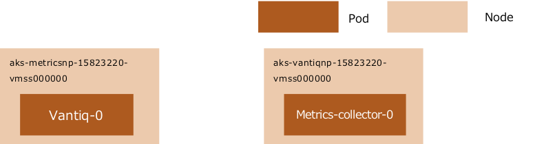

```sh
$ kubectl get pods -n app -o wide
NAME                           READY   STATUS      RESTARTS   AGE     IP              NODE                                
👉metrics-collector-0            1/1     Running     0          38m     10.19.112.33    aks-vantiqnp-15823220-vmss000000    
mongobackup-1605657600-2rtlk   0/1     Completed   0          2d13h   10.19.112.249   aks-grafananp-15823220-vmss000000   
mongobackup-1605744000-8gmnz   0/1     Completed   0          37h     10.19.112.241   aks-grafananp-15823220-vmss000000   
mongobackup-1605830400-r842f   0/1     Completed   0          13h     10.19.112.241   aks-grafananp-15823220-vmss000000   
mongodb-0                      2/2     Running     0          6d22h   10.19.113.62    aks-mongodbnp-15823220-vmss000002   
mongodb-1                      2/2     Running     0          6d22h   10.19.113.21    aks-mongodbnp-15823220-vmss000000   
mongodb-2                      2/2     Running     0          6d22h   10.19.113.36    aks-mongodbnp-15823220-vmss000001   
userdb-0                       2/2     Running     0          6d22h   10.19.113.203   aks-userdbnp-15823220-vmss000000    
userdb-1                       2/2     Running     0          6d22h   10.19.114.11    aks-userdbnp-15823220-vmss000002    
userdb-2                       2/2     Running     0          6d22h   10.19.113.223   aks-userdbnp-15823220-vmss000001    
👉vantiq-0                       1/1     Running     0          33m     10.19.112.111   aks-metricsnp-15823220-vmss000000   
vantiq-1                       1/1     Running     0          35m     10.19.112.61    aks-vantiqnp-15823220-vmss000001   
vantiq-2                       1/1     Running     0          38m     10.19.112.75    aks-vantiqnp-15823220-vmss000002   
```
`metrics-collector-0`のスケールを変更して、削除する。

```sh
$ kubectl scale sts -n app metrics-collector --replicas=0
statefulset.apps/metrics-collector scaled
```

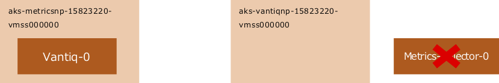

移動先の`aks-vantiqnp-15823220-vmss000000`以外に`taint`を適用する

```sh
$ kubectl taint nodes --all key=value:NoSchedule
node/aks-grafananp-15823220-vmss000000 tainted
node/aks-keycloaknp-15823220-vmss000000 tainted
node/aks-keycloaknp-15823220-vmss000001 tainted
node/aks-keycloaknp-15823220-vmss000002 tainted
node/aks-metricsnp-15823220-vmss000000 tainted
node/aks-mongodbnp-15823220-vmss000000 tainted
node/aks-mongodbnp-15823220-vmss000001 tainted
node/aks-mongodbnp-15823220-vmss000002 tainted
node/aks-userdbnp-15823220-vmss000000 tainted
node/aks-userdbnp-15823220-vmss000001 tainted
node/aks-userdbnp-15823220-vmss000002 tainted
node/aks-vantiqnp-15823220-vmss000000 tainted
node/aks-vantiqnp-15823220-vmss000001 tainted
node/aks-vantiqnp-15823220-vmss000002 tainted

$ kubectl taint nodes aks-vantiqnp-15823220-vmss000000 key:NoSchedule-
node/aks-vantiqnp-15823220-vmss000000 untainted
```

移動する`vantiq-0`を再起動する（Podを削除すると、自動的に再起動する）

```sh
kubectl delete pod -n app vantiq-0
pod "vantiq-0" deleted
```

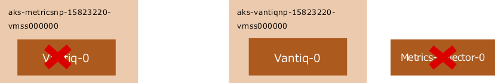

`metrics-collector-0`の移動先の`aks-metricsnp-15823220-vmss000000`以外に`taint`を適用する

```sh
$ kubectl taint nodes --all key=value:NoSchedule
node/aks-vantiqnp-15823220-vmss000000 tainted
Node aks-grafananp-15823220-vmss000000 already has key taint(s) with same effect(s) and --overwrite is false
Node aks-keycloaknp-15823220-vmss000000 already has key taint(s) with same effect(s) and --overwrite is false
Node aks-keycloaknp-15823220-vmss000001 already has key taint(s) with same effect(s) and --overwrite is false
Node aks-keycloaknp-15823220-vmss000002 already has key taint(s) with same effect(s) and --overwrite is false
Node aks-metricsnp-15823220-vmss000000 already has key taint(s) with same effect(s) and --overwrite is false
Node aks-mongodbnp-15823220-vmss000000 already has key taint(s) with same effect(s) and --overwrite is false
Node aks-mongodbnp-15823220-vmss000001 already has key taint(s) with same effect(s) and --overwrite is false
Node aks-mongodbnp-15823220-vmss000002 already has key taint(s) with same effect(s) and --overwrite is false
Node aks-userdbnp-15823220-vmss000000 already has key taint(s) with same effect(s) and --overwrite is false
Node aks-userdbnp-15823220-vmss000001 already has key taint(s) with same effect(s) and --overwrite is false
Node aks-userdbnp-15823220-vmss000002 already has key taint(s) with same effect(s) and --overwrite is false
Node aks-vantiqnp-15823220-vmss000001 already has key taint(s) with same effect(s) and --overwrite is false
Node aks-vantiqnp-15823220-vmss000002 already has key taint(s) with same effect(s) and --overwrite is false

$ kubectl taint nodes aks-metricsnp-15823220-vmss000000 key:NoSchedule-
node/aks-metricsnp-15823220-vmss000000 untainted
```

`Metrics-collector-0` のスケールを変更して、起動させる。

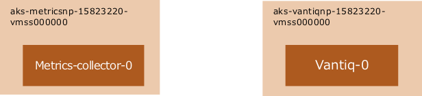

```sh
$ kubectl scale sts -n app metrics-collector --replicas=1
statefulset.apps/metrics-collector scaled
NAME                           READY   STATUS      RESTARTS   AGE     IP              NODE                                
👉metrics-collector-0            1/1     Running     0          53s     10.19.112.127   aks-metricsnp-15823220-vmss000000   
mongobackup-1605657600-2rtlk   0/1     Completed   0          2d14h   10.19.112.249   aks-grafananp-15823220-vmss000000   
mongobackup-1605744000-8gmnz   0/1     Completed   0          38h     10.19.112.241   aks-grafananp-15823220-vmss000000   
mongobackup-1605830400-r842f   0/1     Completed   0          14h     10.19.112.241   aks-grafananp-15823220-vmss000000  
mongodb-0                      2/2     Running     0          6d23h   10.19.113.62    aks-mongodbnp-15823220-vmss000002  
mongodb-1                      2/2     Running     0          6d23h   10.19.113.21    aks-mongodbnp-15823220-vmss000000
mongodb-2                      2/2     Running     0          6d23h   10.19.113.36    aks-mongodbnp-15823220-vmss000001
userdb-0                       2/2     Running     0          6d23h   10.19.113.203   aks-userdbnp-15823220-vmss000000
userdb-1                       2/2     Running     0          6d23h   10.19.114.11    aks-userdbnp-15823220-vmss000002
userdb-2                       2/2     Running     0          6d23h   10.19.113.223   aks-userdbnp-15823220-vmss000001
👉vantiq-0                       1/1     Running     0          4m47s   10.19.112.26    aks-vantiqnp-15823220-vmss000000
vantiq-1                       1/1     Running     0          79m     10.19.112.61    aks-vantiqnp-15823220-vmss000001
vantiq-2                       1/1     Running     0          82m     10.19.112.75    aks-vantiqnp-15823220-vmss000002
```
taintを解除する

```sh
$ kubectl taint nodes --all key:NoSchedule-
node/aks-grafananp-15823220-vmss000000 untainted
node/aks-keycloaknp-15823220-vmss000000 untainted
node/aks-keycloaknp-15823220-vmss000001 untainted
node/aks-keycloaknp-15823220-vmss000002 untainted
node/aks-mongodbnp-15823220-vmss000000 untainted
node/aks-mongodbnp-15823220-vmss000001 untainted
node/aks-mongodbnp-15823220-vmss000002 untainted
node/aks-userdbnp-15823220-vmss000000 untainted
node/aks-userdbnp-15823220-vmss000001 untainted
node/aks-userdbnp-15823220-vmss000002 untainted
node/aks-vantiqnp-15823220-vmss000000 untainted
node/aks-vantiqnp-15823220-vmss000001 untainted
node/aks-vantiqnp-15823220-vmss000002 untainted
error: taint "key:NoSchedule" not found
```

## Podの正しい配置を確認する

チェック項目

- ゾーン冗長化しているNodeの場合、Nodeが別々のゾーンに配置されていること。failure-domain.beta.kubernetes.io/zone が1、2、3に均等に配置されていること。
- DeploymentまたはScaleSetでレプリカが2以上のPodがそれぞれ別のNodeに配置されていること。
- PV (PersistentVolume) が作成されているZoneでPodが稼働していること（`mongodb`、`grafanadb`、`influxdb`）。

それぞれのPodが意図したNode上に配置されていること。特に以下のPodが指定されたNode以外で稼働としている状態は不正とみなす。 (\*は任意の数字または文字列を表す)

seq  | Pod  | Node  
--|---|--
1  | vantiq-* |  aks-vantiqnp-*
2  | mongodb-*  |  aks-mongodbnp-*
3  | userdb-*  |  aks-userdbnp-*
4  | influxdb-*  |  aks-grafananp-*
5  | keycloak-*  |  aks-keycloaknp-*
6  | metrics-collector-* |  aks-metricsnp-*

- 上記を満たしていれば、必ずしもNodeのシーケンス番号とPodのシーケンス番号とAZの番号が一致しなくともよい。(例：AZ: japaneast1上に`aks-vantiqnp-xxxxxxx-vmss000004`があり`vantiq-2`のPodが稼働しているなど)

- `nginx-ingress-controller-xxxxxxx`、`grafana-*` については、Nodeは特に決まっていない。

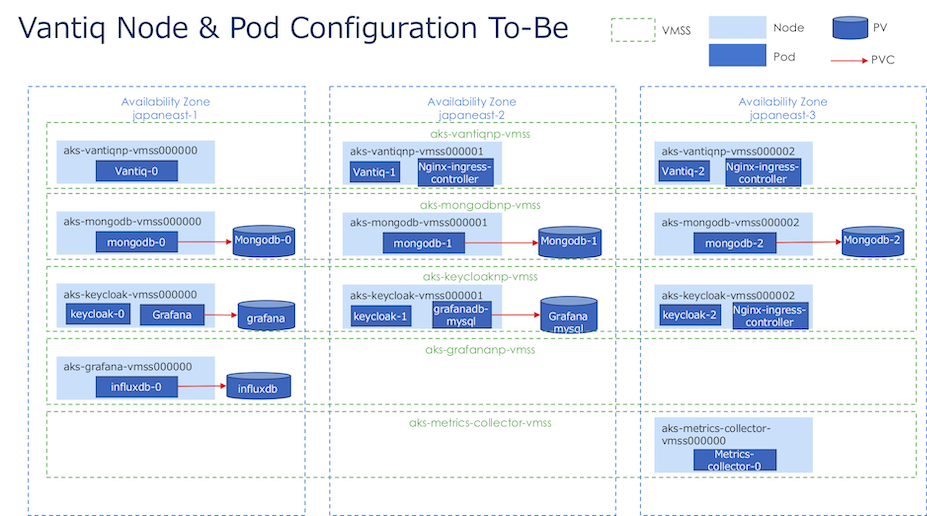

Podがあるべき場所に配置されていないと、以下の問題が発生しうる

- CPU/Memoryリソース不足のため、Podが起動しない（Pendingの状態）
- Podにディスクがマウントできず、Podが起動しない

Nodeが正しいZoneに配置されているか確認する

```sh
$ kubectl get nodes -L failure-domain.beta.kubernetes.io/zone
NAME                                 STATUS   ROLES   AGE   VERSION    ZONE
aks-grafananp-15823220-vmss000000    Ready    agent   25d   v1.16.15   japaneast-1
aks-keycloaknp-15823220-vmss000000   Ready    agent   25d   v1.16.15   japaneast-1
aks-keycloaknp-15823220-vmss000001   Ready    agent   25d   v1.16.15   japaneast-2
aks-keycloaknp-15823220-vmss000002   Ready    agent   25d   v1.16.15   japaneast-3
aks-metricsnp-15823220-vmss000000    Ready    agent   25d   v1.16.15   japaneast-1
aks-mongodbnp-15823220-vmss000000    Ready    agent   25d   v1.16.15   japaneast-1
aks-mongodbnp-15823220-vmss000001    Ready    agent   25d   v1.16.15   japaneast-2
aks-mongodbnp-15823220-vmss000002    Ready    agent   25d   v1.16.15   japaneast-3
aks-userdbnp-15823220-vmss000000     Ready    agent   9d    v1.16.15   japaneast-1
aks-userdbnp-15823220-vmss000001     Ready    agent   9d    v1.16.15   japaneast-2
aks-userdbnp-15823220-vmss000002     Ready    agent   9d    v1.16.15   japaneast-3
aks-vantiqnp-15823220-vmss000000     Ready    agent   25d   v1.16.15   japaneast-1
aks-vantiqnp-15823220-vmss000001     Ready    agent   25d   v1.16.15   japaneast-2
aks-vantiqnp-15823220-vmss000002     Ready    agent   25d   v1.16.15   japaneast-3
```

Podが正しいNodeに配置されているか確認する
```sh
$ kubectl get pods -A -o wide
NAMESPACE     NAME                                                READY   STATUS      RESTARTS   AGE     IP              NODE                                 NOMINATED NODE   READINESS GATES
app           metrics-collector-0                                 1/1     Running     0          2d18h   10.19.112.127   aks-metricsnp-15823220-vmss000000    <none>           <none>
app           mongobackup-1605916800-2mchr                        0/1     Completed   0          2d8h    10.19.112.244   aks-grafananp-15823220-vmss000000    <none>           <none>
app           mongobackup-1606003200-nrx22                        0/1     Completed   0          32h     10.19.112.237   aks-grafananp-15823220-vmss000000    <none>           <none>
app           mongobackup-1606089600-8gjdf                        0/1     Completed   0          8h      10.19.112.228   aks-grafananp-15823220-vmss000000    <none>           <none>
app           mongodb-0                                           2/2     Running     0          9d      10.19.113.62    aks-mongodbnp-15823220-vmss000002    <none>           <none>
app           mongodb-1                                           2/2     Running     0          9d      10.19.113.21    aks-mongodbnp-15823220-vmss000000    <none>           <none>
app           mongodb-2                                           2/2     Running     0          9d      10.19.113.36    aks-mongodbnp-15823220-vmss000001    <none>           <none>
app           userdb-0                                            2/2     Running     0          9d      10.19.113.203   aks-userdbnp-15823220-vmss000000     <none>           <none>
app           userdb-1                                            2/2     Running     0          9d      10.19.114.11    aks-userdbnp-15823220-vmss000002     <none>           <none>
app           userdb-2                                            2/2     Running     0          9d      10.19.113.223   aks-userdbnp-15823220-vmss000001     <none>           <none>
app           vantiq-0                                            1/1     Running     0          2d18h   10.19.112.26    aks-vantiqnp-15823220-vmss000000     <none>           <none>
app           vantiq-1                                            1/1     Running     0          2d19h   10.19.112.61    aks-vantiqnp-15823220-vmss000001     <none>           <none>
app           vantiq-2                                            1/1     Running     0          2d20h   10.19.112.75    aks-vantiqnp-15823220-vmss000002     <none>           <none>

(途中略・・・)

shared        grafana-67df56d6dc-4jj57                            1/1     Running     0          9d      10.19.112.178   aks-keycloaknp-15823220-vmss000001   <none>           <none>
shared        grafanadb-mysql-85b686d65c-wgx9s                    1/1     Running     0          9d      10.19.112.166   aks-keycloaknp-15823220-vmss000001   <none>           <none>
shared        influxdb-0                                          1/1     Running     0          9d      10.19.112.236   aks-grafananp-15823220-vmss000000    <none>           <none>
shared        keycloak-0                                          1/1     Running     0          9d      10.19.112.132   aks-keycloaknp-15823220-vmss000000   <none>           <none>
shared        keycloak-1                                          1/1     Running     0          9d      10.19.112.199   aks-keycloaknp-15823220-vmss000002   <none>           <none>
shared        keycloak-2                                          1/1     Running     0          9d      10.19.113.219   aks-userdbnp-15823220-vmss000001     <none>           <none>
shared        nginx-ingress-controller-76bbccfb8f-5lc2n           1/1     Running     0          9d      10.19.112.197   aks-keycloaknp-15823220-vmss000002   <none>           <none>
shared        nginx-ingress-controller-76bbccfb8f-89wcz           1/1     Running     0          9d      10.19.112.177   aks-keycloaknp-15823220-vmss000001   <none>           <none>
shared        nginx-ingress-controller-76bbccfb8f-9gbv5           1/1     Running     0          9d      10.19.112.229   aks-grafananp-15823220-vmss000000    <none>           <none>
shared        nginx-ingress-default-backend-7fb6f95b89-kxjc7      1/1     Running     0          9d      10.19.112.174   aks-keycloaknp-15823220-vmss000001   <none>           <none>
shared        telegraf-ds-2vm8w                                   1/1     Running     0          9d      10.19.113.251   aks-userdbnp-15823220-vmss000002     <none>           <none>
shared        telegraf-ds-5lhxm                                   1/1     Running     0          9d      10.19.113.65    aks-mongodbnp-15823220-vmss000002    <none>           <none>
shared        telegraf-ds-5sxt9                                   1/1     Running     0          9d      10.19.112.196   aks-keycloaknp-15823220-vmss000002   <none>           <none>
shared        telegraf-ds-c2q9l                                   1/1     Running     0          9d      10.19.113.191   aks-userdbnp-15823220-vmss000000     <none>           <none>
shared        telegraf-ds-d6wgg                                   1/1     Running     0          9d      10.19.113.33    aks-mongodbnp-15823220-vmss000001    <none>           <none>
shared        telegraf-ds-gjjnc                                   1/1     Running     0          9d      10.19.112.239   aks-grafananp-15823220-vmss000000    <none>           <none>
shared        telegraf-ds-h2d4l                                   1/1     Running     1          9d      10.19.112.155   aks-keycloaknp-15823220-vmss000000   <none>           <none>
shared        telegraf-ds-j7sl9                                   1/1     Running     0          9d      10.19.112.120   aks-metricsnp-15823220-vmss000000    <none>           <none>
shared        telegraf-ds-l7b55                                   1/1     Running     0          9d      10.19.112.85    aks-vantiqnp-15823220-vmss000002     <none>           <none>
shared        telegraf-ds-l9b7d                                   1/1     Running     0          9d      10.19.113.9     aks-mongodbnp-15823220-vmss000000    <none>           <none>
shared        telegraf-ds-nckml                                   1/1     Running     0          9d      10.19.112.183   aks-keycloaknp-15823220-vmss000001   <none>           <none>
shared        telegraf-ds-r92hc                                   1/1     Running     0          9d      10.19.112.60    aks-vantiqnp-15823220-vmss000001     <none>           <none>
shared        telegraf-ds-sg4kg                                   1/1     Running     0          9d      10.19.112.10    aks-vantiqnp-15823220-vmss000000     <none>           <none>
shared        telegraf-ds-wvqln                                   1/1     Running     0          9d      10.19.113.232   aks-userdbnp-15823220-vmss000001     <none>           <none>
shared        telegraf-prom-6d6598f56b-dsf9n                      1/1     Running     0          9d      10.19.113.249   aks-userdbnp-15823220-vmss000002     <none>           <none>
```

PodがClaimしているPVとPVが配置されているZoneを確認する

```sh
$ kubectl get pv -L failure-domain.beta.kubernetes.io/zone
NAME                                       CAPACITY   ACCESS MODES   RECLAIM POLICY   STATUS   CLAIM                             STORAGECLASS   REASON   AGE   ZONE
pvc-033fa5eb-e3ed-4e87-84b7-78dfe66a5d16   500Gi      RWO            Retain           Bound    app/datadir-userdb-2              vantiq-sc               9d    japaneast-2
pvc-13d491a7-b4cf-4d0b-9f06-599a33b2d1ea   500Gi      RWO            Retain           Bound    app/datadir-mongodb-1             vantiq-sc               9d    japaneast-1
pvc-13e6c453-44a2-4c96-9044-8aca44a9d559   5Gi        RWO            Retain           Bound    shared/grafana                    vantiq-sc               9d    japaneast-2
pvc-2be552e9-ef10-47f7-a4e7-e932cac292ed   500Gi      RWO            Retain           Bound    app/datadir-userdb-0              vantiq-sc               9d    japaneast-1
pvc-461fd9ca-d9c8-48d3-bf39-215503ec07b0   150Gi      RWO            Retain           Bound    shared/influxdb-data-influxdb-0   vantiq-sc               9d    japaneast-1
pvc-85001e7e-0a3b-4594-961a-ed069073ee30   8Gi        RWO            Retain           Bound    shared/grafanadb-mysql            vantiq-sc               9d    japaneast-2
pvc-97ca324b-a7cd-458f-ad0c-b4d4b9ed08e2   500Gi      RWO            Retain           Bound    app/datadir-mongodb-2             vantiq-sc               9d    japaneast-2
pvc-b2711b97-94b5-4591-afdf-433c86e1f52c   500Gi      RWO            Retain           Bound    app/datadir-userdb-1              vantiq-sc               9d    japaneast-3
pvc-f1fd088d-3704-465a-bba8-1c6eff6ae701   500Gi      RWO            Retain           Bound    app/datadir-mongodb-0             vantiq-sc               9d    japaneast-3
```


## インフラ障害についてのアナウンスを確認する

Infra障害のステータスを確認する。

<https://status.azure.com/status/>

チェック項目

- インフラ障害が起きていないこと
- 各可用性ゾーンが稼働していること
- Nodeが可用性ゾーンに分散配置されていること（正しく稼働していればゾーンバランスが保たれるはず。）  
 <https://docs.microsoft.com/ja-jp/azure/virtual-machine-scale-sets/virtual-machine-scale-sets-use-availability-zones#zone-balancing>

## Grafanaおよびエラーログを確認する

VANTIQ PlatformのMonitorで、アラート・障害の要因について調べる。

System Admin向けチェック項目と必要なアクション
seq  |  チェック項目 | 権限  |  是正アクション
--|---|---|--
1  | VANTIQ IDEにログインはできるか  | system admin  |  VANTIQ IDEにログイン時に内部エラーが出る場合、keycloakとVANTIQ間に問題がある。当該サービスの再起動を行う。
2  |  VANTIQのリソースの使用量が異常に高くなっていないか（CPU利用率、メモリ使用率、GC時間などが、1週間程度の平均値の倍以上となっていたり、CPU 利用率が 200% を越えてはいないか）。 | system admin  |  Org Adminにリソースを大量に消費している処理、またはそのきっかけとなったオペレーションなどがないか確認を依頼する。原因を取り除いたあと自然に回復しないようであればサービスの再起動を行う。
3  | mongoDBの使用率が異常に高くなっていないか（リクエスト数、CPU利用率、メモリ使用量などが、1週間程度の平均値の倍以上となっていたり、CPU 利用率が 200% を越えてはいないか）。  | system admin  |  Org Adminにリソースを大量に消費している処理、またはそのきっかけとなったオペレーションなどがないか確認を依頼する。原因を取り除いたあと自然に回復しないようであればサービスの再起動を行う。
4  | 一時的なデータ量の増大はなかったか。  | system admin  |  Org Adminに急激なデータ量（リクエスト）の増大の原因を解決するよう依頼する。
5  | Quota Violation、Creditの枯渇が起きていないか(エラーが発生していないか)。  | system admin  |  Org Adminにデータ量（リクエスト）の増大の原因を解決するよう依頼する。原因を取り除いた後自然に回復しないようであればサービスの再起動を行う。
6  | データ量やイベント数の増大はないか(処理時間が10秒以上かかっていないか)。  | system admin  |  イベント数や処理時間が著しく上昇しているAppやResourceを特定し、アプリケーション保守チームに是正を依頼する。
7  | Quota Violation、Creditの枯渇が起きていないか(エラーが発生していないか)。  |  system admin |  アプリケーション保守チームと連携し、原因の処理やデータソースを特定し、是正を依頼する。
8  | タイムアウトエラーが発生していないか（2分以上の処理）。処理時間が長いイベントはないか（数秒～2分）。  | system admin  |  アプリケーション保守チームと連携し、原因の処理やデータソースを特定し、是正を依頼する。
9  | Dropが発生していないか | system admin  |  イベント数や処理時間が著しく上昇しているAppやResourceを特定し、アプリケーション保守チームに是正を依頼する。


Org Admin向けチェック項目と必要なアクション
seq  |  チェック項目 | 権限  |  是正アクション
--|---|---|--
6  | データ量やイベント数の増大はないか(処理時間が10秒以上かかっていないか)。  | org admin  |  イベント数や処理時間が著しく上昇しているAppやResourceを特定し、アプリケーション保守チームに是正を依頼する。
7  | Quota Violation、Creditの枯渇が起きていないか(エラーが発生していないか)。  |  org admin |  アプリケーション保守チームと連携し、原因の処理やデータソースを特定し、是正を依頼する。
8  | タイムアウトエラーが発生していないか（2分以上の処理）。処理時間が長いイベントはないか（数秒～2分）。  | org admin  |  アプリケーション保守チームと連携し、原因の処理やデータソースを特定し、是正を依頼する。
9  | Dropが発生していないか | org admin  |  イベント数や処理時間が著しく上昇しているAppやResourceを特定し、アプリケーション保守チームに是正を依頼する。

#### Grafana 使用方法

[運用] → [モニター] → [Grafana] を選択する。(図は System Admin 権限の例)

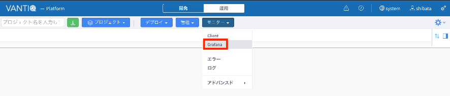

*version 1.31 の場合  
[管理] → [Grafana] を選択する。(図は System Admin 権限の例)*
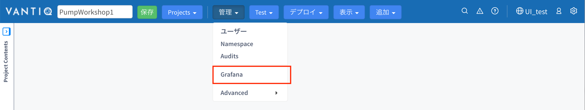

[Home] を選択する。

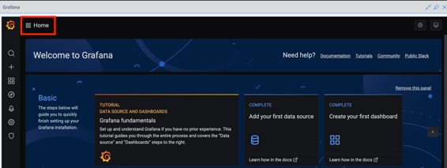

[Dashboard] を選択する。  
 \- Dashboard は権限レベルによって異なる。

Dashboard　選択後に、確認対象の日付などを設定する。  
- 時間の範囲、リフレッシュ間隔の設定

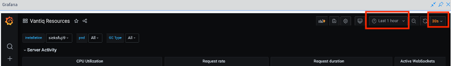  
[Relative time ranges] でプリセットの時間の範囲を選択可能 (設定されている time zone に依存する)  
リフレッシュ間隔の選択も可能  

[Absolute time range] で時間の範囲のカスタム設定が可能  
\- [From] と [To] に日時入力後、[Apply time range] を選択  

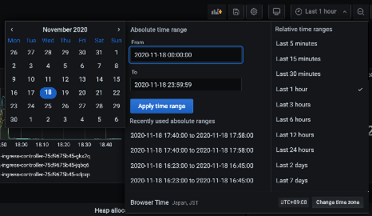

ここで設定した値は、[Recently used absolute ranges] にリストされ、再利用可能

- 二通りの方法で拡大表示が可能

パネルタイトルのプルダウンメニューから [View] を選択  
グラフ上で拡大表示させたいエリアをドラッグ


#### System Admin 権限でのチェック項目確認例

System Admin 権限の Dashboard

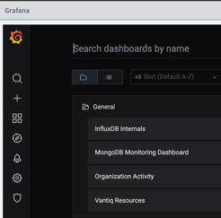

1.  VANTIQ IDE にログインはできるか  
ログイン時に認証などのエラーメッセージが表示されないか

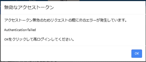

2.  VANTIQのリソースの使用量が異常に高くなっていないか（CPU利用率、メモリ使用率、GC時間など）  
`Vantiq Resources`

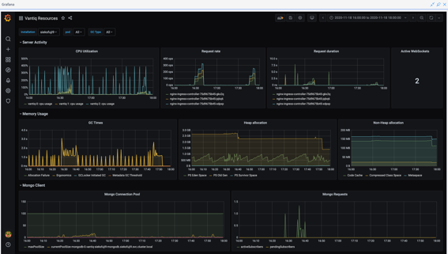

3.  mongoDBの使用率が異常に高くなっていないか（リクエスト数、CPU利用率、メモリ使用量）  
`MongoDB Monitoring Dashboard`

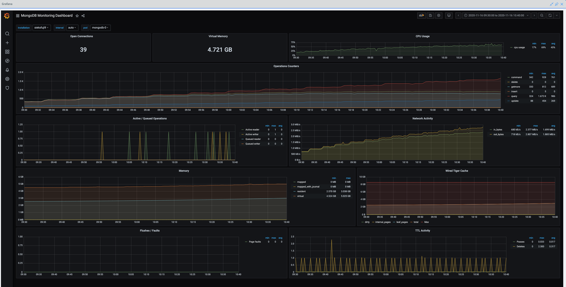

4.  一時的なデータ量の増大はなかったか  
`Organization Activity`

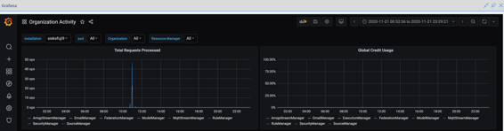

5.  Quota Violation、Creditの枯渇が起きていないか  
`Organization Activity`

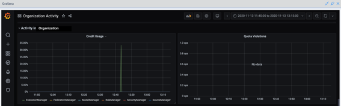

VANTIQ IDE のエラーペインにおいても確認できる

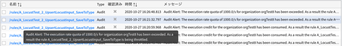

6.  タイムアウトエラーが発生していないか。処理時間が長いイベントはないか。  
`Vantiq Resources` -- `Request Duration`

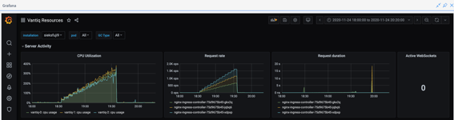

7.  異常が見つかった場合、Organizationごとのパフォーマンスを確認し、問題のあるOrganizationを特定し、その管理者に適宜指示をする。

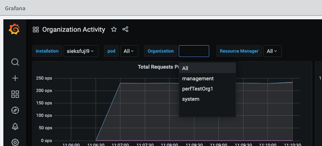

#### Organization Admin 権限でのチェック項目確認例

Organization Admin 権限の Dashboard

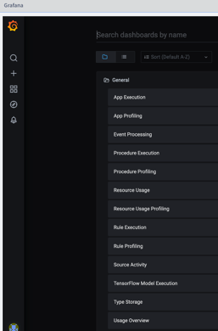

6.  データ量やイベント数の増大はないか  
`App Execution`

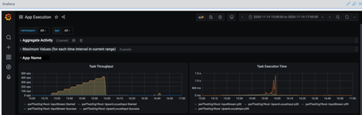

7.  Quota Violation、Creditの枯渇が起きていないか  
`Usage Overview`

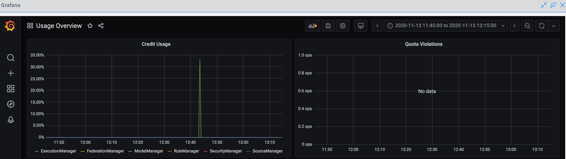

8.  タイムアウトエラーが発生していないか。処理時間が長いイベントはないか。  
`Rule Execution`、`Procedure Execution`

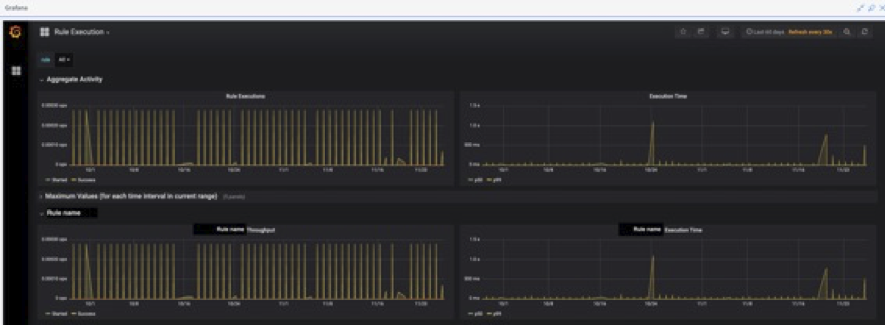

9.  Drop が発生していないか  
`Event Processing` -- `Drops`

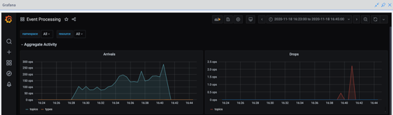

10. 異常が見つかった場合、問題のあるnamespaceを特定し、namespaceの管理者に適宜指示をする。

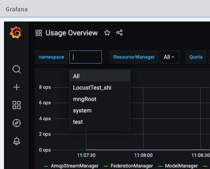

## アプリ保守チームへの対応を依頼する

アプリケーション保守チームに問題のあるアプリケーションに関する確認および問題の是正を依頼する。恒常的なデータ量増大によるものでなければ、アプリケーション側で解決を行う。

チェック項目と是正アクション

seq  | チェック項目  |  チェック実施者 |  是正アクション
--|---|---|--
1  | VANTIQ IDEにログインはできるか。イベント処理は動作しているか。  | アプリ保守チーム  |  VANTIQ IDEにログイン時に内部エラーが出る場合、keycloakとVANTIQ間に問題がある。当該サービスの再起動を行う。一方、ログインのみ不可で背後のイベント処理が動作している場合、再起動のタイミングは運用チームと調整する。
2  | データ量やイベント数の急激な増大はないか(処理時間が10秒以上かかっていないか）。  |  アプリ保守チーム |  イベント数や処理時間が著しく上昇しているAppやResourceを特定し、一時的にdeactivate, データソースの遮断、緊急修正デプロイを行う。
3  | タイムアウトエラーが発生していないか（2分以上の処理）。処理時間が長いイベントはないか（数秒～2分）。  | アプリ保守チーム  |  原因の処理やデータソースを特定し、一時的に遮断、暫定対応等を行う。よくある原因はVANTIQアプリが連携している先対向システムの同期呼び出しによるレスポンス遅延であり、非同期化の設計の見直しが必要になる。
4  | 最近アプリケーションの変更がリリースされたか。  | アプリ保守チーム  |  最近デプロイされたアプリケーションに問題がある場合、前バージョンを再デプロイする。
5  | エラーが大量に発生していないか。  | アプリ保守チーム  |  イベント数や処理時間が著しく上昇しているAppやResourceを特定し、一時的にdeactivate、 データソースの遮断、緊急修正デプロイを行う。アプリケーションのロジックが問題の場合、開発環境で不具合のないことの検証が必要。クォータに関する問題の場合、イベント数やデータ量の調整や設計の再検討も必要になる。
6  | 最近Typeへのデータの大量投入など行ったか。  | アプリ保守チーム  |  データ投入を中断する。


#### Developer 権限でのチェック項目確認例

Developer 権限の Dashboard  
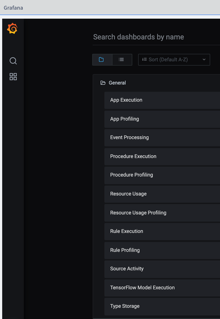

1.  VANTIQ IDEにログインはできるか。イベント処理は動作しているか。

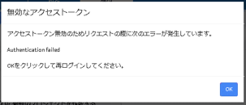

2.  データ量やイベント数の急激な増大はないか。  
`App Execution`  

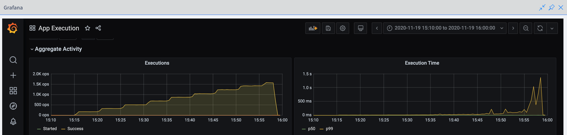

3.  タイムアウトエラーが発生していないか。処理時間が長いイベントはないか。  
`Procedure Execution`、`Rule Execution`  

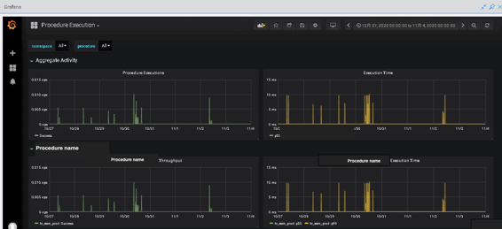

4.  最近アプリケーションの変更がリリースされたか。  
リリース情報などの確認を行う。

5.  エラーが大量に発生していないか。  
VANTIQ IDE のエラーペインにおいても確認できる。

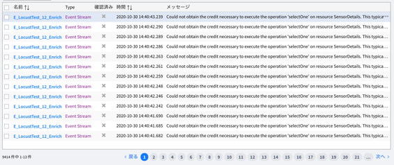

6.  最近Typeへのデータの大量投入など行ったか。  
聞き取りやVANTIQ IDE のエラーペインにおいても確認できる。

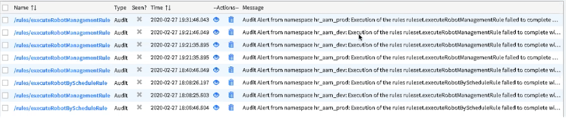


## Supportチームへエスカレーションする

VANTIQアプリケーションの問題については、以下のテンプレートに従う。

[Support-Issue-Submission-Template.docx](https://community.vantiq.com/ja/forums/topic/support-issue-submission-template/) _(要ログイン)_

VANTIQ基盤に関する問題は、以下のテンプレートに従い情報を提供する。

宛先 jp-customersuccess \<jp-customersuccess\@vantiq.com

- Cluster Name / クラスタ の番号
- Incident Description / Resource / インシデントの内容、問題のあるリソース   
- Submission Type {Defect, Enhancement, Developer Support, Infrastructure}
- Severity 影響のあった基盤  {1, 2, 3, 4}
- Screenshots
- Diagnosis情報
  - `kubectl get pods -A -o wide`
  - `kubectl get nodes -o wide`
  - `kubectl logs`
  - `kubectl describe`
  - etc.
- すでに行われた復旧アクション
