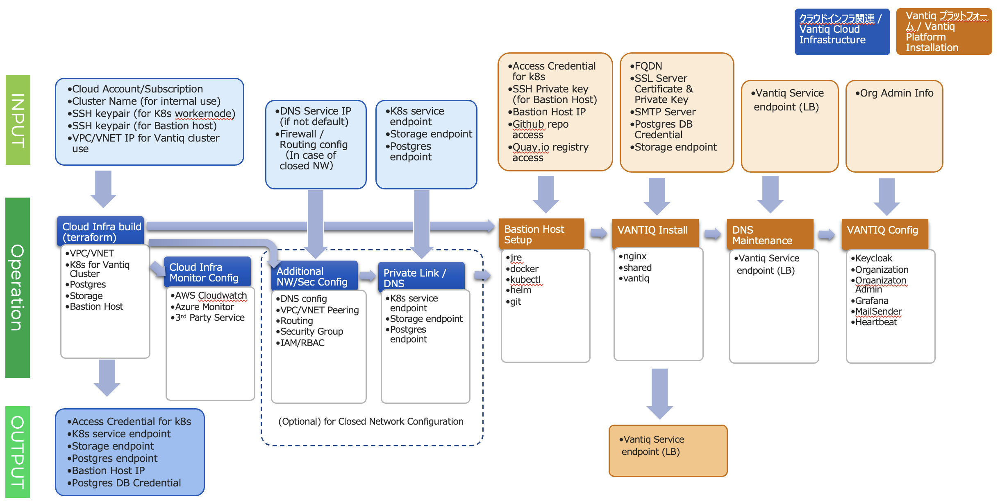

# Vantiqプラットフォーム関連
Vantiq Platformの構築や運用に関するガイドや手順です。

## Vantiq Cloud
- [Vantiq Cloud 構築 ](./docs/jp/vantiq-install.md)
  - [deploy.yamlのカスタマイズ構成](./docs/jp/deploy_yaml_config.md)
  - [Grafanaカスタマイズ(Email通知設定)](./docs/jp/grafana.md)
  - [Vantiq Organization, Namespace, User Role の関係](./docs/jp/org_user_management.md)
- [Vantiq Cloud 保守 ](./docs/jp/vantiq-maintenance.md)
- [Vantiq Cloud 構成Tips/構築および保守におけるトラブルシューティング過去事例](./docs/jp/vantiq-install-maintenance-troubleshooting.md)
- [Vantiq Cloud 運用におけるトラブルシューティングガイド](./docs/jp/vantiq_k8s_troubleshooting.md)
- [Vantiq Private Cloud解体作業](./docs/jp/vantiq-teardown.md)

## Vantiq Edge
- [Quay.io の新規アカウント作成手順](./docs/jp/create_quay.io_account.md)
- [Vantiq Edge Admin タスク](./docs/jp/vantiq-edge-admin.md)  
- [Vantiq Organization, Namespace, User Role の関係](./docs/jp/org_user_management.md)

## その他/ツール
- [Vantiq Organizationのマイグレーション作業](./docs/jp/vantiq-org-migration.md)
- [ネットワーク構成デバッグツール](./docs/jp/alpine-f.md)
- [サーバー間時刻同期確認ツール](./docs/jp/timestamp_ds.md)
- [サーバー証明書用 CSR 作成手順](./docs/jp/prepare_csr4rsasslcert.md)

# Vantiq Platform related
Guides and procedures for building and operating the Vantiq Platform.

- [Custom configuration of deploy.yaml](./docs/eng/deploy_yaml_config.md)
- [Trouble Shooting Guide for Vantiq Cloud install and maintenance](./docs/eng/vantiq-install-maintenance-troubleshooting.md)
- [Trouble Shooting Guide for Vantiq Cloud operations](./docs/eng/vantiq_k8s_troubleshooting.md)
- [Network Configuration Debug Tool](.//docs/eng/alpine-f.md)
- [Servers Time Synchronization Check Tool](./docs/eng/timestamp_ds.md)
- [MongoDB related](./docs/eng/mongodb.md)
- [Procedure for generating a CSR for a server certificate](./docs/eng/prepare_csr4rsasslcert.md)
- [Migration of Vantiq Organization](./docs/eng/vantiq-org-migration.md)
- [Procedure for tearing down Vantiq Private Cloud](./docs/eng/vantiq-teardown.md)
- [How to create a new Quay.io account](./docs/eng/create_quay.io_account.md)
- [Relationship between Vantiq Organization, Namespace and User Role](./docs/eng/org_user_management.md)

## List of maintenance items for the Vantiq platform

|# | Items  | Description | Appropriate timing | Standard preparation time | Service outage on update | Operator|
|---|----|-------|------|----------------|----------------------|----------|
|1  | Vantiq License Renewal  | The license file referenced by the Vantiq cluster. **If the license is not valid, the Vantiq service will stop.**| After the PO has been issued but before the license expires.   | 1 week         | Not required| Vantiq Support|
|2  | SSL Certificate Renewal  | SSL certificate to be used by the Vantiq cluster. **If it expires, one cannot log in to the Vantiq IDE or connect to the service via HTTPS REST.** | Before the certificate expires.  | 2 weeks        | Not required | Vantiq Support|
|3  | Vantiq Minor Upgrade   | Version upgrade of Vantiq with the addition of features. | About once every four months (three times a year).   | 1 week         | Required   | Vantiq Support|
|4  | Vantiq Patch Upgrade | Version upgrade of the Vantiq to fix issues of the current version.  | At any time the fix that impacts the normal operations is released. | 2 days | Not required  | Vantiq Support|
|5  | Service Principal Account Update | (Only when configuring Internal Load Balancer in Azure) Service Principal used in AKS that has a permission to configure Load Balancer as Private. **The service may stop after the expiration date.** | Before the Service Principal expires. | 1 week         | Required  | Vantiq Support|
